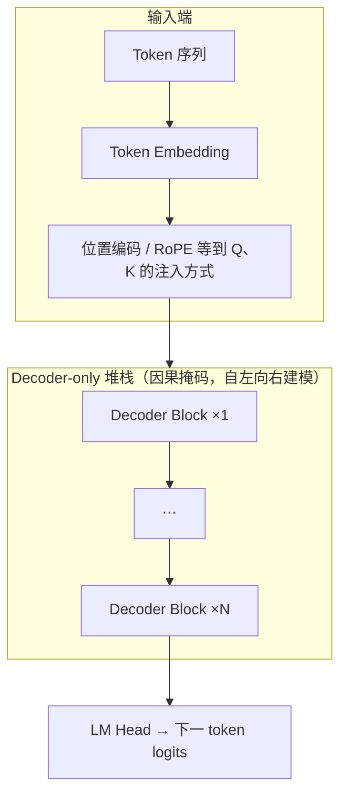
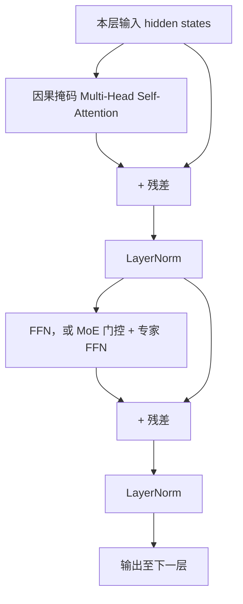

<strong>大模型基础与架构</strong>

# 1. 为什么需要大模型

**1.1. 统一底座的优势**  
传统 NLP 常常是「一任务一模型」：每个场景单独建数据集、单独训练与维护一套参数，重复投入大。做法是先在超大规模通用语料上做 **自监督预训练**，得到相对通用的语言与知识底座，再按业务用 **SFT、RAG、工具调用、评测与数据闭环** 等拼成具体产品能力——**一套底座、多种落地形态**，减少反复从零训小模型、重复造轮子。

**1.2. 规模带来的能力跃迁**  
当参数量、数据量与训练算力超过一定阈值后，模型往往会表现出 **涌现能力**（如复杂推理、多步指令遵循、少样本迁移）：小规模时不稳定或缺失的行为，在规模化后变得可用。与之相伴的经典叙事是 **缩放定律（Scaling Laws）**：在数据、算力、模型配方匹配的前提下，验证损失等指标随规模往往可预测地改善，为「是否值得继续加码训练」提供经验依据。

仅有「继续堆稠密参数」一条路径，已不足以描述近年的工程现实。**2025–2026 年前后**，讨论更多落在 **固定推理预算下的高效缩放**：**MoE** 用「总参数量大、每步只激活子集」换容量与 specialization；**MLA、GQA** 等降低 **KV 占用或 K/V 头数**，在相近显存与延迟下换更长上下文或更大批次；再配合 **投机解码、权重量化、算子融合** 等推理侧手段，以及 **数据与后训练配方**，其性价比在工程评估里常与「线性加大稠密前向算力」并列。读各家模型卡时，建议同时看 **激活参数量、上下文上限、许可证与部署条款**，而不是只看名义总参数。

**1.3. 工程上的取舍**  
能力上行通常对应更高的显存与算力账单、更长的尾延迟，以及更复杂的运维与容错。线上系统必须在 **能力、时延、成本（及合规）** 之间做显式取舍，并为峰值流量与 SLO 留余量。前文提到的 **MoE、MLA、GQA** 等，分别对应「容量 / KV 显存 / 注意力开销」等不同瓶颈；弄清自己卡在哪一类，才谈得上用架构与系统优化 **缓解矛盾而非盲目加卡**——这也是后文从 Transformer 讲到 KV Cache 与推理加速的主线。

---

# 2. Transformer 架构详解

上一节谈的是「要不要上大模型、算力花在哪」；落到实现上，当前主流 **开放权重对话模型** 几乎都用同一套积木：**Transformer 解码器堆栈**（Decoder-only）。它源自 2017 年论文 *Attention Is All You Need* 里的 **Decoder** 设计：用 **自注意力** 在序列上传递信息，再经 **前馈子层** 做逐 token 非线性变换，多层堆叠后接 **语言建模头** 预测下一词。翻译等任务常用的 **Encoder–Decoder**（两侧各一堆栈、中间交叉注意力）在 LLM 产品里较少见，因此下文默认 **GPT / LLaMA / Qwen 式 Decoder-only**；差异主要体现在 **位置编码（如 RoPE）**、**注意力变体（MHA / GQA / MLA）**、**FFN 是否换成 MoE** 等。

**结构示意**（与常见 LLM 一致；多模态模型会在 Embedding 侧拼接视觉等分支，骨干仍是此类块重复堆叠。）

单层 **Decoder Block**（下图接近原始论文的 **Post-LN**：Attention / FFN 子层后做 **残差相加再 LayerNorm**。许多开源 LLM 采用 **Pre-LN / Pre-RMSNorm**（先 Norm 再进子层），箭头顺序会不同，以各仓库实现为准。）

若本地 Markdown 预览不渲染 Mermaid，可将代码块复制到 [Mermaid Live Editor](https://mermaid.live) 查看。

## 2.1. Self-Attention 原理

- **要解决的问题**：对长度为 \(n\) 的序列，让每个位置都能「看到」其它位置的信息，并学习 **谁该关注谁**。
- **核心计算（缩放点积注意力）**：将输入映射为 Query \(Q\)、Key \(K\)、Value \(V\)，注意力权重由 \(QK^\top\) 经缩放与 softmax 得到，再对 \(V\) 加权求和。直观理解：**用 Query 去匹配 Key，用权重去聚合 Value**。
- **因果掩码（Causal Mask）**：自回归生成时，位置 \(i\) 只能看见 \(\le i\) 的位置，保证训练和推理一致；BERT 类双向模型则不用因果掩码。

## 2.2. Multi-Head Attention

- **多头**：将 \(Q,K,V\) 拆成多组子空间并行计算，再拼接投影。意义类似 CNN 多通道：不同头可捕捉不同关系（语法、指代、长距离依赖等）。
- **与推理的关系**：多头使每层状态更丰富，但也增加 **KV Cache** 的存储量（每层每头都要缓存；**GQA / MQA** 通过减少 K/V 头数缓解这一问题）。

## 2.3. FFN 与 MoE

- **FFN（前馈层）**：通常对每个 token 独立做两层 MLP（如维度扩张再压回），是参数量的大头之一；常见激活包括 GeLU、**SwiGLU**（LLaMA 系常用）。
- **MoE（混合专家）**：将部分 FFN 换成「多专家 + 门控」，每个 token 只激活少数专家，从而在 **总参数量很大** 的同时控制 **单次前向的计算量**。2025 年后 **超大规模开源/开放权重模型** 中 MoE 路线极为常见（如部分 Qwen3、DeepSeek、Llama 4 等），选型时需区分 **总参数** 与 **每 token 激活参数**。

## 2.4. MLA（Multi-Head Latent Attention）

**MLA**（多头潜在注意力，DeepSeek-V3 / R1 等采用的核心设计之一）在注意力计算中对 Key/Value（或其中间表示）做 **低秩/潜在空间压缩**，使推理阶段缓存的 **KV 占用显著低于标准 MHA**，往往比仅缩头数的 **GQA** 更激进地省显存。直觉：**用更紧凑的潜在向量表示历史，再还原或内积得到注意力 logits**，在几乎不线性增加序列侧存储的前提下拉长上下文或换更大批次。对比 **GQA**：GQA 主要减少 K/V **头数**；MLA 则从表示本身压缩 KV **带宽**，两者可与其他优化（PagedAttention、KV 量化）叠加。具体公式与实现细节以各模型技术报告为准。

---

# 3. 主流大模型架构与选型对比（2026 年最新）

下列聚焦 **2026 年前后工程选型** 常用的开源权重与主流闭源 API 系列；**参数量、上下文与许可** 以各厂商当时发布的模型卡为准，部署前请核对最新版本与条款。

## 3.1. 主流系列速览表

| 模型系列 | 架构特点 | 总参数 / 激活参数 | 典型上下文长度 | 核心优势场景 | 许可证 / 部署友好度 | 2026 年典型强项 |
|----------|----------|-------------------|----------------|--------------|------------------------|-----------------|
| **Llama 4 Maverick**（Meta） | Decoder-only + **iRoPE** + MoE 等 | 约 400B / **~17B active** | **1M+**（视部署与版本） | 通用对话、多模态、性价比部署 | Llama License（较开放，需遵守品牌/用途条款） | 多模态、长上下文、生态（vLLM 等） |
| **Llama 4 Scout**（Meta） | Decoder-only，多模态与长上下文取向 | 参数量级依官方卡 | **超长上下文** 场景 | 长文档、检索增强、多模态理解 | 同 Llama 系列许可 | 上下文与多模态工程组合 |
| **Qwen3-235B-A22B**（阿里） | Decoder-only + **GQA** + MoE | 235B / **22B active** | 128K～1M（依变体） | 中文、代码、**Agent / 工具调用** | **Apache 2.0**（常见开放权重） | 中文理解、工具链与国产硬件适配 |
| **Qwen3.5 系列**（阿里） | 同系演进，部分变体强化推理/代码 | 依具体 checkpoint | 同上量级 | 代码、Agent、行业落地 | 多为 Apache 2.0，以模型卡为准 | 迭代快、文档与工具全 |
| **DeepSeek-V3.2**（DeepSeek） | Decoder-only + **MLA** + 大规模 MoE | 约 **671B～685B / ~37B active** | 128K～200K+（依版本） | 数学、代码、通用推理 | **MIT**（开放权重友好） | 激活参数效率、推理成本 |
| **DeepSeek-R1**（DeepSeek） | 同系骨干 + 强 **CoT / 推理** 对齐 | 与 V 系 MoE 骨干对应 | 与 V 系相当 | 复杂推理、竞赛数学、长链思考 | MIT | **纯推理**、蒸馏与二次开发友好 |
| **Grok-4 / Grok-4.1**（xAI） | Decoder-only + 面向在线与一致性优化 | 未公开 | **2M+**（API 文档为准） | 实时信息、低幻觉、对话一致性 | **闭源**（xAI API） | 实时搜索结合、产品化推理体验 |
| **Claude 4.6 Opus / Sonnet**（Anthropic） | Decoder-only，强对齐与安全栈 | 未公开 | 长上下文（以 API 为准） | 企业合规、长文本分析、安全敏感场景 | **闭源**（Anthropic API） | 长文本推理、安全与可控性 |
| **Gemini 3.1 Pro**（Google） | 原生多模态、长上下文 | 未公开 | 长上下文与多模态窗口以官方为准 | 多模态、Google 云生态 | **闭源**（Vertex / AI Studio） | 多模态融合、与企业 GCP 集成 |

## 3.2. 选型建议（工程视角）

- 追求 **极致性价比 + 开源自由**（可自托管、二次开发）→ 优先考虑 **DeepSeek-R1 / DeepSeek-V3.2**（MIT，MoE+MLA，推理与代码口碑强，成本曲线友好）。
- **中文 + Agent + 工具链 / 国产算力** → 优先考虑 **Qwen3 / Qwen3.5**（Apache 2.0 常见，阿里系文档、框架与社区配套齐）。
- **多模态 + 超长上下文 + 开放权重部署** → 关注 **Llama 4 Maverick / Scout**（注意 Llama License 条款与硬件需求）。
- 需要 **最高安全基线、长文本与合规** → 闭源侧可评估 **Claude 4.6** 系列 API（结合数据出境与 SLA）。
- **强实时、低幻觉、与搜索/世界知识结合** → 闭源侧可评估 **Grok-4.x**；要与现有云栈一致可看 **Gemini 3.1 Pro**。
- **预算有限但要强推理** → 除全尺寸 MoE 外，可关注 **DeepSeek-R1 蒸馏版**、**Qwen3 小规模 MoE 或稠密变体**，用同样预算换更高质量数据与后训练。

**阅读建议**：选型时不仅看总参数量，更要对照 **激活参数、上下文长度、许可证、工具链（vLLM、量化、Agent）** 与业务语言分布；闭源模型以 **API 价格、速率限制与数据政策** 为准。

---

# 4. KV Cache 原理与优化

- **是什么**：自回归生成第 \(t+1\) 个 token 时，前面各层的 **K、V** 对已生成前缀不变，可缓存下来，避免每步重复计算整段历史——这就是 **KV Cache**。
- **显存占用直觉**：大致与 **层数 × 序列长度 × 每 token 的 K/V 表示大小 × 精度** 成正比；标准 MHA 还与头数相关，**GQA / MLA** 等会改变「每 token K/V」的有效宽度。上下文从 4K 拉到 128K 乃至 1M 时，KV 往往成为首要瓶颈。
- **常见优化方向**：
  - **GQA / MQA / MLA**：从缩头、分组到潜在压缩，降低 Cache 体积（MLA 详见 §2.4）。
  - **PagedAttention（vLLM）**：把 KV 分页管理，减少碎片与浪费（详见 [3.1 vLLM 推理部署](../03_部署与推理/3.1_vLLM推理部署.md)）。
  - **量化 KV**：INT8/FP8 等降低单元素占用（需权衡精度）。

---

# 5. 推理加速关键技术

- **批处理与调度**：**Continuous Batching** 动态拼 batch，提高 GPU 利用率（vLLM 等）。
- **算子与图优化**：FlashAttention 系列降低注意力显存与 IO；融合内核减少 launch 开销。
- **投机解码（Speculative Decoding）**：用小模型草稿 + 大模型验证，换吞吐（实现复杂，需框架支持）。
- **权重量化**：W8A16、GPTQ/AWQ 等降低带宽压力（与 [3.2 量化](../03_部署与推理/3.2_INT量化.md) 衔接）。

---

# 6. 2026 年大模型发展趋势（简览）

- **MoE 成为默认选项之一**：超大规模模型普遍采用「大总参、小激活」，工程上必须同时优化 **门控负载均衡** 与 **通信**（多卡 / 多机）。
- **注意力与 KV 继续「减负」**：在 GQA 之外，**MLA** 等压缩 KV 的设计与 **更长上下文** 需求绑定，与 KV 量化、分页内存协同。
- **多模态原生**：文本、图像、音频统一 tokenizer 或统一骨干的模型更常见，部署侧需考虑 **模态对齐、延迟与显存峰值**。
- **推理与成本优先**：相对「单纯扩大稠密参数」，产业更关注 **单位美元质量**、**SLO 内延迟** 与 **端侧 / 私有部署**，推动小模型+强后训练、投机解码与硬件协同。

---

# 7. 参考资料

- Vaswani et al., *Attention Is All You Need*（Transformer 原论文）
- Touvron et al., *LLaMA / LLaMA 2* 技术报告；Meta **Llama 4** 技术报告与模型卡（Decoder-only、iRoPE、MoE 等）
- Hoffmann et al., *Training Compute-Optimal Large Language Models*（Chinchilla 与缩放定律）；后续 **推理最优与 MoE 缩放** 相关讨论见各厂商报告
- **DeepSeek** V3 / R1 技术报告（**MLA**、MoE 与训练细节）
- **Qwen3 / Qwen3.5** 模型卡与开源仓库 README
- 各闭源 API 文档（xAI Grok、Anthropic Claude、Google Gemini）以官方为准
