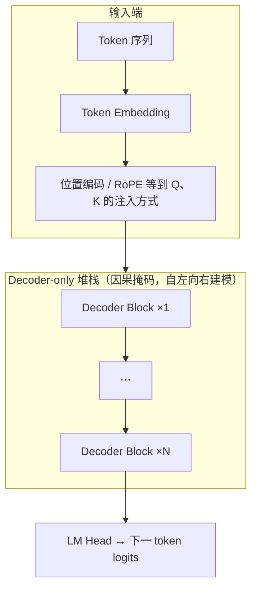
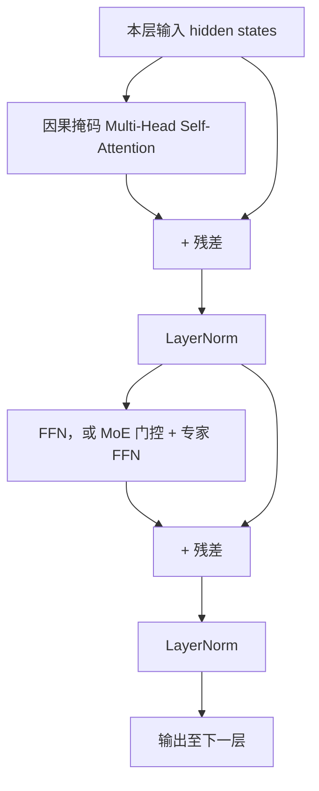

<strong>Transformer 架构详解</strong>

# 1. Transformer 架构详解

上一节（[动机与缩放取舍](1.1_动机与缩放取舍.md)）谈的是「要不要上大模型、算力花在哪」；落到实现上，当前主流 **开放权重对话模型** 几乎都用同一套积木：**Transformer 解码器堆栈**（Decoder-only）。它源自 2017 年论文 *Attention Is All You Need* 里的 **Decoder** 设计：用 **自注意力** 在序列上传递信息，再经 **前馈子层** 做逐 token 非线性变换，多层堆叠后接 **语言建模头** 预测下一词。翻译等任务常用的 **Encoder–Decoder**（两侧各一堆栈、中间交叉注意力）在 LLM 产品里较少见，因此下文默认 **GPT / LLaMA / Qwen 式 Decoder-only**；差异主要体现在 **位置编码（如 RoPE）**、**注意力变体（MHA / GQA / MLA）**、**FFN 是否换成 MoE** 等。

**结构示意**（与常见 LLM 一致；多模态模型会在 Embedding 侧拼接视觉等分支，骨干仍是此类块重复堆叠。）

单层 **Decoder Block**（下图接近原始论文的 **Post-LN**：Attention / FFN 子层后做 **残差相加再 LayerNorm**。许多开源 LLM 采用 **Pre-LN / Pre-RMSNorm**（先 Norm 再进子层），箭头顺序会不同，以各仓库实现为准。）

若本地 Markdown 预览不渲染 Mermaid，可将代码块复制到 [Mermaid Live Editor](https://mermaid.live) 查看。

## 1.1. Self-Attention 原理

- **要解决的问题**：对长度为 \(n\) 的序列，让每个位置都能「看到」其它位置的信息，并学习 **谁该关注谁**。
- **核心计算（缩放点积注意力）**：将输入映射为 Query \(Q\)、Key \(K\)、Value \(V\)，注意力权重由 \(QK^\top\) 经缩放与 softmax 得到，再对 \(V\) 加权求和。直观理解：**用 Query 去匹配 Key，用权重去聚合 Value**。
- **因果掩码（Causal Mask）**：自回归生成时，位置 \(i\) 只能看见 \(\le i\) 的位置，保证训练和推理一致；BERT 类双向模型则不用因果掩码。

## 1.2. Multi-Head Attention

- **多头**：将 \(Q,K,V\) 拆成多组子空间并行计算，再拼接投影。意义类似 CNN 多通道：不同头可捕捉不同关系（语法、指代、长距离依赖等）。
- **与推理的关系**：多头使每层状态更丰富，但也增加 **KV Cache** 的存储量（每层每头都要缓存；**GQA / MQA** 通过减少 K/V 头数缓解这一问题）。

## 1.3. FFN 与 MoE

- **FFN（前馈层）**：通常对每个 token 独立做两层 MLP（如维度扩张再压回），是参数量的大头之一；常见激活包括 GeLU、**SwiGLU**（LLaMA 系常用）。
- **MoE（混合专家）**：将部分 FFN 换成「多专家 + 门控」，每个 token 只激活少数专家，从而在 **总参数量很大** 的同时控制 **单次前向的计算量**。2025 年后 **超大规模开源/开放权重模型** 中 MoE 路线极为常见（如部分 Qwen3、DeepSeek、Llama 4 等），选型时需区分 **总参数** 与 **每 token 激活参数**。

## 1.4. MLA（Multi-Head Latent Attention）

**MLA**（多头潜在注意力，DeepSeek-V3 / R1 等采用的核心设计之一）在注意力计算中对 Key/Value（或其中间表示）做 **低秩/潜在空间压缩**，使推理阶段缓存的 **KV 占用显著低于标准 MHA**，往往比仅缩头数的 **GQA** 更激进地省显存。直觉：**用更紧凑的潜在向量表示历史，再还原或内积得到注意力 logits**，在几乎不线性增加序列侧存储的前提下拉长上下文或换更大批次。对比 **GQA**：GQA 主要减少 K/V **头数**；MLA 则从表示本身压缩 KV **带宽**，两者可与其他优化（PagedAttention、KV 量化）叠加。具体公式与实现细节以各模型技术报告为准。
