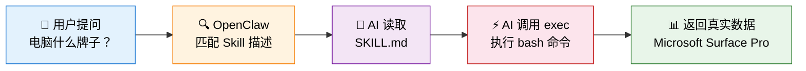

<!-- 文档同步自 https://github.com/chenweidu666/OpenClaw-Deployment-Issues 分支 main — 请勿手工与上游长期双轨编辑 -->


# 1. OpenClaw Skill 开发指南：AI 能力无限扩展


> 本文档详细介绍 OpenClaw 的 Skill 系统——如何用 Markdown + Shell 脚本给 AI 增加全新能力。
>
> 返回 [项目总览](../README.md) | 相关文档：[Workspace 自定义指南](./7.2.4_OpenClaw_Workspace.md)

---


# 2. 目录


- [1. Skill 系统概述](#1-skill-系统概述)
  - [1.1 什么是 Skill](#11-什么是-skill)
  - [1.2 工作原理](#12-工作原理)
  - [1.3 开发流程](#13-开发流程)
- [2. 实战案例与总览](#2-实战案例与总览)
- [3. 更多 Skill 思路](#3-更多-skill-思路)

---


# 3. Skill 系统概述


## 3.1. 1 什么是 Skill

**Skill 系统是 OpenClaw 的杀手级特性。** 一个 Markdown 文件 + 一个 Shell 脚本，就能给 AI 增加一种全新能力——不需要改一行 OpenClaw 源码。

> **📌 重要更新（2026-02-11）**：所有 5 个自定义 Skill 及其 Function Calling 工具已**全部清理**。原因：切换到本地 Qwen3-8B 模型后上下文窗口有限（24K tokens），需要精简系统提示词（从 34 工具裁剪到 23 工具）。Skills 目录和插件工具注册均已清空，仅保留插件框架供后续使用。
>
> 以下内容保留作为**历史参考和开发指南**，记录 Skill 开发的完整方法论。

每个 Skill 一个子目录，存放在 `~/.openclaw/skills/` 下：

```
~/.openclaw/skills/       # ← 当前已清空
├── system_info/          # Skill 1（已删除）
│   ├── SKILL.md
│   └── gather_info.sh
└── weather/              # Skill 2（已删除）
    ├── SKILL.md
    ├── get_weather.sh
    └── weather_feishu_push.sh
```

## 2 工作原理



用户提问 → OpenClaw 根据 `description` 字段匹配 Skill → 将 `SKILL.md` 注入 AI 上下文 → AI 知道该执行什么命令。

## 3 开发流程

每个 Skill 的开发只需 3 步：

| 步骤 | 操作 | 说明 |
|:----:|------|------|
| 1 | `mkdir -p ~/.openclaw/skills/<名称>` | 创建 Skill 目录 |
| 2 | 编写脚本 + `SKILL.md` | 脚本实现功能，SKILL.md 定义触发条件和使用说明 |
| 3 | `openclaw gateway --force` | 重启 Gateway 加载新 Skill |

**SKILL.md 模板**：

```markdown
---
name: skill_name
description: 描述这个 Skill 做什么，用户问什么问题时应该触发。写得越详细，匹配越准确。
metadata: { "openclaw": { "emoji": "🔧", "requires": { "bins": ["bash"] } } }
---

# Skill 标题

## 使用方法
运行：`bash ~/.openclaw/skills/skill_name/script.sh`

## 可用命令
- 命令1: `xxx`
- 命令2: `xxx`
```

> **关键点**：`description` 字段决定了什么问题会触发这个 Skill，建议写得详细且覆盖多种表述方式。

---


# 4. 实战案例与总览


## 4.1. 1 Skill 总览（历史记录）

> **以下 5 个 Skill 均已于 2026-02-11 清理**，保留此表作为开发参考。

| # | Skill | 类型 | 状态 | 删除原因 |
|---|-------|------|:----:|----------|
| 1 | **system_info** 🖥️ | 命令执行型 | ⛔ 已删除 | Docker 容器内信息有限 |
| 2 | **weather** 🌤️ | CSV 读取型 | ⛔ 已删除 | 外部 API 依赖，维护成本高 |
| 3 | **nas_search** 🗄️ | 命令执行型 | ⛔ 已删除 | Docker 容器只读挂载，find 受限 |
| 4 | **bilibili_summary** 📺 | API 服务型 | ⛔ 已删除 | 3060 已改为 LLM 推理，流程复杂 |
| 5 | **personal_info** 💬 | 纯数据 / 命令型 | ⛔ 已删除 | 精简系统提示与工具集时一并移除 |

五种 Skill 类型（设计参考）：**命令执行型**（脚本 + exec）、**定时推送型**（脚本 + cron + Webhook）、**纯数据型**（只有 SKILL.md）、**API 服务型**（调用远程 GPU 推理服务）、**云 API 查询型**（调用云厂商管理 API）。

> **与 README / 插件文档的对应**：主文档按 **`~/.openclaw/skills/` 目录名** 常列举 **personal_info**（个人问答）。迭代中还曾单独做过 **DashScope 费用查询**（如 **qwen_usage** 脚本、**qwen_billing** / **`cw_qwen_billing`** 插件工具等），与 personal_info **不是同一个 Skill**，但同属「自定义扩展」；插件阶段 `cw_*` 注册名与 Skill 目录名也可能不一一同名，以你本地历史 `skills/` 与 `index.ts` 为准。上述均已随 2026-02-11 清理关闭。

> **📌 原工具详细文档**见 [原生工具插件开发 — 第 5 节](./7.2.6_OpenClaw_Native_Tools_Plugin.md#5-实战5-个原生工具)（已标注为历史参考）。

---


# 5. 更多 Skill 思路


基于同样的模式，可以继续开发：

| Skill | 类型 | 功能 | 实现思路 |
|-------|------|------|----------|
| `stock_monitor` | 定时推送 | 股票/基金监控 | 行情 API + 飞书推送 |
| `docker_manager` | 命令执行 | Docker 管理 | `docker ps` / `docker logs` |
| `smart_home` | 命令执行 | 智能家居控制 | Home Assistant API |
| `faq` | 纯数据 | 常见问题解答 | SKILL.md 写入 Q&A |

> **Skill 的精髓**：Markdown 定义触发条件，Shell 脚本实现逻辑（或直接用 Markdown 注入知识），AI 作为中间调度层。技术栈：bash + curl + python3 + FastAPI + Docker + systemd + alibabacloud SDK。

---

> **文档最近修订**：2026-03-23（历史 Skill 表与 README 对齐 personal_info；补充与 qwen_billing / 插件名的脚注说明）
