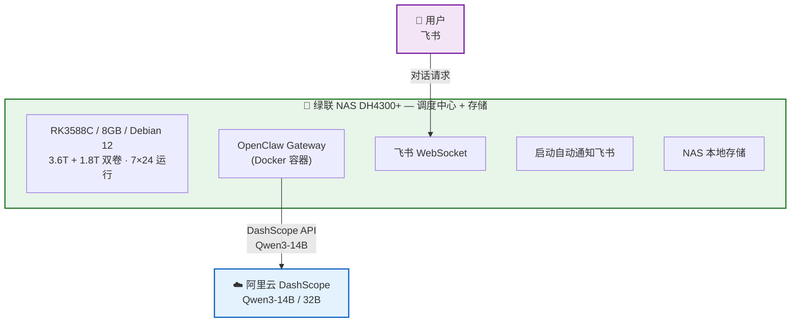
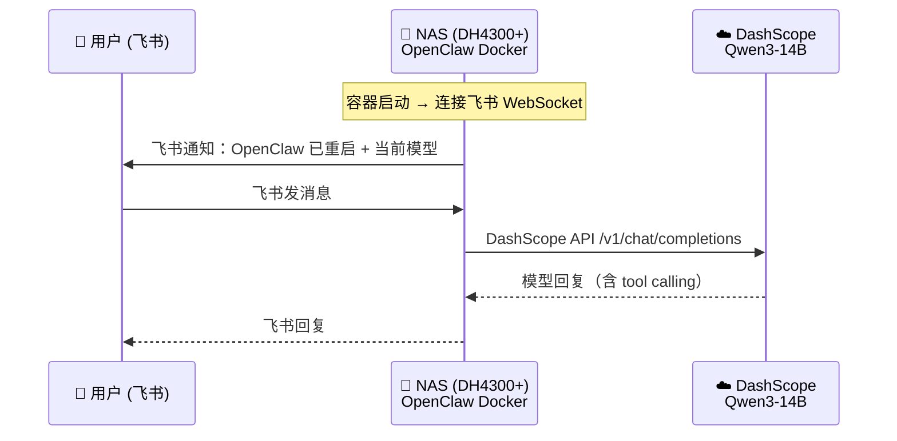

<!-- 文档同步自 https://github.com/chenweidu666/OpenClaw-Deployment-Issues 分支 main — 请勿手工与上游长期双轨编辑 -->


# 1. OpenClaw 部署指南与踩坑记录：NAS + 云端 API 私人 AI 助手完整实战


<p align="center">
  
</p>

> **OpenClaw** 是 2026 年前后社区讨论度很高的开源 AI 助手方案之一——它不只是一个聊天机器人框架，而是一个完整的 **AI Agent 操作系统**：支持飞书 / Web 多渠道接入，内置工具调用（function calling）、技能系统（Skills）、记忆管理、多 Agent 协作，还能接入任意 OpenAI 兼容的大模型。
>
> 本仓库是一份**从零到可用的完整实战文档**：用一台绿联 DH4300+ NAS（7×24 低功耗调度中心）+ 阿里云 DashScope API（Qwen3-14B），搭建纯云端推理的私人 AI 助手；收录 **17 个典型踩坑案例、完整解决方案与最佳实践**，便于检索与复用到同类部署（NAS / ARM64 / 纯云端 API）。
>
> **运行状态说明**：文中「**当时 / 文档记录期末（约 2026-02-11）**」在用的模型与工具配置，指实战收尾阶段的**最终选型**；后因 Token 成本，**OpenClaw 实例已暂停运行**（详见 [安全加固与项目复盘](./7.2.7_OpenClaw_Security_and_Retrospective.md) 中的时间线与功能总览 ⏸️）。操作步骤仍可按需复现，请勿将「当前使用」理解为作者至今仍在 7×24 在线服务。

---


# 2. 仓库结构


```
7.2_OpenClaw-Deployment-Issues/          # 技术文档站中的目录名
├── README.md                              # 入口：亮点、架构、快速开始、导航
├── 7.2.1_OpenClaw_Deploy_Guide.md         # 环境构建与 API 配置
├── 7.2.2_OpenClaw_Pitfalls_and_Practices.md   # 踩坑 17 则 + 问答 + 最佳实践
├── 7.2.3_OpenClaw_Nginx_WebUI.md          # Nginx HTTPS Web UI
├── 7.2.4_OpenClaw_Workspace.md            # Workspace 自定义指南
├── 7.2.5_OpenClaw_Skills.md               # Skill 开发指南
├── 7.2.6_OpenClaw_Native_Tools_Plugin.md  # 原生工具插件开发
├── 7.2.7_OpenClaw_Security_and_Retrospective.md  # 安全、时间线、裁剪决策、优缺点
└── images/                                # 架构图、截图等资源
```

> **说明**：文中提到的 `docker/`、`workspace/` 等为实战部署时的**本地项目目录**（Dockerfile、entrypoint、Workspace 文件等），可按你的实际仓库组织放置；本 Git 仓库以 **README + 分篇文档 + 图片** 为主，便于作为 [OpenClaw-Deployment-Issues](https://github.com/chenweidu666/OpenClaw-Deployment-Issues) 独立传播。

---


# 3. 项目亮点


- **NAS + 云端 API 架构**：绿联 NAS DH4300+（7×24 低功耗调度中心 + 5.4T 持久存储）+ 阿里云 DashScope Qwen3-14B API，轻量高效
- **纯云端推理**：DashScope Qwen3-14B / 32B，131K 上下文窗口，当时测算极低成本（百万 token 约 ¥1.5 输入档，**以云厂商现网价目为准**），无需 GPU 硬件
- **23 个内置工具实测**：exec / 文件读写 / heartbeat / memory / web_fetch 全部验证，含 8B vs 14B 工具调用能力对比
- **系统提示词精简实战**：从 34 工具 → 23 工具，决策与清单见 [安全与复盘](./7.2.7_OpenClaw_Security_and_Retrospective.md#系统提示词裁剪决策记录2026-02-11)（含本地 8B 阶段背景）
- **Docker 隔离部署**：非 root + cap_drop ALL + no-new-privileges + exec 白名单，启动自动通知飞书
- **exec 审批系统实战**：allowlist 白名单 + safeBins + askFallback 配置，Docker 非交互模式下的踩坑与解决
- **完整踩坑记录**：[踩坑记录与实践](./7.2.2_OpenClaw_Pitfalls_and_Practices.md) 收录 17 则，按 5 大类整理（模型选型 / Skill 配置 / AI 行为 / 运维 / NAS 环境），含诊断过程与可复用方案
- **NAS 作为主机的实践**：RK3588C ARM64 平台运行 OpenClaw + Node.js + Docker 的完整实战经验
- **模型演进全记录**：从云端 14B → 本地 8B（vLLM）→ 回归云端 14B，完整记录各阶段的取舍与经验

---


# 4. 系统架构




**数据流示例 — 云端 API 对话**：



---


# 5. 自定义 Skill（已全部清理）


> **2026-02-11**：所有自定义 Skill 和工具已清理。原因：精简系统提示词、聚焦核心能力。原有 5 个自定义 Skill（system_info / weather / nas_search / personal_info / bilibili_summary）及其 Function Calling 工具已移除，后续根据需要重新开发。
>
> 保留 OpenClaw 内置的 23 个核心工具（文件读写、Shell 执行、网页搜索、浏览器、定时任务、消息、记忆等）。**在清理前、暂停前**，最终选型为云端 DashScope Qwen3-14B API，131K 上下文窗口充足。

---


# 6. 快速查找


- **遇到问题？** → [踩坑记录与实践](./7.2.2_OpenClaw_Pitfalls_and_Practices.md#踩坑记录17-个案例)（17 则 + 最佳实践表）
- **想快速部署？** → [快速开始](#快速开始) + [环境构建与 API 配置](./7.2.1_OpenClaw_Deploy_Guide.md)
- **对比不同模型？** → [硬件清单与性能实测](#硬件清单与性能实测)
- **安全 / 时间线 / Token 评估？** → [安全加固与项目复盘](./7.2.7_OpenClaw_Security_and_Retrospective.md)

---


# 7. 文档导航


| 序号 | 文档 | 内容概述 |
|:----:|------|----------|
| 1 | **[环境构建与 API 配置](./7.2.1_OpenClaw_Deploy_Guide.md)** | 选型对比、硬件准备、NAS 上安装 OpenClaw、接入阿里云 Qwen3 |
| 2 | [**踩坑记录与实践**](./7.2.2_OpenClaw_Pitfalls_and_Practices.md) | 17 个踩坑（5 大类）、Workspace/Skill 问答、最佳实践速查表 |
| 3 | [Nginx HTTPS Web UI](./7.2.3_OpenClaw_Nginx_WebUI.md) | Nginx 反向代理、自签名 SSL、局域网 Web UI 访问 |
| 4 | [Workspace 自定义指南](./7.2.4_OpenClaw_Workspace.md) | SOUL.md / IDENTITY.md / TOOLS.md 定义 AI 人格与能力 + 模型选型对比 |
| 5 | [Skill 开发指南](./7.2.5_OpenClaw_Skills.md) | Skill 原理、实战案例（含 Qwen 费用监控）、3060 GPU 转写服务架构、本地 Whisper 选型分析 |
| 6 | [**原生工具插件开发**](./7.2.6_OpenClaw_Native_Tools_Plugin.md) | 自定义插件 Function Calling 原理、开发指南、踩坑总结（自定义工具已清理，保留框架） |
| 7 | [**安全加固与项目复盘**](./7.2.7_OpenClaw_Security_and_Retrospective.md) | 4 层安全、部署时间线、功能完成度、工具裁剪决策、优缺点与 Token 评估 |

---


# 8. 快速开始


```bash
# 1. 克隆安装工具
git clone https://github.com/miaoxworld/OpenClawInstaller.git
cd OpenClawInstaller && chmod +x install.sh config-menu.sh

# 2. 一键安装（自动检测环境、安装依赖、引导配置）
./install.sh

# 3. 验证
source ~/.openclaw/env
openclaw agent --agent main --message "你好"
```

详细步骤见 [环境构建与 API 配置](./7.2.1_OpenClaw_Deploy_Guide.md)。

---


# 9. 硬件清单与性能实测


| 设备 | 角色 | 规格 | 说明 |
|------|------|------|------|
| 绿联 DH4300+ NAS | **OpenClaw 调度中心 + 持久存储** | RK3588C / 8GB / 3.6T+1.8T 双卷 | Debian 12，7×24 运行，Docker 容器运行 Gateway + 飞书 + 存储一体 |
| ~~RTX 3060 工作站~~ | ~~LLM 推理节点~~ | ~~i5-13490F / 32GB / RTX 3060 12GB~~ | 历史：曾用 vLLM 运行 Qwen3-8B-AWQ，后改为纯云端 API，不再作为推理节点 |

## 9.1. 为什么选 NAS 作为主机？

之前使用 Surface Pro 5 作为 OpenClaw Gateway 调度中心，但 2 核 4 线程的 i5-7300U 在启动多个服务时负载极高，触发 watchdog 反复重启，系统极不稳定。**绿联 DH4300+ 就是绿联旗下的 NAS 机型**（RK3588C 8 核 + 8GB 内存），本就是为 7×24 运行设计的存储设备，搭载完整 Debian 12，磁盘 I/O 极强，非常适合兼任 OpenClaw 的常驻调度中心。

## 9.2. NAS 存储路径

NAS 双卷存储，OpenClaw Docker 容器通过只读挂载访问：

| NAS 本地路径 | 容器内路径 | 用途 |
|-------------|-----------|------|
| `/volume2/Movies` | `/nas/volume2/Movies` | 电影库 |
| `/volume2/Photos` | `/nas/volume2/Photos` | 照片 |
| `/volume2/Musics` | `/nas/volume2/Musics` | 音乐 |
| `/volume2/Games` | `/nas/volume2/Games` | 游戏 |
| `/volume2/迅雷下载` | `/nas/volume2/迅雷下载` | 迅雷下载 |
| `/volume1/@home/cw` | `/nas/volume1/@home/cw` | 用户主目录 |

> **注意**：绿联 UGOS 的用户目录默认权限为 `d---------+`（ACL 管理），Docker 容器的 `node` 用户（UID 1000）无法读取。需在宿主机执行 `sudo chmod -R o+rX /volume2/Movies /volume2/Photos /volume2/Musics /volume2/Games` 修复权限。

**历史：3060 工作站 SMB 挂载**（已弃用）：

早期 3060 工作站通过 `/etc/fstab` 配置 CIFS 自动挂载到 `/mnt/nas/`。关键参数：
- `_netdev`：网络就绪后才挂载
- `nofail`：挂载失败不阻塞开机
- `vers=3.0`：SMB 3.0 协议
- 凭证通过独立文件管理（权限 600）

**性能对比（实测）**：

| 测试项 | NAS (DH4300+) | 3060 工作站 |
|--------|:-------------:|:-----------:|
| CPU 单核 (pi 5000位) | 572 ms | **85 ms** |
| CPU 多核 (并行 gzip) | 1888 ms (8核) | **538 ms (16核)** |
| Node.js (50M sqrt) | 1159 ms | — |
| 磁盘写入 (256MB) | **2.1 GB/s** | 280 MB/s |

> **结论**：NAS 虽然 CPU 性能偏弱（ARM64 架构），但具有 **磁盘 I/O 极强（2.1 GB/s）、7×24 低功耗运行、存储空间充足（5.4T）** 三大优势，作为 OpenClaw Gateway 调度中心 + 数据存储一体机是最佳选择。Node.js 在 RK3588C 上运行 OpenClaw Gateway 完全可用，响应延迟主要取决于云端 DashScope API 而非本地 CPU。**该阶段**最终采用纯云端推理（Qwen3-14B），NAS 只负责网关调度 + 存储，无需 GPU 硬件。

---


# 10. 深入阅读（独立文档）


以下内容已从 README **拆出**，避免单页过长；与下表 **不重复**，请按需打开。

| 文档 | 说明 |
|------|------|
| [**踩坑记录与实践**](./7.2.2_OpenClaw_Pitfalls_and_Practices.md) | 17 个踩坑（现象 / 原因 / 方案）、Workspace 与 Skill 问答、最佳实践速查表 |
| [**安全加固与项目复盘**](./7.2.7_OpenClaw_Security_and_Retrospective.md) | 4 层安全、部署时间线、功能完成度、工具裁剪决策、优缺点与 Token 评估 |

**按问题跳转（锚点在新文档内）**：

| 问题 | 链接 |
|------|------|
| Skill 注册后 AI 仍不调用 | [坑 5](./7.2.2_OpenClaw_Pitfalls_and_Practices.md#坑-5skill-有了但-ai-不调用) |
| 系统提示过大、会话溢出 | [坑 11](./7.2.2_OpenClaw_Pitfalls_and_Practices.md#坑-11系统提示过大--会话历史溢出14b-上下文崩溃) |
| NAS SSH 不稳 | [坑 14](./7.2.2_OpenClaw_Pitfalls_and_Practices.md#坑-14ssh-串联-nas-经常断连--改用-smb-挂载) |
| ARM64 上 Node 安装失败 | [坑 15](./7.2.2_OpenClaw_Pitfalls_and_Practices.md#坑-15nas-arm64-平台-nodejs-安装踩坑apt-依赖冲突--nvm-救场) |
| Docker 读不了 NAS 目录 | [坑 16](./7.2.2_OpenClaw_Pitfalls_and_Practices.md#坑-16ugos-nas-目录权限--docker-容器无法读取用户文件) |
| Nginx WebSocket / token | [坑 3](./7.2.2_OpenClaw_Pitfalls_and_Practices.md#坑-3nginx-websocket-要注入-token) |
| 插件 / nativeSkills | [坑 12](./7.2.2_OpenClaw_Pitfalls_and_Practices.md#坑-12skill-上下文依赖--自定义插件原生-function-calling) |

---


# 11. 参考链接


- [OpenClaw 官方仓库](https://github.com/openclaw/openclaw)
- [OpenClaw 一键部署工具](https://github.com/miaoxworld/OpenClawInstaller)
- [OpenClaw Manager 桌面版](https://github.com/miaoxworld/openclaw-manager)
- [阿里云 DashScope](https://dashscope.console.aliyun.com/)
- [DashScope OpenAI 兼容模式文档](https://help.aliyun.com/zh/model-studio/developer-reference/compatibility-of-openai-with-dashscope)
- [飞书开放平台](https://open.feishu.cn/)
- [faster-whisper](https://github.com/SYSTRAN/faster-whisper)
- [vLLM 文档](https://docs.vllm.ai/)
- [OpenClaw 安全文档](https://docs.clawd.bot/security)
- [OpenClaw Exec Approvals](https://docs.clawd.bot/tools/exec-approvals)

---

> **实战记录撰写期**：2026 年 2 月 8 ~ 11 日（部署与踩坑原文档成稿区间）
>
> **文档最近修订**：2026 年 3 月 23 日 — README 改为入口页；分篇文件名与站点侧栏对齐为 **7.2.1**～**7.2.7**；踩坑与实践见 [7.2.2](./7.2.2_OpenClaw_Pitfalls_and_Practices.md)，安全与复盘见 [7.2.7](./7.2.7_OpenClaw_Security_and_Retrospective.md)；统一「暂停前最终选型」、Docker 表述、Skill 名单脚注、价目时效与交叉链接。
>
> 如有问题欢迎评论交流！
