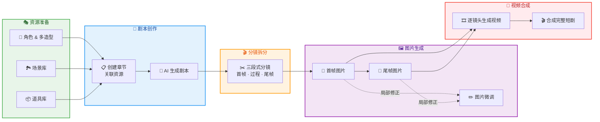
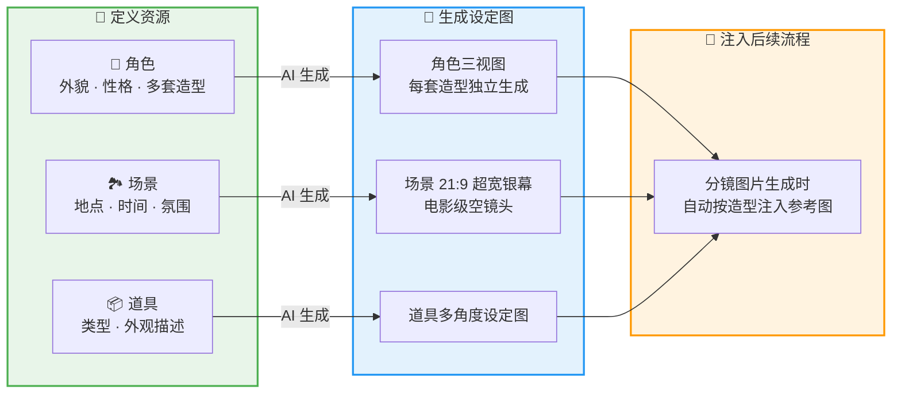
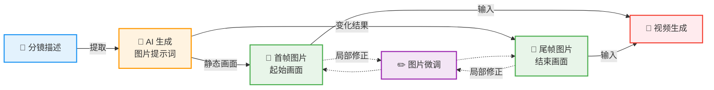
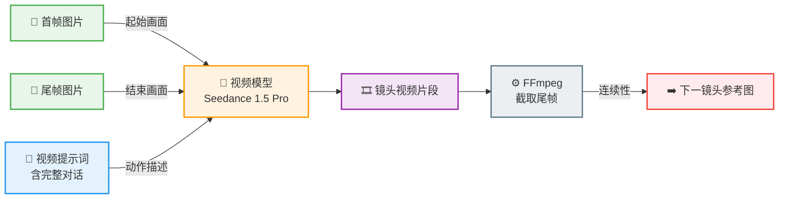

<!-- 文档同步自 https://github.com/chenweidu666/CineMaker-AI-Platform 分支 main — 请勿手工与上游长期双轨编辑 -->


<div style="text-align: center; font-size: 2rem; font-weight: 700; margin-bottom: 0.5rem;"><strong>CineMaker 工作流程详解</strong></div>

从一个故事想法到一部完整的 AI 短剧，需要经过哪些步骤？每一步为什么这样设计？
本文以 AI 女性日常 Vlog《姜小卷的周一，又是元气满满的一天》为例，带你走完从资源准备到成片的全流程。


# 1. 概述


## 1.1. 短剧管理首页

打开 CineMaker，首先进入的是**短剧管理首页**——所有项目的统一入口。

<div align="center">


*▲ 图 1：**短剧管理首页**。顶部导航栏提供**「AI 日志」**等全局功能入口和**「+ 创建剧本」**按钮；主区域以卡片形式展示所有短剧项目，每张卡片包含项目标题、风格描述、创建时间、章节数和**画幅标签（竖画/横画）**，悬停时显示编辑、导出、删除等快捷操作；底部支持分页浏览。点击任意项目卡片即可进入项目详情。*

</div>

## 1.2. 2 项目概览

进入项目后，顶部导航可以切换角色管理、章节管理、场景管理、道具管理等模块：

<div align="center">


*▲ 图 2：**项目概览页**。顶部 Tab 导航在**角色管理、章节管理、场景管理、道具管理**之间快速切换，一目了然地展示项目的所有资源和制作进度。*

</div>

## 1.3. 3 制作流程总览

从一个故事想法到最终成片，CineMaker 的制作流程分为五个阶段：



*▲ **流程总览**：CineMaker 的**五步制作流程**。从**资源准备**（角色多造型、场景库、道具库）出发，经过**剧本创作**、**AI 分镜拆分**、**首帧/尾帧图片生成**（含微调），最终**逐镜头生成视频**并合成完整短剧。虚线箭头表示图片微调的可选循环。*

## 4 配置 API

使用 CineMaker 之前，需要先配置火山方舟 API Key。所有 AI 功能（文本生成、图片生成、视频生成）共用同一个 API Key。

### 第一步：获取 API Key

1. 打开 [火山方舟 API Key 管理](https://console.volcengine.com/ark/region:ark+cn-beijing/apiKey)，登录后点击「创建 API Key」
2. 在 [开通管理](https://console.volcengine.com/ark/region:ark+cn-beijing/openManagement) 开通以下模型：
   - **文本**：`doubao-1-5-pro-32k-250115`
   - **图片**：`doubao-seedream-4-0-250828`（在「计算机视觉」Tab 下）
   - **视频**：`doubao-seedance-1-5-pro-251215`（在「计算机视觉」Tab 下）

### 第二步：在 CineMaker 中配置

1. 进入「AI 日志」页面，切换到「配置 API」Tab
2. 点击右上角「+ 配置 API」按钮
3. 输入 API Key，点击「测试连接」，三个模型全部通过后点击「保存」
4. 保存后会一次性创建文本（Doubao）、图片（Seedream）、视频（Seedance）三条配置

<div align="center">


*▲ **API 配置页面**。「当前已配置」区域展示文本、图片、视频三条配置的状态；下方 Tab 可分别查看每种类型的配置详情，支持测试连接、禁用和删除操作。*

</div>

<div align="center">


*▲ **配置 API 弹窗**。火山引擎简洁模式下只需输入一个 API Key，Base URL 和模型 ID 已自动配置。点击「测试连接」验证文本、图片、视频三个接口均可连通后，即可保存。*

</div>

> **提示**：同一 API Key 可同时用于文本、图片、视频；Base URL 固定为 `https://ark.cn-beijing.volces.com/api/v3`。也可以通过环境变量 `ARK_API_KEY` 配置，避免在 Web 界面中暴露密钥。

## 5 核心 AI 模型

CineMaker 的整个流程由四类 AI 模型协作驱动，各司其职：

| 类型 | 模型 | 供应商 | 职责 |
|------|------|--------|------|
| 🤖 **文本** | **Doubao 1.5 Pro** | 火山引擎（豆包） | 剧本生成、分镜拆分、图片/视频提示词生成、角色/场景/道具提取、提示词优化 |
| 🖼️ **图片** | **Seedream 4.0** | 火山引擎（豆包） | 角色三视图、场景 21:9 超宽银幕空镜头、首帧/尾帧图片生成 |
| ✏️ **图片编辑** | **Seededit 3.0** | 火山引擎（豆包） | 图片微调 —— 基于编辑指令的局部重绘 |
| 🎥 **视频** | **Seedance 1.5 Pro** | 火山引擎（豆包） | 首尾帧模式视频生成，支持对话口型、运镜控制 |
| 👁️ **视觉理解** | Doubao Seed 1.6 Vision | 火山引擎（豆包） | 视频逐帧分析、画面内容理解 |

> **为什么全部选择火山引擎（豆包）？** Doubao 1.5 Pro 中文理解能力强，适合处理中文剧本和提示词生成；Seedream 原生支持中文提示词，不需要翻译环节；Seedance 的首尾帧模式非常适合"先生图再生视频"的工作流。全链路统一在一个平台上，API 接口一致、调用链路简单、账单统一管理。

**火山引擎官方文档**：

| 文档 | 链接 |
|------|------|
| Seedance 视频生成教程 | [Seedance SDK 教程](https://www.volcengine.com/docs/82379/1366799) |
| Seedream 图片生成教程 | [Seedream 4.0-4.5 教程](https://www.volcengine.com/docs/82379/1824121) |
| Seedream 提示词指南 | [提示词最佳实践](https://www.volcengine.com/docs/82379/1829186) |
| Seedream + Seedance 最佳实践 | [图生视频最佳实践](https://www.volcengine.com/docs/82379/1951250) |
| 模型列表与定价 | [模型列表](https://www.volcengine.com/docs/82379/1799865) · [计费说明](https://www.volcengine.com/docs/82379/1544106) |
| API 配置指南 | [如何申请 API 密钥并配置到 CineMaker](./7.1.4_火山引擎API申请指南.md) |

## 6 核心优势

<table>
<tr>
<td width="50%" align="center">

**⏱️ 1 小时出片**

从故事构思到最终成片，全流程 **1 小时内完成**。<br/>
资源准备、剧本生成、分镜拆分、图片生成、视频生成均由 AI 自动完成，<br/>
**人工只需在最后一步将视频片段导入剪映等剪辑软件进行精剪**。

</td>
<td width="50%" align="center">

**💰 单集成本 ≈ 20 元**

以本例（**13 个镜头、1 分 30 秒** Vlog）为参考，<br/>
全部 AI API 调用费用合计约 **¥20 人民币**。<br/>
相比传统短剧制作的人力、场地、拍摄成本，**降低了 99% 以上**。

</td>
</tr>
</table>

> 传统短剧制作需要编剧、导演、演员、摄像、后期等多人协作，周期通常以**天甚至周**为单位。CineMaker 将整条链路压缩到 **"一个人 + 一小时 + 二十元"**，让个人创作者也能高效产出完整短剧。

---


# 2. 资源管理 —— 角色 / 场景 / 道具


## 2.1. 为什么要先建资源库？

AI 生成图片和视频时最大的痛点是**一致性**：同一个角色在不同镜头里长得不一样，同一个场景换个角度就变了样。

CineMaker 的解决方案是**参考图驱动**：先为每个角色、场景、道具生成一张"设定图"，后续所有镜头的图片生成时，都把这些设定图作为参考图一起发给 AI，让 AI"照着画"。



*▲ **参考图驱动流程**：先**定义资源**（角色外貌/造型、场景氛围、道具外观），再由 AI 为每类资源**生成设定图**（角色三视图、场景 21:9 超宽银幕空镜头、道具多角度图），这些设定图在后续分镜图片生成时会**自动按造型注入为参考图**，保障画面一致性。*

## 2 角色管理 & 多造型系统

<div align="center">


*▲ 图 3：**角色管理列表**。每个角色卡片展示角色名、角色类型、**造型数量**，以及每套造型的**三视图参考图**（基础形象 + 各套造型）。右上角提供**「+ 添加角色」**和**「AI 生成」**两种创建方式，支持搜索和按角色类型筛选。以姜小卷为例，她拥有 4 套造型（基础形象、黄色泡泡袖裙、睡衣、居家服、通勤装），每套造型都有独立的三视图。*

</div>

Vlog 类内容有一个核心挑战：**同一个角色在不同场景穿着不同的衣服**。姜小卷早上穿睡衣、出门换通勤装、回家换居家服——如果只有一张参考图，AI 无法区分这些造型变化。

CineMaker 的**多造型系统**（Character Appearances）解决了这个问题：一个角色可以拥有多套造型，每套造型有独立的外貌描述和参考图，分镜关联到具体造型而非角色本身。

以本例的主角 **姜小卷** 为例，她有 3 套造型：

| 造型 | 出场镜头 | 关键外貌特征 |
|------|---------|-------------|
| 睡衣 | S01、S02、S13 | 浅粉色圆领睡衣（胸口兔子刺绣），蓬松短卷发睡后微乱，毛绒拖鞋 |
| 居家服 | S03、S10-S12 | 奶白色 oversize 卫衣配深灰阔腿裤，银色星星耳钉，白色棉袜 |
| 通勤装 | S04-S09 | 米色针织开衫搭白色 T 恤，浅蓝直筒牛仔裤，涂鸦帆布包，淡妆 |

配角也有各自的造型设定：

| 角色 | 造型 | 出场 | 关键特征 |
|------|------|------|---------|
| 苏念 | 职场西装 | S06、S08 | 黑色修身西装搭白色丝质衬衫，利落低马尾，冷玫瑰红唇色 |
| 白小鸥 | 清新吊带裙 | S12（屏幕中） | 浅绿色吊带裙，珍珠耳坠，乌黑波浪卷发 |

每套造型都会独立生成**三视图形象图**（正面、3/4 侧面、背面，白色背景），作为该造型在所有相关镜头中的"身份证"。

三视图的生成分为两步：先生成**基础形象**（统一白色运动套装），再基于基础形象**换装生成**各套造型。

<div align="center">


*▲ 图 26：**基础造型三视图生成**对话框。上方为 AI 生成的提示词，包含角色外貌描述和关键约束——**"保留人物的长相和五官特征，纯白色背景，人物只穿白色贴身运动套装（运动背心+运动短裤），赤脚站立，从左到右并排展示正面、3/4 侧面、背面三个全身站立视角"**；中间为参考图区域（可上传最多 5 张）；底部显示生成尺寸 **4:3 横向 2304×1728（三视图专用比例）**。基础形象统一使用白色运动套装和赤脚，目的是**剥离所有服装干扰，只锁定角色的长相、体型和肤色**，后续换装时严格以此为基准。*
</div>

生成结果如下——姜小卷的基础形象三视图，白色运动套装、赤脚，正面/3/4 侧面/背面三个视角：

<div align="center">


*▲ 图 28：**姜小卷基础形象三视图**生成结果。白色背景下，角色穿白色贴身运动套装赤脚站立，从左到右分别展示**正面、3/4 侧面、背面**。三个视角的**五官、发型、体型完全一致**，下方附有完整的外貌描述文字。这张图将作为后续所有换装造型的**"身份证"**。*
</div>

基础形象生成后，为角色添加具体造型时，系统会自动将基础形象三视图作为参考图注入：

<div align="center">


*▲ 图 27：**换装造型三视图生成**对话框。提示词以**"保留人物的长相和五官特征，穿着以下服装造型"**开头，后接完整的外貌和服装描述；**「基础形象」**区域自动引用之前生成的白色运动套装三视图（标注"生成造型时将自动使用基础形象作为参考"），确保**换装后五官、体型不变**；**「装扮参考」**区域可上传最多 5 张服装风格参考图，辅助 AI 理解目标造型的风格和细节。*
</div>

换装生成结果——姜小卷的「黄色泡泡袖裙」造型三视图：

<div align="center">


*▲ 图 29：姜小卷**「黄色泡泡袖裙」**造型三视图生成结果。对比图 28 的基础形象可以看到：**五官、发型和体型完全一致**，只有服装从白色运动套装变为明黄色 V 领泡泡袖连衣裙搭配棕色细皮带和棕色低跟圆头皮鞋。这就是**"换装不换脸"**的效果。*
</div>

> **🎯 三视图提示词设计巧思**
>
> 角色三视图不是随便画三张图，而是经过精心设计的提示词模板：
>
> - **一图三视角**：一张图内从左到右并排展示正面、3/4 侧面、背面三个全身站立视角，确保 AI 在一次生成中保持三个角度的造型一致
> - **纯白背景 + 无装饰**：去除所有场景干扰，让参考图只传递"这个人长什么样"的信息
> - **头身比 1:7.5**：明确约束身材比例——"腿部修长占身高一半以上"，避免 AI 随机生成过矮或比例失调的角色
> - **默认中国人种族特征**：所有角色默认为中国人，外貌描述中强制包含"亚洲面孔"等种族特征词，保证生成结果与剧本设定匹配
> - **换装继承**：生成新造型三视图时，提示词会引用基础形象参考图，要求"严格保留其中人物的长相五官特征，只改变服装"，实现换装不换脸

> **🎯 AI 角色信息填充提示词设计巧思**
>
> AI 将用户的简短描述扩展为结构化角色信息时，对"外貌特征"字段有严格约束：
>
> - **纯视觉、不含剧情**：只输出性别、年龄、体型、脸型、发型、服装等视觉特征，不混入"温柔善良"等性格词（性格会填到独立字段）
> - **150-300 字**：既够详细以区分角色，又不会因过长导致 AI 生图时"选择性遗忘"
> - **适配三视图生成**：外貌描述必须适合"正面照、全身照、纯色背景"的场景，不包含动态姿势或特定场景元素
> - **默认中国人**：所有角色默认为中国人，外貌描述中强制包含种族特征词（如"亚洲面孔"），除非用户明确指定

了解了三视图的生成原理后，我们来看如何创建角色。CineMaker 提供两种方式——手动填写适合对角色有明确构想的情况，AI 智能填充则适合快速创建大量角色：

### 1 手动创建

逐个填写角色名称、外貌特征、性格描述、角色身份等信息，还可以上传参考图片和角色形象图。

> **建议上传三视图格式的图片**（正面、3/4 侧面、背面并排在一张图中）。后续所有环节——首帧/尾帧图片生成、参考图注入、图片微调——的提示词都是基于三视图设计的。如果上传的是单角度照片，AI 只能从一个角度理解角色外貌，在不同镜头角度下容易出现不一致。

<div align="center">


*▲ 图 4：**手动创建角色**对话框。填写角色名称、外貌特征、性格描述等信息，可上传**参考图片和角色形象图**。建议上传**三视图格式**的图片，后续提示词和参考图注入均基于三视图设计。*

</div>

### 2 AI 智能填充

只需写一段简短的角色描述（甚至一两句话），点击「AI 处理」，AI 就会自动将其扩展为结构化的角色信息——角色名称、外貌特征、性格特点等字段全部自动填充，确认无误后一键导入到表单。

<div align="center">


*▲ 图 5：**AI 智能填充**角色信息。用户在**「输入原始信息」**中写一段简短描述，点击**「AI 处理」**后，AI 自动将其拆解为**角色名称、外貌特征、性格特点**等结构化字段，确认后点击**「导入到表单」**即可创建角色。*

</div>

创建完成后，可以在角色编辑页面定义每套造型的外貌描述、管理参考图：

<div align="center">


*▲ 图 6：**角色编辑页面**。左侧管理角色的**多套造型**（如"睡衣"、"居家服"），右侧编辑每套造型的**外貌描述**、上传或 AI 生成的**三视图参考图**。*

</div>

## 3 场景管理

Vlog 的场景比故事片多得多。姜小卷一天的生活要经过 9 个场景：

| 场景 | 时段 | 氛围描述 |
|------|------|---------|
| 家中卧室 | 清晨/深夜 | 柔和暖光，温馨简约的小卧室，床头柜上放着手账和耳钉 |
| 家中浴室 | 清晨 | 白色调简洁浴室，洗漱台镜子映出晨光 |
| 家中厨房 | 早晨/傍晚 | 温暖灯光的小厨房，灶台整洁，生活气息浓厚 |
| 家中客厅 | 晚间 | 瑜伽垫铺在地上，沙发旁有落地灯，温馨放松 |
| 梧桐路通勤路段 | 早晨/傍晚 | 梧桐树荫道，阳光透过树叶洒下斑驳光影 |
| 地铁 6 号线车厢 | 早高峰 | 早高峰车厢内，窗外灯光飞掠 |
| 公司会议室 | 上午 | 明亮整洁的会议室，白板、投影 |
| 公司食堂 | 中午 | 热闹的食堂，靠窗位置 |
| 公司办公区 | 下午 | 办公工位，电脑、保温杯 |

AI 根据每个场景描述生成 **21:9 超宽银幕电影级空镜头**（3360×1440，无人物），采用中远景机位展现空间全貌与纵深层次，这些图会在对应镜头生成时自动注入为背景参考图。

<div align="center">


*▲ 图 7：**场景管理列表**。每个场景卡片展示 AI 生成的 **21:9 超宽银幕电影级空镜头**（无人物、中远景机位），这些设定图会在对应镜头生成时**自动注入为背景参考**。*

</div>

> **🎯 场景提示词设计巧思**
>
> - **纯背景无人物**：场景提示词强制要求"无人物、无角色、空场景"——因为人物会在分镜图片生成时通过参考图注入，场景设定图只负责传递环境信息，混入人物反而会干扰后续生成
> - **21:9 超宽银幕构图**：采用 3360×1440 分辨率的超宽画幅，以中远景机位展现空间全貌与纵深层次，营造电影级场景氛围，为后续分镜图片提供沉浸感更强的环境参考
> - **去叙事化**：提示词会过滤掉所有剧情相关的描述（如"女孩在厨房做早餐"），只保留纯视觉环境信息（"温暖灯光的小厨房，灶台整洁"），避免场景设定图中出现不该有的人物或动作
> - **风格统一**：所有场景共享同一个风格标签（如"文艺清新"），确保卧室和办公室虽然环境不同，但画面的色彩、笔触风格一致

## 4 道具管理

<div align="center">


*▲ 图 8：**道具管理列表**与道具详情。道具卡片展示名称和 AI 生成的**多角度设定图**，点击可查看大图详情。道具命名带**角色前缀**（如"姜小卷-手机"），便于系统**自动关联**到对应镜头。*

</div>

道具是镜头中出现的关键物品。本例中姜小卷的道具包括：

- 手机（闹钟、拍照、视频通话）、银色星星耳钉（AI 身份的常驻科技符号）
- 煎锅与锅铲、咖啡杯、耳机、通勤包
- 瑜伽垫、手账本、面膜、笔记本电脑、保温杯

AI 可以从剧本中自动提取道具列表，并为每个道具生成设定图。道具命名带角色前缀（如"姜小卷-手机"），方便系统自动关联到对应镜头。

> **🎯 道具提示词设计巧思**
>
> - **三视图 + 白底**：与角色设定图同理，道具也采用"4:3 横向构图，纯白背景，正面全貌 / 3/4 侧面 / 背面或内部细节"三视角布局，在一张图内全面展示外观
> - **材质配色一致**：提示词要求三个视角的"外观材质配色完全一致"，防止 AI 在不同角度给同一物品画出不同的颜色或材质
> - **只提取关键道具**：AI 提取时会过滤掉普通日用品（如普通杯子、笔），只保留对剧情有意义或有明确视觉特征的道具，避免道具库过于臃肿
> - **owner 关联**：道具描述中标注所属角色，生成分镜图片时系统会自动将"姜小卷-手机"的设定图注入到姜小卷使用手机的镜头中

## 5 小结：为什么参考图 + 文字描述缺一不可？

> **角色一致性 = 造型设定图（参考图） + 穿着特征描述（提示词）**

只靠文字描述不够——AI 图片模型对同一段文字的理解每次都会有微妙差异。加入参考图后，模型可以"看到"这个角色长什么样，再加上文字描述作为补充，一致性大幅提升。

多造型系统在 Vlog 场景中尤为重要：同一个姜小卷在睡衣、通勤装、居家服之间切换时，每套造型都有独立的参考图保障视觉一致性，不会出现"穿睡衣的参考图影响通勤装的生成"这种串扰问题。

---


# 3. 章节管理 —— 从故事到剧本


<div align="center">


*▲ 图 9：**章节管理列表**。展示每个章节的标题、关联的**角色/场景数量**、**分镜数量**和制作进度。点击进入章节详情可编辑剧本和管理分镜。*

</div>

## 3.1. 为什么要把资源和剧本分开管理？

如果直接让 AI 写剧本，它会自己发明角色和场景，无法和你预设的角色形象图对应。CineMaker 的做法是：

1. **先建好角色/场景/道具**（上一步已完成）
2. **创建章节时关联资源**：从资源库中勾选本集用到的角色造型、场景、道具
3. **输入故事大纲**：只需一两句话描述剧情
4. **AI 生成完整剧本**：AI 会严格使用你指定的角色和场景，而不是自己编造

<div align="center">


*▲ 图 10：**章节资源定义**页面。从项目资源库中勾选本集用到的**角色造型、场景和道具**，AI 生成剧本时会**严格使用这些资源，不会自行编造**。*

</div>

## 3.2. 2 实例：姜小卷的资源关联与剧本生成

**导入的资源：**
- 角色造型：姜小卷-睡衣、姜小卷-居家服、姜小卷-通勤装、苏念-职场西装、白小鸥-清新吊带裙
- 场景：家中卧室、家中浴室、家中厨房、家中客厅、梧桐路通勤路段、地铁 6 号线车厢、公司会议室、公司食堂、公司办公区
- 道具：手机、星星耳钉、煎锅与锅铲、咖啡杯、耳机、通勤包等

**用户输入的故事大纲：**

> 姜小卷的普通周一：早起赖床 → 洗漱做早餐 → 梧桐路出门坐地铁 → 公司开会被点名 → 独食午餐 → 下午同事偷偷投喂蛋糕 → 夕阳下班 → 回家做饭翻车 → 瑜伽笑场 → 和闺蜜视频聊天 → 写手账说晚安。普通的一天，但好像也没那么糟。

**AI 生成的剧本** 会包含：

- 完整的独白和对白（用「」括起的台词）
- 动作描写（每个角色的表情、肢体动作）
- 场景与造型切换标记（如"新场景，切入家中厨房，换装为居家服"）

<div align="center">


*▲ 图 11：**剧本设计页面**。左侧输入故事大纲，AI 根据关联的角色、场景、道具资源生成完整剧本，包含**旁白、对话、动作描写和场景切换标记**。*

</div>

剧本生成后还支持 **AI 辅助重写**，可以调整对白风格（比如更日常口语化、更治愈温柔）或动作描写的详细程度。

> **🎯 剧本生成提示词设计巧思**
>
> - **资源约束**：AI 生成剧本时会收到完整的角色、场景、道具列表，提示词严格要求"只使用列表中的资源"，杜绝 AI 自行编造不存在的角色或场景
> - **格式规范**：对话使用 `角色名（动作/神态）：台词` 格式，动作指示用全角括号，场景切换明确标记造型更换——这些格式规范是为了让下游的分镜拆分 AI 能准确解析
> - **内容净化**：重写提示词内置"艺术化处理"规则——不直接拒绝任何剧情，而是用隐喻、象征、环境描写替代直接表达，确保内容符合公序良俗的同时保留故事完整性
> - **外貌描述适配三视图**：剧本中每个角色的外貌描述要求适合"正面照、全身照、纯色背景"的场景，这样后续生成三视图时可以直接复用剧本中的描述

---


# 4. AI 分镜 —— 从剧本到镜头


## 4.1. 为什么需要分镜？

剧本是连续的文字叙述，但视频是一个镜头一个镜头拼接的。分镜就是把剧本拆解成若干个独立镜头，每个镜头明确：画面里有什么、发生了什么、最后变成什么样。

## 4.2. 2 两阶段方案

<div align="center">


*▲ 图 12：**分镜生成结果**。AI 将剧本拆分为多个镜头，每个镜头包含**三段描述**：**首帧描述**（静态画面）、**中间过程**（动态动作+对话）、**尾帧描述**（变化结果），分别服务于图片和视频模型。*

</div>

经过多次实验和迭代，我们确定了**两阶段分镜方案**：

**第一阶段：剧本 → 分镜拆分**

一次 AI 调用，将剧本拆解为若干镜头。每个镜头输出**三段描述**，分别服务于不同的下游模型：

| 描述字段 | 用途 | 内容要求 |
|----------|------|---------|
| `first_frame_desc` | 给图片模型，生成首帧 | 静态画面：人物站位、表情、环境、光影 |
| `middle_action_desc` | 给视频模型，生成动态视频 | 动作过程 + **所有台词对话**（不可遗漏） |
| `last_frame_desc` | 给图片模型，生成尾帧 | 相对于首帧发生了什么变化（位置/表情/氛围） |

**第二阶段（可选）：逐镜头细化**

为每个镜头补充视频制作参数：景别（远/中/近/特写）、运镜方式（推/拉/摇/固定）、BGM、音效等。

## 4.3. 3 实例：13 个镜头的分镜方案

《姜小卷的周一》被拆分为 13 个镜头，总时长 90 秒：

| 镜头 | 标题 | 时长 | 造型 | 景别 | 首帧概要 |
|------|------|------|------|------|---------|
| S01 | 闹钟赖床 | 8s | 睡衣 | 近景 | 晨光微弱的卧室，穿粉色睡衣的短卷发女孩蜷缩在被窝中 |
| S02 | 洗漱戴耳钉 | 6s | 睡衣 | 中景 | 白色浴室，女孩撑着洗漱台睡眼惺忪 |
| S03 | 煎蛋咖啡 | 8s | 居家服 | 中景 | 温暖厨房，穿奶白卫衣的女孩站在灶台前 |
| S04 | 梧桐路出门 | 5s | 通勤装 | 全景 | 清晨梧桐树荫道，女孩戴耳机轻快走路 |
| S05 | 地铁发呆 | 3s | 通勤装 | 中景 | 早高峰车厢内，女孩靠车门望向窗外 |
| S06 | 开会发言 | 8s | 通勤装 | 中景→近景 | 会议室，女孩低头记笔记，对面苏念站立发言 |
| S07 | 独食鸡腿 | 6s | 通勤装 | 中景 | 食堂靠窗位，女孩一人安静吃饭 |
| S08 | 下午茶投喂 | 6s | 通勤装 | 近景 | 工位上，女孩偷偷看手机，桌上出现蛋糕 |
| S09 | 夕阳下班 | 8s | 通勤装 | 全景→中景 | 傍晚梧桐路，橙粉色晚霞，女孩走出写字楼 |
| S10 | 番茄鸡蛋面 | 8s | 居家服 | 中景 | 厨房，女孩翻炒番茄鸡蛋，盐放多了 |
| S11 | 瑜伽笑场 | 6s | 居家服 | 全景 | 客厅瑜伽垫上，女孩跟视频做高难度动作 |
| S12 | 闺蜜视频 | 8s | 居家服 | 近景 | 沙发上视频通话，屏幕中白小鸥灿烂笑着 |
| S13 | 写手账晚安 | 10s | 睡衣 | 近景 | 床上敷面膜写手账，轻声说"晚安" |

## 4.4. 4 关键设计决策

**1. 同一场景的连续剧情合并到一个镜头**

早期实验中，AI 倾向于把每个动作、每句话都拆成单独的镜头，导致镜头过于碎片化。现在的规则是：只有在场景切换、造型更换、构图明显变化时才拆分新镜头。

**2. 禁止使用角色名字，只用穿着特征指代**

图片模型和视频模型不认识"姜小卷"是谁，但它们能理解"穿米色针织开衫搭白色 T 恤的短卷发女孩"。所以在所有提示词中，角色一律用穿着特征来指代：

```
❌ 姜小卷从被窝里伸出手关闹钟
✅ 穿浅粉色圆领睡衣（胸口兔子刺绣）的蓬松短卷发女孩从被窝里伸出手关闹钟
```

多造型系统让这个策略特别有效——"穿米色开衫的短卷发女孩"和"穿粉色睡衣的短卷发女孩"在提示词中自然区分了同一角色的不同造型。

**3. 镜头间的承接关系**

每个镜头（S02 起）都标注了与上一镜头的承接关系：

- **同场景**：描述相对上一镜尾帧的机位变化，角色状态必须延续
- **新场景**：写明切入的新场景（和造型更换），首帧为全新独立画面

例如 S12（闺蜜视频）承接 S11（瑜伽笑场）：

> 同场景，机位从全景切为近景，女孩从瑜伽垫移到沙发上，手持手机开始视频通话

**4. 对话量按镜头时长约束**

视频模型在有限时长内能表现的内容是有限的。因此：

| 镜头时长 | 适合的内容 | `middle_action_desc` 字数 |
|----------|-----------|-------------------------|
| 3-5 秒 | 纯动作/氛围，无对白 | 20-50 字 |
| 6-8 秒 | 1-2 轮对白 + 动作 | 60-120 字 |
| 9-12 秒 | 2-3 轮对白 + 完整动作序列 | 120-250 字 |

> **🎯 分镜提示词的更多设计巧思**
>
> **Seedance 友好化**：视频模型擅长表情变化、肢体运动、嘴唇说话动作，但不擅长精细的道具操作（如倒水、翻页）。因此提示词会把道具的状态变化（如"咖啡杯从满变空"）放到 `last_frame_desc`（由图片模型处理），而 `middle_action_desc` 只描述人物动作。
>
> **多人镜头站位规则**：当画面中出现两个人时，提示词有专门的约束：
> - 用"两位身材相近的成年女性"代替具体身高描述，禁止使用"高挑""娇小"等词（AI 无法精确控制身高差）
> - 明确标注每人的画面位置——"画面左侧"/"画面右侧"
> - 坐姿人物的头顶约在站立人物的胸口到肩膀高度（用画面比例而非 cm 控制）
> - 每人必须描述完整的穿搭（上衣 + 下装 + 鞋），包括坐下时可能被遮挡的部分
>
> **解剖学约束**：提示词强制要求"每人两只手臂、两只手、两条腿、两只脚、一个头"，并且明确坐/站状态和被遮挡的肢体部分——这些看似多余的限制，是无数次"三只手""两个头"生成事故后总结出来的。

---


# 5. 首帧 / 尾帧图片生成


## 5.1. 为什么需要生成首帧和尾帧？

视频模型（如 Seedance 1.5 Pro）最稳定的生成模式是**首尾帧模式**：给定起始画面和结束画面，AI 自动生成中间过渡动画。这比纯文字描述生成的视频，在画面一致性和动作连贯性上都好得多。

所以我们需要为每个镜头生成两张图片：



*▲ **图片生成流程**：分镜描述经 AI 转换为**图片提示词**，分别生成**首帧**（静态起始画面）和**尾帧**（变化结束画面）。生成结果不满意时可通过**图片微调**进行局部修正（虚线循环），最终首帧和尾帧一起输入视频模型生成动态视频。*

## 2 首帧：静态起始画面

<div align="center">


*▲ 图 13：**首帧图片生成**面板。展示 AI 自动生成的**图片提示词**、注入的**参考图列表**（角色造型图 + 场景设定图 + 风格锚定图），以及最终的生成结果。*

</div>

<div align="center">


*▲ 图 14：**生成确认弹窗**。显示**帧类型**（首帧/尾帧）、完整的 **AI 提示词**、所有**参考图缩略图**，确认无误后点击生成。*

</div>

AI 根据 `first_frame_desc` + 角色造型参考图 + 场景参考图，自动生成一段图片提示词。

> **🎯 首帧提示词设计巧思**
>
> 首帧提示词不是简单地"把分镜描述翻译成图片提示词"，而是遵循一套严格的生成公式：
>
> **提示词公式**：`景别构图 + 环境（地点+光影） + 主体（外貌+姿态+表情） + 道具与位置 + 画风`
>
> **零遗漏原则**：分镜描述中出现的每一个名词（人物、道具、家具）都必须在提示词中出现，空间关系和措辞保持一致。AI 会进行自检：核对所有道具/位置/表情/景别/肢体是否完整覆盖。
>
> **多人比例控制**：不使用"高挑""娇小"等模糊词，而是用画面比例控制——"站立者头顶不超过画面高度 85%""坐者头顶约在站者胸口到肩膀位置"，让 AI 通过构图而非身高数值来处理人物比例关系。
>
> **完整穿搭描述**：每个角色必须描述完整的可见穿搭（上衣 + 下装 + 鞋子），坐姿角色如果下半身可见也要描述裤子/裙子和鞋子，否则 AI 可能随机生成不匹配的下装。
>
> **硬性约束**：完全静态（无运动模糊）、80-180 字、不出现角色名字、不出现"参考图""三视图"等元信息、不出现相机术语、不生成文字/水印。

以 S06（开会）的首帧为例：

> 中景，明亮的会议室，穿米色针织开衫的短卷发女孩坐在会议桌一侧低头记笔记，对面身材纤细挺拔、穿黑色修身西装搭白色丝质衬衫的利落低马尾女性站立发言，气场强势。

## 3 尾帧：变化结果

<div align="center">


*▲ 图 15：**尾帧图片生成**面板。与首帧类似，但参考图中**额外包含本镜头的首帧图片**，确保首尾画面的人物、环境保持一致。*

</div>

<div align="center">


*▲ 图 16：**尾帧生成确认**弹窗。参考图列表中可以看到**首帧图片被自动注入**，AI 将基于首帧描述生成**"变化后"**的画面。*

</div>

尾帧不是重新描述一遍画面，而是基于首帧描述**发生了什么变化**。

> **🎯 尾帧提示词设计巧思**
>
> 尾帧提示词的核心原则是**"只说变化，不重复"**：
>
> - **不重述场景**：首帧已经描述了"明亮的会议室"，尾帧不需要再说一遍——因为 AI 已经拿到了首帧图片作为参考
> - **不重述外貌**：不需要再描述角色的穿着和发型，这些信息已经通过首帧图片和造型参考图传递
> - **只描述四类变化**：① 角色姿态/表情（如"从低头变为抬头"）② 位置变化（仅在位移时才写）③ 物品状态变化（如"咖啡杯变空"）④ 氛围变化（如"光线变暗"）
> - **60-150 字**：比首帧更短，因为大部分信息已经存在于参考图中
>
> 这个设计让图片模型在已有首帧图片的基础上做最小修改，而不是凭空重新生成一张图——大幅提升了首尾帧之间的画面一致性。

以 S06 为例：

> **首帧**：穿米色开衫的短卷发女孩坐在会议桌一侧低头记笔记

> **尾帧**：穿米色开衫的女孩从低头记笔记变为抬头正色发言，表情从走神变为认真专注。穿黑色西装的低马尾女性侧头看向她，神情从严肃变为认可。

## 4 参考图注入

生成图片时，系统会自动注入以下参考图：

1. **风格锚定图** —— 第一个镜头的首帧图片，保证全集视觉风格一致
2. **场景背景图** —— 当前场景的 21:9 超宽银幕空镜头（如"公司会议室"）
3. **角色造型图** —— 当前镜头关联的具体造型参考图（如"姜小卷-通勤装"而非通用角色图）
4. **首帧图片** ——（仅尾帧生成时）本镜头已完成的首帧，保证首尾画面一致

多造型系统在这里的价值尤为明显：S01（闹钟赖床）注入的是"姜小卷-睡衣"的三视图，而 S06（开会）注入的是"姜小卷-通勤装"的三视图。系统根据分镜关联的造型自动选择正确的参考图，不需要手动切换。

## 5 参考帧：镜头间的顺滑衔接

同一场景的连续镜头之间，画面需要保持连贯——上一镜结束时角色站在窗边，下一镜开始时角色不能突然跳到沙发上。CineMaker 提供了**参考帧功能**来解决这个问题。

<div align="center">


*▲ 图 30：**参考帧功能**。右侧面板中开启**「参考帧」**开关后，系统自动将上一镜头的**视频尾帧截图**（标注"已就绪"）注入为当前镜头的参考图。首帧提示词只需描述**相对于上一镜头尾帧的变化**（如镜头拉远、角色转身），AI 便能生成与前一镜头自然衔接的画面。*

</div>

**工作原理**：当镜头 N 的视频生成完成后，系统通过 FFmpeg 自动截取视频的最后一帧保存为图片。生成镜头 N+1 的首帧时，开启「参考帧」开关，这张尾帧截图会被自动注入到参考图列表中。此时首帧提示词**不需要从零描述整个画面**，只需描述相对于上一镜头尾帧的变化即可：

> **示例：从镜头 2（洗漱）过渡到镜头 3（早餐）**
>
> 镜头 2 的尾帧：姜小卷在浴室洗漱完毕，抬头对着镜子微笑
>
> 镜头 3 开启参考帧后，首帧提示词只需写：**"镜头从浴室切换到厨房，姜小卷穿着同样的睡衣站在料理台前"** —— AI 会基于上一帧的角色形象，在新场景中生成保持一致的角色画面。

这个功能特别适合以下场景：
- **同场景连续镜头**（如 S11 → S12 都在客厅）：角色位置、姿态、光影自然延续
- **场景切换但角色延续**（如从浴室走到厨房）：角色外貌和状态保持一致，只有环境变化
- **运镜变化**（如从中景切到特写）：画面内容一致，只有构图和景别发生变化

对于完全无关的场景跳转（如白天办公室 → 晚上卧室），则不需要开启参考帧，由新场景的设定图接管即可。

## 6 图片微调

AI 一次生成的图片不一定完美——可能手部畸形、表情不自然、光影不对。CineMaker 提供了**图片微调编辑器**，无需重新生成整张图片，通过编辑指令对局部进行修正。

<div align="center">


*▲ 图 17：专业编辑器的**「镜头图片」**面板。展示当前镜头的**首帧/尾帧生成结果**，下方提供**"微调"**入口，可直接进入图片微调编辑器进行局部修正。*

</div>

在专业编辑器的「镜头图片」面板中，生成结果下方可直接进入微调编辑器。

<div align="center">


*▲ 图 18：**图片微调编辑器**。左侧为原图预览，右侧提供**快捷编辑指令**按钮和**自由文本输入框**。用户可以选择预设指令（如"修正手部"、"调整表情"）或用**自然语言描述修改需求**，AI 会对原图进行**局部重绘**。*

</div>

微调编辑器提供了常用的快捷编辑指令：

| 指令 | 用途 |
|------|------|
| 眼神对视 | 修正角色视线方向，让多人镜头中眼神交流更自然 |
| 修正手部 | 修复 AI 常见的手指数量、姿态畸变问题 |
| 调整表情 | 改变角色的面部表情（如从严肃变微笑） |
| 增强光影 | 优化画面的光照层次和阴影效果 |
| 背景虚化 | 增加景深效果，突出主体 |
| 调整构图 | 微调画面的构图比例和主体位置 |

除了快捷指令，还可以用自然语言描述需要修改的内容（如"让两个人的眼神四目相对"、"修正手指姿态"），AI 会基于原图进行局部重绘，保持其他区域不变。

---


# 6. 视频生成与合成


<div align="center">


*▲ 图 19：**专业编辑器全貌**。左侧为**分镜列表**，中间为**视频素材预览区**，右侧为**镜头属性面板**（景别、运镜、BGM 等），底部为**时间线拖拽编辑区**。*

</div>

## 6.1. 从图片到视频

<div align="center">


*▲ 图 20：**视频生成面板**。展示**首帧图片**、**尾帧图片**和 AI 自动生成的**视频提示词**（包含完整对话），以及最终生成的视频片段预览。*

</div>

<div align="center">


*▲ 图 21：**视频生成确认**弹窗。显示选用的模型（如 **Seedance 1.5 Pro**）、**分辨率、时长、价格预估**，以及完整的视频提示词预览，确认后提交生成。*

</div>

每个镜头的视频生成流程：



*▲ **视频生成流程**：**首帧图片**（起始画面）、**尾帧图片**（结束画面）和**视频提示词**（含完整对话的动作描述）三者一起输入 **Seedance 1.5 Pro** 视频模型，生成镜头视频片段。生成完成后 **FFmpeg 自动截取视频最后一帧**，作为下一个镜头的参考图，实现**镜头间的画面连续性**。*

**视频提示词** 由 AI 根据 `middle_action_desc` 自动生成。

> **🎯 视频提示词设计巧思**
>
> 视频提示词是整个系统中最复杂的一环——它需要在有限的时长内精确控制动作、对话和运镜，同时与首尾帧图片保持一致。
>
> **只描述运动，不描述场景和外貌**：视频模型已经拿到了首帧（和尾帧）图片，它能"看到"场景和角色长什么样。提示词只需要描述**从首帧到尾帧之间发生了什么运动**，重复描述场景反而会干扰模型。
>
> **步骤-时长映射**：不同时长能承载的动作量是有上限的：
> | 时长 | 最大动作步骤 | 节奏要求 |
> |------|------------|---------|
> | 3-5s | 最多 2 步 | 简单动作，无对话 |
> | 6-8s | 3-4 步 | 可含 1-2 句对话 |
> | 10-12s | 5-6 步 | 多轮对话 + 完整动作序列 |
>
> 如果动作步骤超出时长承载量，保留开头和结尾动作，压缩中间过程。节奏遵循"慢-匀-慢"原则，结尾留约 0.5 秒静止。
>
> **对话必须完整**：每句台词一句不漏地写入提示词，并配上嘴部动作描述（如"粉色薄唇微张嘟囔"）。每句台词约占 2-3 秒时长，用于校验对话量是否超出镜头时长。
>
> **运镜公式**：`起幅构图 → 运镜方式 → 落幅构图`，从固定的枚举中选择（景别 5 种、角度 7 种、运镜 12 种），让每个镜头都有专业的运镜节奏。
>
> **物理约束**：提示词开头强制注入"生成视频中的主体必须与参考图中的主体完全一致"，并约束质量守恒（物体不凭空出现/消失）、运动惯性（动作连贯不跳帧）、绝对不生成任何文字/字幕/水印。

以 S01（闹钟）的视频提示词为例：

> 穿粉色睡衣的短卷发女孩皱眉从被窝中缓缓伸出一只手摸索床头，粉色薄唇微张嘟囔：「周一……再躺五分钟。」关掉闹钟后手缩回被窝，整个人往被子里缩了缩。

## 2 视频合成

CineMaker 内置了基础的视频合成能力（FFmpeg 合并、20+ 转场效果、时间线拖拽、片段裁剪），但对于最终成片，我们**推荐将所有 AI 生成的视频片段下载到本地，导入剪映进行专业剪辑**。

<div align="center">


*▲ 图 22：**剪映专业版编辑界面**。将 CineMaker 生成的所有视频片段导入剪映，利用其丰富的**转场、字幕、配音和调色**功能完成最终精剪出片。*

</div>

**推荐使用剪映的原因：**

- **转场与特效**：剪映提供更丰富的转场动画、滤镜、调色功能
- **音频处理**：AI 配音、BGM 自动节拍匹配、音效库、音量曲线
- **字幕生成**：语音自动识别生成字幕，支持多种字幕样式
- **细节调整**：变速、关键帧动画、画中画、蒙版等高级编辑能力

CineMaker 内置编辑器适合快速预览和初步编排，剪映适合最终精修出片。典型工作流是：CineMaker 完成 AI 素材生成 → 一键下载全部视频片段 → 导入剪映精剪 → 导出成片。

## 3 完整的端到端流程

以《姜小卷的周一》为例，整个制作过程：

1. 创建角色姜小卷（3 套造型：睡衣/居家服/通勤装）+ 苏念 + 白小鸥 → 每套造型生成三视图
2. 创建 9 个场景（卧室/浴室/厨房/客厅/梧桐路/地铁/会议室/食堂/办公区）→ 生成 21:9 超宽银幕场景图
3. 创建道具（手机/星星耳钉/煎锅/咖啡杯/耳机/通勤包等）→ 生成道具设定图
4. 创建章节，关联角色造型、场景和道具，输入故事大纲
5. AI 生成剧本 → AI 拆分为 13 个分镜
6. AI 为每个分镜生成图片提示词（自动匹配造型参考图）
7. 批量生成 13 个首帧图片
8. 批量生成 13 个尾帧图片
9. 逐镜头生成视频（首帧图 + 尾帧图 + 视频提示词）
10. FFmpeg 合并 13 个视频片段 → 90 秒 Vlog 完成

从第 4 步到第 10 步，大部分工作由 AI 自动完成。用户的核心工作是在第 1-4 步定义好角色造型和故事，以及在中间过程中对 AI 生成结果进行审核和微调。

以下是本例最终合成的成片效果：

<video src="../guides/images/episode-1_compressed.mov" controls width="100%"></video>

<div align="center">

*▲ 图 25：**最终成片**《姜小卷的周一，又是元气满满的一天》。**13 个镜头、90 秒 Vlog**，从资源准备到视频合成**全流程由 AI 辅助完成**。*

</div>

---


# 7. AI 日志系统


在整个制作过程中，每一次 AI 调用（文本生成、图片生成、视频生成）都会被完整记录。

<div align="center">


*▲ 图 23：**AI 日志列表**。按时间倒序记录每一次 AI 调用，显示**服务类型**（文本/图片/视频）、**使用的模型和供应商**、**请求状态**（成功/失败）和耗时。*

</div>

<div align="center">


*▲ 图 24：**AI 请求详情**弹窗。完整展示一次 AI 调用的所有信息：**System Prompt**（系统提示词）、**User Prompt**（用户提示词）、注入的**参考图列表**，以及 AI 返回的**原始 JSON 响应**。对调试提示词非常有用。*

</div>

AI 日志系统记录了每次调用的：

- **请求内容**：完整的用户提示词（User Prompt）和系统提示词（System Prompt）
- **模型与供应商**：使用了哪个模型（如 doubao-seedance-1-5-pro-251215）、哪个供应商（doubao/volcengine/openai）
- **请求参数**：分辨率、时长、参考图模式、种子值等完整参数
- **响应结果**：生成状态（成功/失败）、耗时、生成的图片/视频 URL
- **调用统计**：总调用次数、成功率、按用途分类的统计

这对于**调试提示词**尤其重要——当生成结果不理想时，可以直接查看实际发送给模型的提示词是什么，快速定位是提示词问题还是模型问题，而不需要反复猜测。

---


# 8. 附录：相对开源版本的核心改进


CineMaker 基于开源项目 [火宝短剧（huobao-drama）](https://github.com/chatfire-AI/huobao-drama) 二次开发。原项目提供了基础的剧本生成、分镜拆分和视频合成能力，我们在此基础上针对**画面一致性**、**分镜质量**和**生产效率**做了大量改进：

| 改进项 | 原版 | CineMaker |
|--------|------|-----------|
| 角色多造型 | 每角色仅一种外貌 | 同一角色多套造型，分镜级别关联，参考图自动匹配 |
| 角色描述 | 使用角色名字 | 禁用名字，全部用穿着特征指代（图片/视频模型不识别名字） |
| 分镜拆分 | 一步生成，镜头碎片化 | 两阶段方案：先整体拆分再逐镜头细化，同场景连续剧情合并 |
| 首帧/尾帧 | 单一描述 | 三段描述分离：首帧（静态）/ 中间过程（动态+对话）/ 尾帧（变化） |
| 对话控制 | 无约束 | 按镜头时长约束对话量（3-5s 无对白，6-8s 一两轮，9-12s 多轮） |
| 镜头连续性 | 无 | 支持任意镜头的视频尾帧作为当前首帧参考图 |
| 图片微调 | 无 | 基于编辑指令的局部重绘（修手部、调表情、改光影等） |
| AI 重新取景 | 无 | 参考图模式下 AI 理解空间位置，只调整镜头角度 |
| 景别/构图 | 无约束 | 图片提示词严格遵循首帧描述的景别（近景只拍单人等） |
| 提示词翻译 | 无 | 图片/视频生成前自动中译英 |
| 视频模型 | 基础适配 | 深度适配 Seedance 1.5 Pro 镜头属性 |
| 编辑体验 | blur 自动保存 | 显式编辑/保存模式，防止误覆盖 |
| 用户系统 | 无 | JWT 认证、团队数据隔离、成员管理 |
| 存储 | 本地默认 | 默认使用本地存储路径（`./data/storage`），可按需扩展对象存储 |
