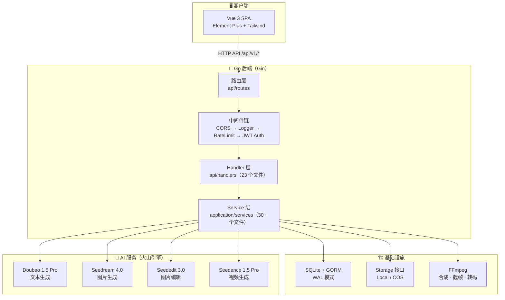
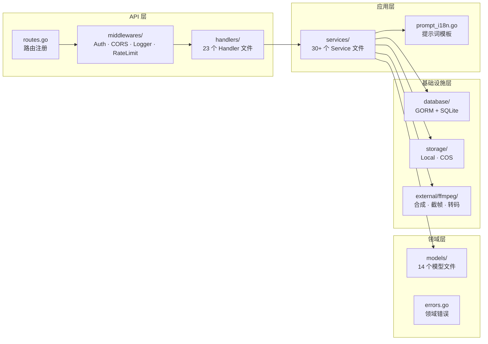
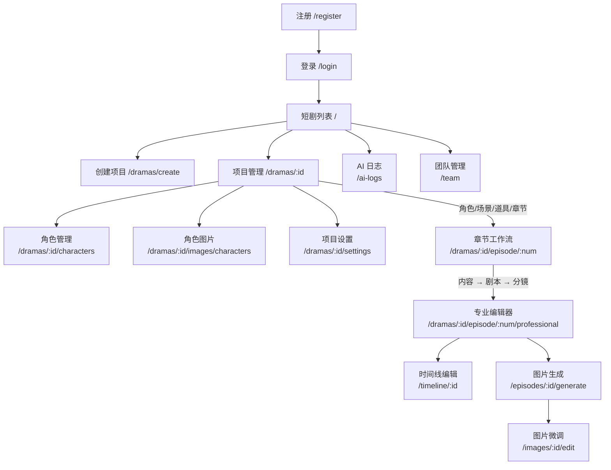
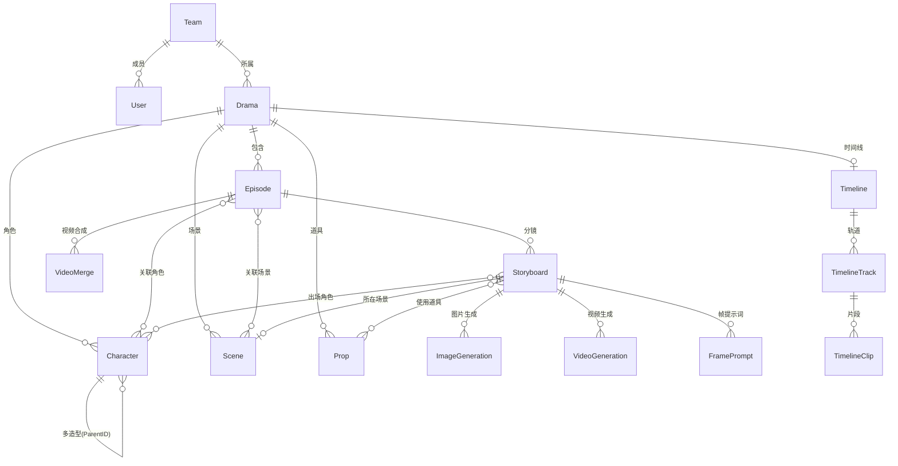
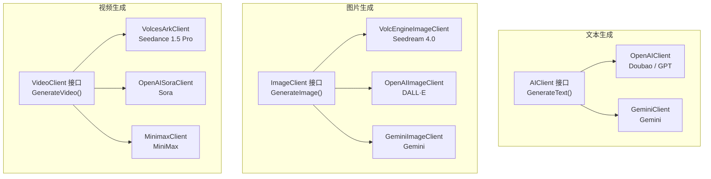
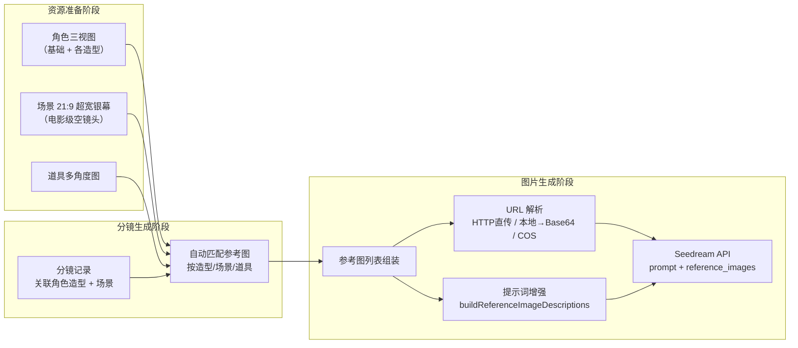
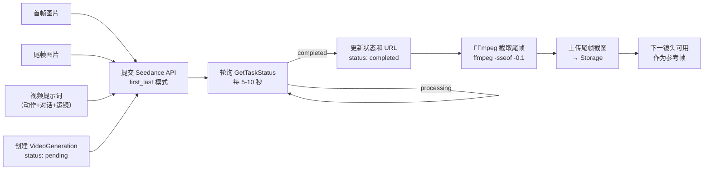
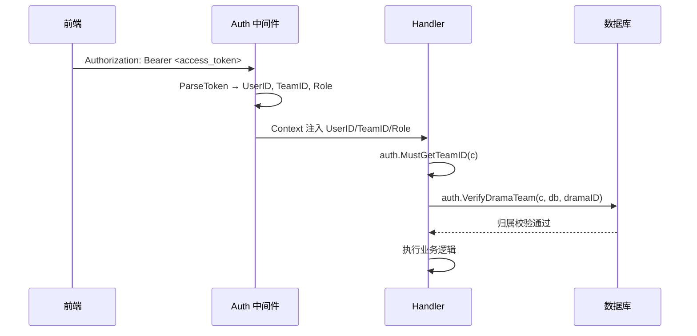

<!-- 文档同步自 https://github.com/chenweidu666/CineMaker-AI-Platform 分支 main — 请勿手工与上游长期双轨编辑 -->


<div style="text-align: center; font-size: 2rem; font-weight: 700; margin-bottom: 0.5rem;"><strong>CineMaker 技术方案</strong></div>

CineMaker 是一个全栈 AI 短剧制作平台，从剧本创作到视频成片的全流程由 AI 驱动。
本文面向开发者和技术评审，系统描述架构设计、技术选型、核心模块实现和数据流。
产品工作流详见 [产品工作流](./7.1.1_产品工作流.md)，提示词指南见 [提示词指南](./7.1.3_提示词指南.md)。


# 1. 系统架构总览


## 1.1. 技术栈

| 层级 | 技术 | 说明 |
|------|------|------|
| **后端** | Go 1.25, Gin, GORM, SQLite | 单二进制部署，WAL 模式，无需外部数据库 |
| **前端** | Vue 3, TypeScript, Vite 5, Element Plus, Tailwind 4 | Pinia 状态管理，vue-i18n 国际化 |
| **AI 服务** | 火山引擎全链路 | Doubao 文本 / Seedream 图片 / Seededit 编辑 / Seedance 视频 |
| **存储** | 本地文件系统（默认） | Storage 接口抽象，默认本地可开箱即用，支持后续扩展对象存储 |
| **媒体处理** | FFmpeg | 视频合成、尾帧提取、音频抽取、场景切分 |
| **部署** | Docker, Docker Compose | 开发环境 air 热加载，生产环境多阶段构建 |

## 1.2. 2 架构总览



> **为什么选择单体架构？** CineMaker 面向个人创作者和小团队，单体 Go 二进制 + SQLite 的组合足以支撑数十并发用户。部署只需一个 Docker 容器、一个数据文件，运维成本极低。如果未来需要水平扩展，Storage 接口和 AI 客户端接口已经做好了抽象，可以平滑迁移到微服务架构。

---


# 2. 后端分层架构


## 2.1. 四层结构



**各层职责**：

| 层级 | 路径 | 职责 | 典型文件 |
|------|------|------|---------|
| API | `api/handlers/`（23 个） | 接收 HTTP 请求，绑定参数，调用 Service，返回 JSON | `drama.go`, `storyboard.go`, `image_generation.go` |
| API | `api/middlewares/` | 横切关注点：认证、日志、限流、跨域 | `auth.go`, `ratelimit.go` |
| 应用 | `application/services/`（33 个） | 业务逻辑编排，AI 调用，异步任务管理 | `script_generation_service.go`, `frame_prompt_service.go` |
| 领域 | `domain/models/`（14 个） | GORM 模型定义，领域常量 | `drama.go`, `character_library.go` |
| 基础设施 | `infrastructure/database/` | GORM + SQLite 连接，AutoMigrate | `database.go` |
| 基础设施 | `infrastructure/storage/` | 存储接口与实现（Local / COS） | `storage.go`, `local_storage.go`, `cos_storage.go` |
| 基础设施 | `infrastructure/external/ffmpeg/` | FFmpeg 封装：视频合成、截帧、转码 | `ffmpeg.go` |

## 2 路由设计

所有路由在 `api/routes/routes.go` 中统一注册，按资源分组：

```
/api/v1/
├── auth/          # 公开：register, login, refresh
├── dramas/        # 项目管理
├── episodes/      # 章节管理
├── characters/    # 角色管理
├── character-library/  # 角色库
├── scenes/        # 场景管理
├── props/         # 道具管理
├── storyboards/   # 分镜管理
├── images/        # 图片生成
├── videos/        # 视频生成
├── video-merges/  # 视频合成
├── ai-configs/    # AI 服务配置
├── ai-logs/       # AI 调用日志
├── tasks/         # 异步任务状态
├── assets/        # 素材管理
├── upload/        # 文件上传
├── audio/         # 音频提取
└── team/          # 团队管理
```

非 `/api/` 路径统一返回 `web/dist/index.html`（SPA fallback），`/static/` 路径映射到本地存储目录。

## 3 中间件链

请求按以下顺序经过中间件：

1. **Recovery** — Gin 内置，panic 恢复
2. **CORS** — 跨域头注入，支持凭证，`/static` 和 `/assets` 单独处理
3. **Logger** — 记录请求方法、路径、状态码、耗时、IP
4. **RateLimit** — 内存计数器，每 IP 2000 次/分钟，超限返回 429
5. **Auth** — 解析 `Authorization: Bearer <token>`，将 UserID / TeamID / Role 写入 Gin Context

> **为什么选 SQLite？** 单机部署场景下，SQLite 的 WAL 模式已能提供足够的读并发。无需安装数据库服务、无需管理连接池、数据就是一个文件——`docker cp` 即可备份。连接配置使用 `_journal_mode=WAL&_busy_timeout=5000&_synchronous=NORMAL` 确保写入可靠性。

---


# 3. 前端架构


## 3.1. 技术选型

- **框架**：Vue 3 Composition API + TypeScript
- **构建**：Vite 5（HMR 热更新，开发端口 3012）
- **UI**：Element Plus 组件库 + Tailwind 4 原子化 CSS
- **状态**：Pinia（`user` 认证状态 + `episode` 缓存）
- **路由**：Vue Router 4，路由守卫处理登录态
- **国际化**：vue-i18n（当前仅中文）

## 3.2. 2 页面结构与路由



**核心页面**：

| 页面 | 组件 | 职责 |
|------|------|------|
| 项目列表 | `DramaList.vue` | 项目卡片网格、创建/编辑/删除/导出 |
| 项目管理 | `DramaManagement.vue` | 角色/场景/道具/章节的统一管理入口 |
| 章节工作流 | `EpisodeWorkflow.vue` | 三步流程：内容设定 → 剧本设计 → 分镜生成 |
| 专业编辑器 | `ProfessionalEditor.vue` | 分镜列表 + 镜头图片/视频 + 属性面板 + 时间线 |
| 图片微调 | `ImageEditor.vue` | 原图预览 + 编辑指令 + AI 局部重绘 |
| AI 日志 | `AILogs.vue` | AI 调用记录筛选、提示词调试 |
| 团队管理 | `TeamManagement.vue` | 成员邀请、角色管理、数据隔离 |

## 3 API 层

`web/src/utils/request.ts` 创建统一 axios 实例：

- **BaseURL**：`/api/v1`（Vite 代理到后端）
- **请求拦截**：自动注入 `Authorization: Bearer <token>`
- **响应拦截**：401 时自动用 RefreshToken 刷新，刷新期间其他请求排队等待
- **超时**：600 秒（适配长时间 AI 生成请求）

API 模块按领域拆分：`drama.ts`、`image.ts`、`video.ts`、`frame.ts`、`character-library.ts`、`prop.ts`、`scene-library.ts`、`ai-log.ts`、`videoAnalysis.ts` 等 22 个文件。

## 4 异步状态更新

所有 AI 生成任务（图片、视频、分镜拆分等）采用 **HTTP 轮询** 获取实时状态，不依赖 SSE 或 WebSocket：

```
前端 setInterval (2-6s)
  → GET /api/v1/images/:id  或  GET /api/v1/videos/:id
  → 检查 status 字段（pending → processing → completed / failed）
  → 终态后 clearInterval
```

> **为什么用轮询而非 WebSocket？** AI 生成任务耗时 10-120 秒，2-6 秒的轮询间隔已经足够实时。轮询实现简单、无状态、易调试，对于当前的单机部署规模完全够用。

## 5 核心重组件

| 组件 | 路径 | 规模 | 职责 |
|------|------|------|------|
| VideoTimelineEditor | `components/editor/VideoTimelineEditor.vue` | ~2960 行 | 视频时间线拖拽、片段裁剪、转场效果、播放控制 |
| StoryboardEditor | `components/editor/StoryboardEditor.vue` | ~1620 行 | 分镜列表管理、预览、时间线条 |
| GridImageEditor | `components/editor/GridImageEditor.vue` | ~520 行 | 图片网格选择、批量操作、缩略图预览 |
| ResourceTab | `components/resource/ResourceTab.vue` | ~470 行 | 资源面板：角色/场景/道具的标签页切换与展示 |
| ImageEditor | `views/editor/ImageEditor.vue` | ~800 行 | 图片微调：预设指令 + 自然语言编辑 + 结果轮询 |

---


# 4. 数据模型设计


## 4.1. 核心实体关系



## 2 多造型系统

角色的多造型通过 `Character` 表的自引用实现：

```
Character (ParentID = NULL)    ← 基础角色：姜小卷
  ├── Character (ParentID = 1) ← 造型1：黄色泡泡袖裙
  ├── Character (ParentID = 1) ← 造型2：睡衣
  ├── Character (ParentID = 1) ← 造型3：居家服
  └── Character (ParentID = 1) ← 造型4：通勤装
```

- 基础角色（`ParentID = NULL`）存储角色名称、性格、描述等元信息
- 子记录（`ParentID` 指向基础角色）存储具体造型的外貌描述（`Appearance`）、三视图（`ImageURL`）和装扮名称（`OutfitName`）
- 分镜（Storyboard）关联的是**具体造型**而非基础角色，确保图片生成时注入正确的三视图参考图

## 3 生成记录

每次 AI 调用都会创建一条生成记录，完整追踪全过程：

| 模型 | 记录内容 |
|------|---------|
| `ImageGeneration` | 提示词、模型、参考图列表、生成尺寸、种子值、结果 URL、状态、错误信息 |
| `VideoGeneration` | 提示词、首帧/尾帧 URL、参考图 URL、分辨率、时长、参考模式、状态 |
| `FramePrompt` | 分镜 ID、帧类型（first/key/last/panel/action）、AI 生成的提示词文本 |
| `AIMessageLog` | 请求 ID、服务类型、System/User Prompt、完整请求/响应、耗时、Token 用量 |

## 4 团队数据隔离

数据隔离在 Handler 层强制执行，不在中间件层：

1. JWT 中间件将 `TeamID` 写入 Gin Context
2. Handler 调用 `auth.MustGetTeamID(c)` 获取当前团队 ID
3. 访问资源时调用 `auth.VerifyDramaTeam(c, db, dramaID)` 校验归属
4. 列表查询通过 `auth.TeamScope(teamID)` GORM Scope 自动追加 `WHERE team_id = ?`

`pkg/auth/ownership.go` 提供了全资源的归属校验函数：`VerifyDramaTeam`、`VerifyEpisodeTeam`、`VerifyCharacterTeam`、`VerifySceneTeam`、`VerifyPropTeam`、`VerifyImageGenTeam`、`VerifyStoryboardTeam`、`VerifyVideoGenTeam` 等。

---


# 5. AI 服务集成


## 5.1. 三类 AI 客户端



每个接口都定义了统一的方法签名和 Option 模式：

| 接口 | 核心方法 | 关键 Option |
|------|---------|-------------|
| `AIClient` | `GenerateText(prompt, systemPrompt, opts...)` | Vision 图片输入 |
| `ImageClient` | `GenerateImage(prompt, opts...)` | `WithReferenceImages`, `WithSize`, `WithModel`, `WithEditMode` |
| `VideoClient` | `GenerateVideo(imageURL, prompt, opts...)` | `WithFirstFrame`, `WithLastFrame`, `WithReferenceImages`, `WithDuration` |

## 2 多供应商动态选择

AI 供应商和模型的选择通过数据库配置（`AIServiceConfig` + `AIServiceProvider`）驱动，而非硬编码：

```
AIServiceConfig
├── service_type: text / image / video
├── provider: volcengine / openai / gemini / minimax
├── model: ["doubao-1.5-pro", "seedream-4.0", ...]
├── base_url, api_key, endpoint
├── is_default: true / false
├── is_active: true / false
└── priority: 排序权重
```

服务层的选择逻辑：

1. 如果请求指定了模型名 → `GetConfigForModel(serviceType, modelName)` 精确匹配
2. 否则 → `GetDefaultConfig(serviceType)` 取 `is_default=true` 的配置
3. 根据 `config.Provider` 实例化对应客户端（`volcengine` → `VolcEngineImageClient`、`openai` → `OpenAIImageClient` 等）

> **当前默认配置**：文本 Doubao 1.5 Pro、图片 Seedream 4.0、图片编辑 Seededit 3.0、视频 Seedance 1.5 Pro。全链路统一火山引擎平台，API 一致、账单统一。

## 3 AI 日志系统

每次 AI 调用都通过 `AIMessageLog` 完整记录：

```
AIMessageLog
├── RequestID (UUID)         # 唯一标识
├── ServiceType              # text / image / video
├── Purpose                  # 用途描述
├── Provider + Model         # 供应商和模型
├── SystemPrompt             # 系统提示词
├── UserPrompt               # 用户提示词
├── FullRequest              # 完整请求体
├── Response                 # AI 原始响应
├── Status                   # success / failed
├── DurationMs               # 耗时（毫秒）
├── PromptTokens / CompletionTokens / TotalTokens
└── DramaID                  # 关联项目（可选）
```

前端的 AI 日志页面支持按服务类型、状态、时间范围筛选，点击任意记录可查看完整的 System Prompt、User Prompt、参考图和 AI 响应——对提示词调试非常有用。

---


# 6. 提示词工程系统


## 6.1. 模板集中管理

所有系统提示词（System Prompt）集中在 `application/services/prompt_i18n.go` 中，通过 `PromptI18n` 结构体统一管理：

| 方法 | 用途 | 典型调用方 |
|------|------|-----------|
| `GetStoryboardSystemPrompt()` | 分镜拆分（JSON 输出） | `StoryboardService` |
| `GetFirstFramePrompt(style, ratio)` | 首帧图片提示词生成 | `FramePromptService` |
| `GetLastFramePrompt(style, ratio)` | 尾帧图片提示词生成 | `FramePromptService` |
| `GetKeyFramePrompt(style, ratio)` | 关键帧图片提示词 | `FramePromptService` |
| `GetVideoPromptGenerationPrompt(ratio)` | 视频提示词生成 | `StoryboardService` |
| `GetVideoConstraintPrompt(refMode)` | 视频约束条件 | `StoryboardService` |
| `GetCharacterExtractionPrompt(style)` | 角色信息提取 | `ScriptGenerationService` |
| `GetSceneExtractionPrompt(style)` | 场景信息提取 | `ScriptGenerationService` |
| `GetPropExtractionPrompt(style)` | 道具信息提取 | `ScriptGenerationService` |
| `GetOutlineGenerationPrompt()` | 剧本大纲生成 | `ScriptGenerationService` |
| `GetEpisodeScriptPrompt()` | 单集剧本生成 | `ScriptGenerationService` |
| `GetStylePrompt(style)` | 风格描述片段 | 各 Frame 生成 |

## 6.2. 2 用户提示词格式化

用户提示词（User Prompt）通过 `FormatUserPrompt(key, args...)` 按场景填充变量：

```
模板 key                     填充内容
─────────────────           ────────────
drama_info_template         剧本信息、角色列表、场景列表
frame_info                  首帧分镜描述、角色外貌、场景信息
last_frame_info             首帧描述 + 尾帧变化描述
last_frame_info_with_first  首帧描述 + 首帧提示词 + 尾帧变化
key_frame_info              关键帧分镜描述
```

这种模板化设计让提示词的调整只需修改 `prompt_i18n.go` 一处，所有调用方自动生效。

## 3 翻译层

`prompt_translator.go` 为非 Seedream 的图片/视频模型提供中文 → 英文翻译：

- Seedream 原生支持中文提示词 → 直接使用
- DALL·E、Gemini 等模型 → 调用大模型将中文提示词翻译为英文后再发送

翻译结果不缓存，每次实时翻译，确保与最新提示词同步。

---


# 7. 参考图注入机制


## 7.1. 注入流程



## 2 参考图类型

生成首帧图片时，系统自动注入以下参考图：

| 序号 | 类型 | 来源 | 作用 |
|------|------|------|------|
| 1 | 风格锚定图 | 第一个镜头的首帧图片 | 保证全集视觉风格统一 |
| 2 | 场景背景图 | 当前场景的 21:9 超宽银幕空镜头 | 控制背景环境、光影氛围 |
| 3 | 角色造型图 | 当前镜头关联的具体造型三视图 | 保证角色外貌、服装一致 |
| 4 | 首帧图片 | （仅尾帧生成）本镜头已完成的首帧 | 保证首尾画面连贯 |
| 5 | 上一镜头尾帧 | （开启参考帧时）上一视频的最后一帧 | 保证镜头间画面连续 |

## 3 URL 解析策略

参考图来源多样，`image_generation_service.go` 中的解析逻辑处理三种情况：

| 来源 | 处理方式 |
|------|---------|
| COS 公网 URL（当前默认） | 直接传递给 AI API（公网可达） |
| `https://...` 其他公网 URL | 直接传递给 AI API |
| `http://localhost:5678/static/...` 本地 URL（仅降级模式） | Docker 容器内读取文件，转为 Base64 data URL |

## 4 提示词增强

`buildReferenceImageDescriptions()` 自动为每张参考图生成描述文本并注入到提示词末尾：

```
输入图片说明：
- 第1张图为场景背景（21:9超宽银幕参考图），请参考其环境、光影和氛围
- 第2张图为角色造型参考图，请严格参考其外貌、服装和配饰
- 第3张图为风格锚定参考图，请保持一致的画风和色调
```

对于尾帧生成，额外追加指令："以首帧为基础……仅对变化部分修改"，引导 AI 做最小修改而非重新生成。

---


# 8. 视频生成流水线


## 8.1. 单镜头视频生成



**首尾帧模式**：`reference_mode: "first_last"`，将首帧图片和尾帧图片作为视频的起止画面传入 Seedance API。视频模型在两张图片之间生成平滑的动态过渡，视频提示词负责描述中间的动作、对话和运镜。

## 2 异步任务管理

视频生成是异步的，完整生命周期：

1. **创建记录**：`VideoGeneration` 入库，`status: pending`
2. **提交 API**：调用 `VolcesArkClient.GenerateVideo()`，获取 `taskID`
3. **轮询状态**：前端 `setInterval` 调用后端 → 后端调用 `GetTaskStatus(taskID)` → 返回 `processing` 或 `completed`
4. **完成处理**：更新 `VideoURL`、`Status`、`CompletedAt`
5. **尾帧提取**：`ffmpeg -sseof -0.1 -i video.mp4 -frames:v 1 -q:v 2 last_frame.jpg`

## 3 镜头间链式传递

```
镜头 1 视频完成 → FFmpeg 截取尾帧 → 上传存储
                                        ↓
镜头 2 开启参考帧 → 尾帧截图自动注入参考图列表
                  → 首帧提示词只描述变化
                  → AI 生成与前一镜头自然衔接的画面
```

这个链式机制实现了同场景连续镜头之间的画面连续性。

## 4 视频合成

单集所有镜头生成完毕后，通过 `VideoMergeService` + FFmpeg 合成完整视频：

1. **下载**：将各镜头视频从 Storage 下载到本地临时目录
2. **裁剪**：按 `StartTime` / `EndTime` 裁剪有效片段（`ffmpeg -ss ... -to ...`）
3. **转场拼接**：使用 FFmpeg `xfade` 滤镜在相邻片段间添加转场效果
4. **输出**：合并后的视频上传到 Storage，创建 `VideoMerge` 记录

---


# 9. 存储系统


## 9.1. 接口抽象

`infrastructure/storage/storage.go` 定义统一的 Storage 接口：

| 方法 | 职责 |
|------|------|
| `Upload(file, filename, category)` | 上传文件，返回访问 URL |
| `Delete(url)` | 删除文件 |
| `GetURL(path)` | 相对路径 → 完整 URL |
| `DownloadFromURL(url, category)` | 下载远程文件到本地，返回 URL |
| `GetAbsolutePath(relativePath)` | 获取文件的本地绝对路径 |

## 9.2. 2 两种实现

| 实现 | 存储位置 | URL 格式 | 状态 |
|------|---------|---------|------|
| `LocalStorage` | `data/storage/` 目录 | `http://host:port/static/category/file` | **当前默认** |
| `COSStorage` | 腾讯云对象存储 | `https://cinemaker-<APPID>.cos.<region>.myqcloud.com/category/file` | 可选扩展 |

切换方式：修改 `config.yaml` 中的 `storage.type` 字段（`local` 或 `cos`），无需改代码。`main.go` 启动时根据配置实例化对应实现，注入到所有需要存储的 Service 中。

## 9.3. 3 本地默认配置（可选扩展 COS）

Public 版默认使用本地存储，不需要云密钥：

```yaml
# configs/config.yaml
storage:
  type: "local"
  local_path: "./data/storage"
  base_url: "http://localhost:5678/static"
  cos:
    bucket: ""
    region: "ap-shanghai"
    secret_id: ""      # 预留扩展
    secret_key: ""     # 预留扩展
    cdn_url: ""        # 预留扩展
```

```dotenv
# .env（已加入 .gitignore）
STORAGE_TYPE=local
```

所有新上传的图片/视频默认写入本地目录 `data/storage/`，通过 `/static` 路由访问。

## 4 何时考虑启用对象存储

LocalStorage 模式下，生成的图片 URL 形如 `http://localhost:5678/static/...`，在本机开发与单机部署场景可直接使用。若你需要跨公网或由外部服务直接回源下载素材，可按需切换到对象存储（如 COS）。

> **降级模式**：当使用 LocalStorage 时，`resolveLocalURLToPath()` 将 URL 转为容器内的文件路径，然后 `loadImageAsBase64()` 读取文件内容编码为 Base64 data URL 发送给 AI API。但 Base64 方式受限于请求体大小和部分 API 的兼容性，因此仅建议在断网调试时使用。

---


# 10. 认证与多租户


## 10.1. JWT 双 Token

| Token | 有效期 | 用途 |
|-------|-------|------|
| AccessToken | 30 分钟 | API 请求认证 |
| RefreshToken | 7 天 | 无感刷新 AccessToken |

Token 中包含 `UserID`、`TeamID`、`Role`（owner / admin / member）。

## 10.2. 2 认证流程



## 3 数据隔离策略

| 层级 | 机制 | 代码 |
|------|------|------|
| 中间件 | 解析 JWT，注入 TeamID | `api/middlewares/auth.go` |
| Handler | 获取 TeamID，校验资源归属 | `auth.MustGetTeamID` + `auth.VerifyXxxTeam` |
| Service | 列表查询追加 TeamID 条件 | `auth.TeamScope(teamID)` GORM Scope |
| 关联资源 | 逐级向上追溯 TeamID | Drama → Episode → Storyboard → Image/Video |

关联资源（如 Storyboard）不直接存储 TeamID，而是通过 Episode → Drama 链路向上追溯到 TeamID 进行校验。

---


# 11. 部署架构


## 11.1. 开发 vs 生产

| 维度 | 开发模式 | 生产模式 |
|------|---------|---------|
| Compose 文件 | `docker-compose.dev.yml` | `docker-compose.yml` |
| 后端镜像 | `Dockerfile.dev`（Go 工具链 + air） | `Dockerfile`（多阶段构建，单二进制） |
| 代码加载 | 源码挂载 `.:/app` | 编译进镜像 |
| 后端进程 | air → 文件变动自动重编译 | `./cinemaker` 直接运行 |
| 前端 | 独立容器 Vite dev（HMR，端口 3012） | 静态文件 `web/dist/` 由后端 Gin 托管 |
| 端口 | 5678（后端）+ 3012（前端） | 7860 → 5678 |
| 重建条件 | 仅 `go.mod` / `Dockerfile.dev` 变更时 | 每次 `deploy start` |

## 11.2. 2 统一入口脚本

`start.sh` 封装所有开发和部署操作：

| 命令 | 说明 |
|------|------|
| `bash start.sh dev` | 启动开发环境（后端 + 前端容器） |
| `bash start.sh stop` | 停止所有容器 |
| `bash start.sh restart` | 重启 |
| `bash start.sh rebuild` | 重建镜像（go.mod 变更后） |
| `bash start.sh logs b -f` | 查看后端日志 |
| `bash start.sh status` | 查看运行状态和访问地址 |
| `bash start.sh deploy start` | 生产部署 |
| `bash start.sh deploy stop` | 停止生产环境 |

## 11.3. 3 数据库迁移

- **主要方式**：GORM `AutoMigrate`，启动时自动同步所有模型到数据库 Schema（新增表/列）
- **辅助方式**：`migrations/*.sql` 手动 SQL，用于一次性数据修补（如添加字段默认值）
- **数据迁移工具**：`cmd/migrate/main.go` 编译为独立二进制 `migrate`，用于存储迁移；`scripts/migrate_to_cos.py` 用于批量上传本地文件到 COS 并更新数据库 URL

> **AutoMigrate 的局限**：GORM AutoMigrate 只做加法（添加表和列），不会删除旧列或修改列类型。需要破坏性变更时，通过 `migrations/*.sql` 手动执行。

---


# 12. 附录：相对开源版本的核心改进


CineMaker 基于 [火宝短剧（huobao-drama）](https://github.com/chatfire-AI/huobao-drama) 二次开发，主要改进包括：

| 领域 | 改进 |
|------|------|
| **角色系统** | 新增多造型系统（基础形象 + N 套换装），分镜级造型关联，三视图生成 |
| **分镜设计** | 两阶段拆分（整体方案 → 逐镜头细化），三段描述（首帧/中间过程/尾帧） |
| **参考图** | 自动注入机制（角色造型 + 场景 21:9 超宽银幕 + 道具 + 风格锚定 + 参考帧） |
| **图片微调** | 快捷编辑指令 + 自然语言局部重绘（基于 Seededit） |
| **视频编辑器** | 专业时间线编辑、20+ 转场效果、片段裁剪、键盘快捷键 |
| **道具系统** | 道具管理和设定图生成，角色前缀命名自动关联 |
| **团队协作** | JWT 认证、多团队数据隔离、成员邀请 |
| **存储** | 本地文件系统为默认存储；Storage 接口抽象，可扩展对象存储 |
| **AI 日志** | 完整的 API 调用追踪，提示词调试 |
| **提示词工程** | 集中模板管理、参考图描述注入、Seedream/Seedance 深度适配 |
