<div align="center">

# 云端大模型

</div>

随着大语言模型（LLM）参数量从 7B 增长到 175B+，模型推理面临**显存占用大**、**计算延迟高**、**吞吐量低**等挑战。将训练好的 PyTorch 模型直接部署到生产环境往往无法满足实际需求，必须经过**模型优化**和**服务化部署**两个关键阶段，才能实现高效、稳定、可扩展的推理服务。

**核心挑战**：
- **显存限制**：70B 模型 FP32 需要 280GB 显存，单卡 A100（80GB）无法承载
- **延迟要求**：生产环境要求首字延迟（TTFT）< 200ms，生成延迟（TPOT）< 50ms/token
- **吞吐量需求**：需要支持高并发请求，QPS 达到 1000+
- **成本控制**：通过量化、批处理等技术降低单次推理成本

**解决方案**：云端大模型的在线推理部署通常采用**模型优化技术**和**模型部署技术**两大核心技术栈，以英伟达技术栈为例：

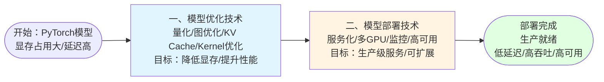

**1、模型优化技术**：将 PyTorch 模型转换为高效的推理引擎，通过**量化**（INT8/INT4 降低显存 50-75%）、**图优化**（算子融合减少 kernel 调用）、**KV Cache 优化**（PagedAttention 支持更大 batch）、**Kernel 优化**（CUDA 定制加速）等技术，将模型从开发态优化为生产态，实现**延迟降低 2-5 倍**、**吞吐量提升 3-10 倍**。

**2、模型部署技术**：将优化后的模型引擎封装成可运行的推理服务，通过**服务化框架**（Triton Inference Server 提供动态批处理、多模型管理）、**多 GPU 并行**（Tensor Parallelism/Pipeline Parallelism 解决单卡显存不足）、**API 接口**（REST/gRPC/SSE 流式支持）、**监控运维**（Prometheus/Grafana/DCGM 实时监控）、**高可用扩展**（Kubernetes 自动扩缩容、负载均衡）等技术，实现**7×24 小时稳定运行**、**按需弹性扩展**、**故障自动恢复**。

以**8 卡 A100 服务器部署 70B 模型**为例：通过 Tensor Parallelism（TP=8）将模型拆分到 8 张 GPU，每张 GPU 只需 35GB 显存；通过 INT8 量化进一步降低到 18GB/卡；通过 Triton 动态批处理将 GPU 利用率提升到 80%+；最终实现 **QPS > 500**、**P99 延迟 < 500ms** 的生产级性能。

---

# 1. 模型优化技术

模型优化技术包括量化、图优化、KV Cache优化、Kernel优化等，目的是提升推理性能和降低资源消耗。


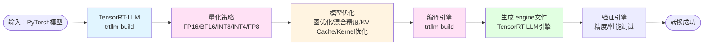

**技术栈**：
- **模型格式转换**：PyTorch/Transformers → **<span style="color: red; font-weight: bold">TensorRT-LLM</span>**
- **<span style="color: red; font-weight: bold">量化技术</span>**：TensorRT-LLM 内置量化（**<span style="color: red; font-weight: bold">FP16</span>**/**<span style="color: red; font-weight: bold">BF16</span>**/**<span style="color: red; font-weight: bold">INT8</span>**/**<span style="color: red; font-weight: bold">INT4</span>**/**<span style="color: red; font-weight: bold">FP8</span>**）
- **<span style="color: red; font-weight: bold">图优化</span>**：**<span style="color: red; font-weight: bold">算子融合</span>**、常量折叠、死代码消除
- **性能分析工具**：NVIDIA Nsight Systems、TensorRT Profiler

**流程**：
1. 使用 **<span style="color: red; font-weight: bold">TensorRT-LLM</span>** 直接转换 PyTorch 模型
2. 选择<span style="color: red; font-weight: bold">量化策略</span>（<span style="color: red; font-weight: bold">FP16</span>/<span style="color: red; font-weight: bold">BF16</span>/<span style="color: red; font-weight: bold">INT8</span>/<span style="color: red; font-weight: bold">INT4</span>/<span style="color: red; font-weight: bold">FP8</span>）
3. 进行<span style="color: red; font-weight: bold">图优化</span>（<span style="color: red; font-weight: bold">算子融合</span>、常量折叠等）
4. 配置<span style="color: red; font-weight: bold">混合精度</span>（敏感层保持 FP16）
5. 优化<span style="color: red; font-weight: bold">KV Cache</span>（<span style="color: red; font-weight: bold">PagedAttention</span> 配置）
6. <span style="color: red; font-weight: bold">Kernel 优化</span>（CUDA 定制）
7. 使用 <span style="color: red; font-weight: bold">TensorRT-LLM</span> 的 `trtllm-build` 工具编译模型
8. 生成 TensorRT-LLM 引擎文件（.engine）
9. 验证引擎精度和性能

**包含的优化技术：**
- **量化技术**：FP16/BF16/INT8/INT4/FP8（降低显存占用 50-75%）
- **图优化**：算子融合、常量折叠、死代码消除（减少 kernel 调用）
- **混合精度配置**：敏感层保持FP16，其他层量化（平衡精度与性能）
- **KV Cache优化**：PagedAttention分页管理（支持更大 batch size）
- **Kernel优化**：CUDA定制kernel（硬件级加速）
- **FlashAttention优化**：分块计算和重计算机制（降低注意力计算显存和延迟）

下面将详细介绍各项优化技术的原理、实现方式和最佳实践：

## 1.1 量化技术

**作用**：通过降低模型权重的数值精度（FP16/BF16/INT8/INT4/FP8），减少显存占用 50-75%，提升推理速度，是模型优化的核心技术之一。

**量化原理**：量化是将高精度浮点数（FP32）转换为低精度数值（FP16/BF16/INT8/INT4/FP8）的过程。通过减少每个权重的存储位数，可以大幅降低显存占用和计算量，同时利用 Tensor Core 等硬件加速单元提升计算速度。

**量化流程**：

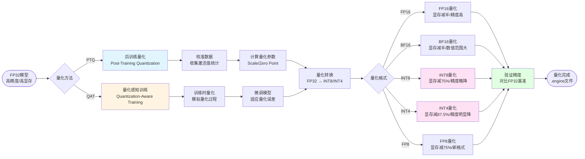

**技术栈**：
- **量化框架**：**<span style="color: red; font-weight: bold">TensorRT-LLM</span>** 内置量化引擎
- **量化格式**：**<span style="color: red; font-weight: bold">FP16</span>**、**<span style="color: red; font-weight: bold">BF16</span>**、**<span style="color: red; font-weight: bold">INT8</span>**、**<span style="color: red; font-weight: bold">INT4</span>**、**<span style="color: red; font-weight: bold">FP8</span>**
- **量化方法**：**<span style="color: red; font-weight: bold">PTQ（后训练量化）</span>**、**<span style="color: red; font-weight: bold">QAT（量化感知训练）</span>**
- **校准工具**：TensorRT-LLM Calibration、校准数据集

**量化格式对比**：

| 格式 | 位数 | 显存减少 | 精度损失 | 适用场景 | Tensor Core支持 |
|------|------|----------|----------|----------|----------------|
| **FP32** | 32位 | 基准 | 无 | 训练/高精度推理 | ❌ |
| **<span style="color: red; font-weight: bold">FP16</span>** | 16位 | 50% | 极小 | 通用推理，精度要求高 | ✅ |
| **<span style="color: red; font-weight: bold">BF16</span>** | 16位 | 50% | 极小 | 大数值范围场景 | ✅ |
| **<span style="color: red; font-weight: bold">INT8</span>** | 8位 | 75% | 小 | 生产环境，平衡性能与精度 | ✅ |
| **<span style="color: red; font-weight: bold">INT4</span>** | 4位 | 87.5% | 中等 | 资源受限场景，端侧部署 | ✅ |
| **<span style="color: red; font-weight: bold">FP8</span>** | 8位 | 75% | 小 | H100等新硬件，未来趋势 | ✅ (H100+) |

**核心知识点**：

1. **PTQ（后训练量化）**：
   - **原理**：在模型训练完成后，使用校准数据集收集激活值统计信息，计算量化参数（Scale、Zero Point），然后直接量化模型权重
   - **优点**：无需重新训练，速度快，适合快速部署
   - **缺点**：精度损失相对较大，需要校准数据集
   - **适用场景**：快速部署、资源受限、精度要求不极致

2. **QAT（量化感知训练）**：
   - **原理**：在训练过程中模拟量化过程，让模型适应量化误差，训练结束后直接导出量化模型
   - **优点**：精度损失小，模型已适应量化
   - **缺点**：需要重新训练，时间长，成本高
   - **适用场景**：精度要求高、有训练资源、长期部署

3. **量化参数计算**：
   - **对称量化**：`quantized_value = round(float_value / scale)`
   - **非对称量化**：`quantized_value = round(float_value / scale) + zero_point`
   - **Scale**：量化缩放因子，`scale = (max - min) / (2^bits - 1)`
   - **Zero Point**：量化零点偏移，用于非对称量化

4. **TensorRT-LLM 量化实现**：
   - 使用 `trtllm-build` 工具时指定 `--quantization` 参数
   - 支持 `fp8`, `int8_sq`, `int4_awq`, `int4_gptq` 等量化模式
   - 自动选择最优量化策略，支持逐层量化
   - 集成校准工具，自动收集激活值统计

**最佳实践**：

1. **量化策略选择**：
   - **精度优先**：使用 FP16/BF16，显存减少 50%，精度几乎无损
   - **性能优先**：使用 INT8，显存减少 75%，精度损失 <1%
   - **极致压缩**：使用 INT4，显存减少 87.5%，精度损失 2-5%

2. **敏感层处理**：
   - 输出层、LayerNorm 等敏感层保持 FP16
   - 注意力层可以量化到 INT8
   - 线性层可以量化到 INT4

3. **校准数据集**：
   - 使用 100-1000 条代表性样本
   - 覆盖模型常见输入分布
   - 避免使用训练集，防止过拟合

4. **精度验证**：
   - 在验证集上对比量化前后精度
   - 关注关键指标（准确率、BLEU、ROUGE等）
   - 设置精度损失阈值（通常 <2%）

5. **性能测试**：
   - 测试量化后的推理速度
   - 验证显存占用减少
   - 对比吞吐量提升（通常 2-4 倍）

## 1.2 图优化

**作用**：通过算子融合、常量折叠、死代码消除等技术，减少 kernel 调用次数，降低计算开销，提升推理效率。

**图优化原理**：图优化是在计算图（Computational Graph）级别对模型进行优化，通过分析算子之间的依赖关系，将多个小算子融合成一个大算子，消除中间结果的内存读写，减少 kernel 启动开销，从而提升推理性能。

**图优化流程**：

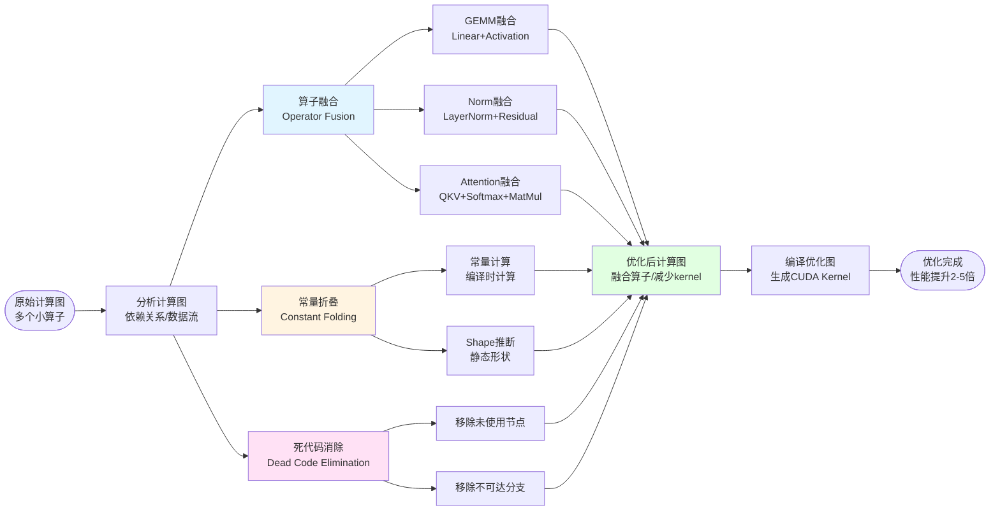

**技术栈**：
- **优化框架**：**<span style="color: red; font-weight: bold">TensorRT-LLM</span>** 图优化引擎
- **融合策略**：**<span style="color: red; font-weight: bold">算子融合（Operator Fusion）</span>**、**<span style="color: red; font-weight: bold">常量折叠（Constant Folding）</span>**、**<span style="color: red; font-weight: bold">死代码消除（Dead Code Elimination）</span>**
- **优化工具**：TensorRT Graph Optimizer、NVIDIA Nsight Systems（性能分析）

**核心优化技术**：

1. **算子融合（Operator Fusion）**：
   - **原理**：将多个连续的小算子合并成一个复合算子，减少 kernel 启动次数和中间结果的内存读写
   - **常见融合模式**：
     - **GEMM + Activation**：`Linear + ReLU/GELU/SiLU` → 融合为单个 kernel
     - **LayerNorm + Residual**：`LayerNorm + Add` → 融合为单个 kernel
     - **Attention 融合**：`QKV Projection + Softmax + MatMul` → 融合为 FlashAttention kernel
     - **MLP 融合**：`Linear + Activation + Linear` → 融合为单个 kernel
   - **性能提升**：减少 50-70% 的 kernel 调用，降低 30-50% 的内存带宽

2. **常量折叠（Constant Folding）**：
   - **原理**：在编译时计算常量表达式，将结果直接嵌入到模型中，避免运行时计算
   - **优化示例**：
     - `Shape([1, 512, 1024])` → 编译时计算，运行时直接使用
     - `Constant + Constant` → 编译时相加，运行时使用结果
   - **性能提升**：消除不必要的运行时计算，减少计算开销

3. **死代码消除（Dead Code Elimination）**：
   - **原理**：移除计算图中未被使用的节点和分支，简化计算图
   - **优化场景**：
     - 移除训练时的 Dropout 层（推理时不需要）
     - 移除未使用的输出分支
     - 移除不可达的代码路径
   - **性能提升**：减少不必要的计算和内存分配

**核心知识点**：

1. **融合策略选择**：
   - **计算密集型融合**：GEMM、MatMul 等计算密集算子优先融合
   - **内存密集型融合**：减少中间结果的读写，降低内存带宽压力
   - **硬件适配**：根据 Tensor Core 特性选择最优融合模式

2. **融合限制**：
   - **数据依赖**：必须保证数据流正确性
   - **显存限制**：融合后 kernel 的显存占用不能超过限制
   - **硬件限制**：某些算子组合无法融合（如不同精度混合）

3. **TensorRT-LLM 自动优化**：
   - 自动识别可融合的算子模式
   - 根据硬件特性选择最优融合策略
   - 支持自定义融合规则

**最佳实践**：

1. **融合模式优化**：
   - 优先融合计算密集型算子（GEMM、MatMul）
   - 将激活函数与线性层融合，减少 kernel 调用
   - Attention 层使用 FlashAttention 融合模式

2. **常量优化**：
   - 将 Shape 计算移到编译时
   - 常量表达式提前计算
   - 使用静态形状推断

3. **代码清理**：
   - 移除训练专用层（Dropout、BatchNorm 训练模式）
   - 移除未使用的输出分支
   - 简化条件分支逻辑

4. **性能验证**：
   - 使用 Nsight Systems 分析 kernel 调用次数
   - 对比优化前后的内存带宽使用
   - 验证性能提升（通常 2-5 倍）

## 1.3 混合精度配置

**作用**：针对不同层的敏感度，采用不同的数值精度（敏感层保持 FP16，其他层量化），在平衡精度与性能的同时，最大化推理速度。

**混合精度原理**：混合精度是指在模型的不同层使用不同的数值精度，对精度敏感的关键层（如输出层、LayerNorm）保持高精度（FP16），对精度不敏感的计算层（如线性层、注意力层）使用低精度（INT8/INT4），在保证模型精度的同时最大化性能提升。

**混合精度配置流程**：

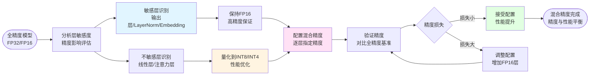

**技术栈**：
- **配置框架**：**<span style="color: red; font-weight: bold">TensorRT-LLM</span>** 混合精度配置
- **精度类型**：**<span style="color: red; font-weight: bold">FP16</span>**（敏感层）、**<span style="color: red; font-weight: bold">INT8</span>**（计算层）、**<span style="color: red; font-weight: bold">INT4</span>**（非关键层）
- **配置方式**：逐层精度配置、自动敏感度分析

**核心配置策略**：

1. **敏感层识别**：
   - **输出层**：最终输出对精度要求高，必须保持 FP16
   - **LayerNorm**：归一化层对数值稳定性敏感，建议 FP16
   - **Embedding 层**：词嵌入层对精度敏感，建议 FP16
   - **第一层和最后一层**：输入输出层通常保持 FP16

2. **可量化层**：
   - **线性层（Linear/MLP）**：计算密集，量化收益大，可以量化到 INT8
   - **注意力层（Attention）**：QKV 投影可以量化，Softmax 保持 FP16
   - **中间层**：模型中间层通常可以量化到 INT8 或 INT4

3. **精度配置原则**：
   - **精度优先**：关键路径保持 FP16，确保精度
   - **性能优先**：非关键路径量化，提升性能
   - **平衡策略**：在精度损失 <1% 的前提下，最大化量化比例

**核心知识点**：

1. **敏感度分析方法**：
   - **逐层量化测试**：逐层量化并测试精度影响
   - **梯度分析**：分析训练时的梯度大小，梯度大的层通常更敏感
   - **激活值分析**：分析激活值的分布，分布范围大的层可能更敏感

2. **TensorRT-LLM 配置**：
   - 在 `config.pbtxt` 中逐层指定精度
   - 支持自动敏感度分析
   - 支持混合精度编译

3. **精度损失控制**：
   - **阈值设置**：通常设置精度损失阈值 <1%
   - **验证方法**：在验证集上对比混合精度和全精度结果
   - **动态调整**：根据验证结果动态调整精度配置

4. **性能收益**：
   - **显存减少**：混合精度可以比全 FP16 减少 20-40% 显存
   - **速度提升**：INT8 层计算速度是 FP16 的 2-4 倍
   - **吞吐量提升**：整体吞吐量提升 1.5-3 倍

**最佳实践**：

1. **配置策略**：
   - 输出层、LayerNorm 保持 FP16
   - 线性层量化到 INT8
   - 注意力层 QKV 量化，Softmax 保持 FP16
   - 中间层可以尝试 INT4

2. **精度验证**：
   - 在验证集上对比精度损失
   - 关注关键指标（准确率、BLEU、ROUGE等）
   - 设置精度损失阈值（通常 <1%）

3. **性能测试**：
   - 测试混合精度后的推理速度
   - 验证显存占用减少
   - 对比吞吐量提升

4. **迭代优化**：
   - 从保守配置开始（更多 FP16 层）
   - 逐步增加量化层，测试精度影响
   - 找到精度和性能的最佳平衡点

## 1.4 KV Cache 优化

**作用**：通过 PagedAttention 分页管理机制，优化 KV Cache 的内存使用，支持更大的 batch size，提升吞吐量。

**KV Cache 原理**：在自回归生成过程中，每次生成新 token 时都需要使用之前所有 token 的 Key 和 Value 向量。KV Cache 将这些向量缓存起来，避免重复计算，但传统方式会导致内存碎片化，限制 batch size。

**PagedAttention 优化原理**：PagedAttention 借鉴操作系统的分页内存管理思想，将 KV Cache 分成固定大小的页（Page），每个请求的 KV Cache 可以分散存储在多个页中，通过页表管理，实现高效的内存分配和回收，消除内存碎片。

**KV Cache 优化流程**：

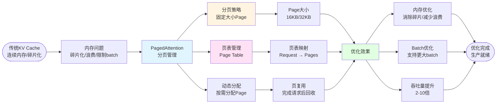

**技术栈**：
- **优化技术**：**<span style="color: red; font-weight: bold">PagedAttention</span>**（分页注意力机制）
- **内存管理**：**<span style="color: red; font-weight: bold">分页内存管理</span>**、**<span style="color: red; font-weight: bold">页表（Page Table）</span>**
- **实现框架**：**<span style="color: red; font-weight: bold">TensorRT-LLM</span>** 内置 PagedAttention 支持

**核心优化技术**：

1. **传统 KV Cache 问题**：
   - **内存碎片化**：不同请求的序列长度不同，导致内存分配不连续，产生碎片
   - **内存浪费**：为每个请求预分配最大长度，但实际使用可能远小于最大值
   - **Batch 限制**：内存碎片化限制了可以同时处理的请求数量

2. **PagedAttention 解决方案**：
   - **分页存储**：将 KV Cache 分成固定大小的页（如 16KB），每个请求的 KV Cache 可以分散在多个页中
   - **页表管理**：维护页表（Page Table），记录每个请求使用的页号，实现逻辑连续、物理分散
   - **动态分配**：按需分配页，请求完成后回收页，实现内存复用

3. **性能优势**：
   - **消除碎片**：固定大小页消除了内存碎片化问题
   - **支持更大 Batch**：内存利用率提升，可以同时处理更多请求
   - **吞吐量提升**：Batch size 增加带来 2-10 倍吞吐量提升

**核心知识点**：

1. **页大小选择**：
   - **小页（16KB）**：更灵活，适合短序列，但页表开销大
   - **大页（32KB/64KB）**：页表开销小，适合长序列，但可能浪费
   - **最佳实践**：根据平均序列长度选择，通常 16KB 或 32KB

2. **页表结构**：
   - **逻辑地址**：请求视角的连续 KV Cache 地址
   - **物理地址**：实际存储的页号列表
   - **映射关系**：通过页表将逻辑地址转换为物理页号

3. **内存分配策略**：
   - **预分配**：启动时预分配页池，减少运行时分配开销
   - **动态分配**：请求到达时按需分配页
   - **页回收**：请求完成后立即回收页，供其他请求使用

4. **TensorRT-LLM 实现**：
   - 在 `config.pbtxt` 中配置 `paged_kv_cache: true`
   - 自动管理页分配和回收
   - 支持与 Continuous Batching 协同工作

**最佳实践**：

1. **配置优化**：
   - 启用 PagedAttention：`paged_kv_cache: true`
   - 根据硬件和模型选择合适页大小
   - 配置足够的页池大小

2. **Batch Size 调优**：
   - 使用 PagedAttention 后，可以大幅增加 batch size
   - 监控 GPU 利用率，找到最优 batch size
   - 平衡延迟和吞吐量

3. **内存管理**：
   - 监控页使用率，避免页池耗尽
   - 及时回收完成请求的页
   - 考虑使用页预分配减少延迟

4. **性能验证**：
   - 对比启用前后的内存使用
   - 测试最大支持的 batch size
   - 验证吞吐量提升（通常 2-10 倍）

## 1.5 Kernel 优化

**作用**：通过 CUDA 定制 kernel，针对特定硬件（Tensor Core）进行硬件级加速，最大化 GPU 计算效率。

**Kernel 优化原理**：Kernel 优化是在 CUDA 编程层面针对特定硬件特性（如 Tensor Core、Warp、Shared Memory）进行深度优化，通过编写高效的 CUDA kernel 替代通用算子，实现硬件级加速。TensorRT-LLM 内置了大量针对不同硬件优化的 kernel，自动选择最优实现。

**Kernel 优化流程**：

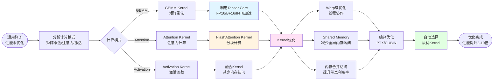

**技术栈**：
- **优化框架**：**<span style="color: red; font-weight: bold">TensorRT-LLM</span>** 内置优化 kernel 库
- **硬件加速**：**<span style="color: red; font-weight: bold">Tensor Core</span>**（矩阵乘法加速）、**<span style="color: red; font-weight: bold">Warp</span>**（线程协作）、**<span style="color: red; font-weight: bold">Shared Memory</span>**（高速缓存）
- **优化技术**：**<span style="color: red; font-weight: bold">Kernel融合</span>**、**<span style="color: red; font-weight: bold">内存合并访问</span>**、**<span style="color: red; font-weight: bold">Warp级优化</span>**

**核心优化技术**：

1. **Tensor Core 加速**：
   - **原理**：Tensor Core 是 NVIDIA GPU 的专用矩阵乘法单元，支持 FP16/BF16/INT8/FP8 精度，计算速度是 CUDA Core 的 10-100 倍
   - **优化策略**：
     - 使用 `wmma` API 调用 Tensor Core
     - 矩阵维度对齐到 16x16 或 8x8（Tensor Core 要求）
     - 使用 FP16/BF16 精度最大化性能
   - **性能提升**：矩阵乘法速度提升 10-100 倍

2. **Kernel 融合**：
   - **原理**：将多个小 kernel 融合成一个大 kernel，减少 kernel 启动开销和中间结果的内存读写
   - **融合模式**：
     - **GEMM + Bias + Activation**：融合为单个 kernel
     - **LayerNorm + Residual**：融合为单个 kernel
     - **Attention QKV + Softmax + MatMul**：融合为 FlashAttention kernel
   - **性能提升**：减少 50-70% 的 kernel 启动开销

3. **Shared Memory 优化**：
   - **原理**：Shared Memory 是 GPU 上的高速缓存（比全局内存快 100 倍），用于缓存频繁访问的数据
   - **优化策略**：
     - 将输入数据缓存到 Shared Memory
     - 使用 Bank Conflict 避免策略
     - 合理分配 Shared Memory 大小（通常 48KB）
   - **性能提升**：减少 50-80% 的内存访问延迟

4. **内存合并访问（Coalesced Access）**：
   - **原理**：GPU 访问内存时，相邻线程访问连续内存地址可以合并为一次访问，提升带宽利用率
   - **优化策略**：
     - 确保线程访问模式是连续的
     - 使用合适的线程块大小（通常是 256 或 512）
     - 避免随机访问模式
   - **性能提升**：内存带宽利用率提升 2-5 倍

5. **Warp 级优化**：
   - **原理**：Warp 是 GPU 的基本执行单位（32 个线程），Warp 内线程可以高效协作
   - **优化策略**：
     - 使用 Warp Shuffle 减少 Shared Memory 访问
     - 使用 Warp Reduce 进行高效归约
     - 避免 Warp Divergence（分支导致性能下降）
   - **性能提升**：减少 20-40% 的计算开销

**核心知识点**：

1. **Tensor Core 使用**：
   - **API**：使用 `wmma::fragment` 和 `wmma::load/store` API
   - **维度要求**：矩阵维度必须是 16x16 的倍数（A100/H100）或 8x8（某些架构）
   - **精度支持**：FP16、BF16、INT8、FP8（H100+）

2. **Kernel 启动优化**：
   - **线程块大小**：通常 128、256、512，根据 kernel 特性选择
   - **Grid 大小**：根据数据大小和线程块大小计算
   - **Stream 并行**：使用多个 CUDA Stream 实现 kernel 并行执行

3. **内存访问模式**：
   - **合并访问**：相邻线程访问连续地址
   - **对齐访问**：内存地址对齐到 128 字节（L2 Cache Line）
   - **预取**：使用 `__prefetch` 提前加载数据

4. **TensorRT-LLM 自动优化**：
   - 自动选择最优 kernel 实现
   - 根据硬件特性（Compute Capability）选择 kernel
   - 支持自定义 kernel 注册

**最佳实践**：

1. **Tensor Core 利用**：
   - 确保矩阵维度对齐到 Tensor Core 要求
   - 使用 FP16/BF16 精度最大化性能
   - 避免频繁的数据类型转换

2. **Kernel 融合**：
   - 优先融合计算密集型算子
   - 减少中间结果的内存读写
   - 平衡融合后的 kernel 复杂度

3. **内存优化**：
   - 合理使用 Shared Memory 缓存热点数据
   - 避免 Bank Conflict
   - 确保内存访问模式是合并的

4. **性能分析**：
   - 使用 Nsight Compute 分析 kernel 性能
   - 关注 Occupancy（占用率）、Memory Throughput、Compute Throughput
   - 对比优化前后的性能提升（通常 2-10 倍）

## 1.6 FlashAttention 优化

**作用**：通过分块计算和重计算机制优化注意力计算，降低注意力计算的显存占用和延迟，特别适用于长序列推理场景。

**FlashAttention 原理**：传统注意力计算需要存储完整的注意力矩阵（O(N^2) 显存），FlashAttention 通过分块计算（Tiling）和在线 Softmax 重计算，将显存复杂度降低到 O(N)，同时通过减少内存读写提升计算速度。

**FlashAttention 优化流程**：

```mermaid
flowchart LR
    Start([传统Attention<br/>O(N^2)显存]) --> Problem[显存问题<br/>长序列无法处理]
    
    Problem --> Flash[FlashAttention<br/>分块计算]
    
    Flash --> Tile[分块策略<br/>Tiling]
    Flash --> Online[在线Softmax<br/>Online Softmax]
    Flash --> Recompute[重计算机制<br/>Gradient Checkpointing]
    
    Tile --> Block[分块计算<br/>Block-wise Computation]
    Online --> Incremental[增量计算<br/>避免存储完整矩阵]
    Recompute --> Memory[显存优化<br/>O(N)复杂度]
    
    Block --> Benefit[优化效果]
    Incremental --> Benefit
    Memory --> Benefit
    
    Benefit --> Speed[速度提升<br/>减少内存读写]
    Benefit --> Memory2[显存减少<br/>O(N^2) -> O(N)]
    Benefit --> LongSeq[支持长序列<br/>32K+ tokens]
    
    Speed --> End([优化完成<br/>生产就绪])
    Memory2 --> End
    LongSeq --> End
    
    style Flash fill:#e1f5ff
    style Tile fill:#fff4e1
    style Online fill:#ffe1f5
    style Benefit fill:#e1ffe1
```

**技术栈**：
- **优化技术**：**<span style="color: red; font-weight: bold">FlashAttention</span>**（分块注意力）、**<span style="color: red; font-weight: bold">FlashAttention-2</span>**（优化版本）
- **核心机制**：**<span style="color: red; font-weight: bold">分块计算（Tiling）</span>**、**<span style="color: red; font-weight: bold">在线 Softmax</span>**、**<span style="color: red; font-weight: bold">重计算</span>**
- **实现框架**：**<span style="color: red; font-weight: bold">TensorRT-LLM</span>** 内置 FlashAttention 支持

**核心优化技术**：

1. **分块计算（Tiling）**：
   - **原理**：将 Q、K、V 矩阵分成多个块（Block），逐块计算注意力，避免存储完整的注意力矩阵
   - **块大小**：通常 64x64 或 128x128，根据硬件特性选择
   - **显存减少**：从 O(N²) 降低到 O(N)，N 为序列长度

2. **在线 Softmax**：
   - **原理**：在计算注意力时，使用在线算法计算 Softmax，避免存储完整的注意力分数矩阵
   - **算法**：使用 `online_softmax` 算法，逐块计算并归一化
   - **优势**：减少内存读写，提升计算效率

3. **重计算机制**：
   - **原理**：在前向传播时不存储中间结果，反向传播时重新计算，以时间换空间
   - **应用**：在 FlashAttention 中，某些中间结果可以重计算
   - **权衡**：增加少量计算时间，大幅减少显存占用

4. **FlashAttention-2 优化**：
   - **并行化改进**：更好的并行化策略，提升 GPU 利用率
   - **算法优化**：优化了分块和重计算策略
   - **性能提升**：相比 FlashAttention 速度提升 2 倍

**核心知识点**：

1. **显存复杂度分析**：
   - **传统 Attention**：需要存储 Q、K、V 和注意力矩阵，显存 O(N²)
   - **FlashAttention**：只存储分块计算的中间结果，显存 O(N)
   - **序列长度影响**：序列长度增加 2 倍，传统方法显存增加 4 倍，FlashAttention 只增加 2 倍

2. **分块策略**：
   - **块大小选择**：根据 GPU 的 Shared Memory 大小选择（通常 16KB-48KB）
   - **对齐要求**：块大小需要是 16 的倍数（Warp 大小）
   - **性能权衡**：块越大，并行度越高，但 Shared Memory 占用越大

3. **TensorRT-LLM 实现**：
   - 自动识别 Attention 层并应用 FlashAttention
   - 支持配置 FlashAttention 参数
   - 与 PagedAttention 协同工作

4. **适用场景**：
   - **长序列推理**：序列长度 > 2K tokens
   - **显存受限**：单卡显存不足以运行传统 Attention
   - **高吞吐量**：需要处理大批量长序列请求

**最佳实践**：

1. **配置启用**：
   - TensorRT-LLM 默认启用 FlashAttention
   - 确保序列长度足够长（> 2K）以体现优势
   - 根据硬件调整块大小

2. **性能调优**：
   - 测试不同块大小的性能
   - 监控 GPU 利用率和显存使用
   - 对比启用前后的性能提升

3. **精度验证**：
   - FlashAttention 在数值上等价于传统 Attention
   - 验证输出结果的一致性
   - 关注长序列的精度表现

4. **组合优化**：
   - 与 PagedAttention 组合使用，进一步优化显存
   - 与量化技术结合，降低显存和计算量
   - 与 Continuous Batching 协同，提升吞吐量

## 1.7 关键技术总结

**核心技术栈**：
1. **模型转换**：TensorRT-LLM、ONNX Runtime
2. **模型优化**：量化（INT8/INT4/FP8）、算子融合、图优化
3. **推理引擎**：TensorRT-LLM Runtime
4. **服务框架**：Triton Inference Server、NVIDIA NIM
5. **硬件加速**：NVIDIA GPU（A100/H100）、Tensor Core、NVLink
6. **部署工具**：Docker、Kubernetes、Helm
7. **监控运维**：Prometheus、Grafana、DCGM

**部署最佳实践**：
1. **模型量化**：使用 INT8 量化，显存和计算量减少 50-75%
2. **批处理优化**：配置 Continuous Batching，提高 GPU 利用率
3. **多 GPU 并行**：大模型使用 TP/PP，提升吞吐量
4. **容器化部署**：使用 Docker/Kubernetes，便于管理和扩展
5. **监控告警**：实时监控推理性能，及时发现问题

---

# 2. 模型部署技术

模型部署技术包括<span style="color: red; font-weight: bold">服务化框架</span>（<span style="color: red; font-weight: bold">Triton Inference Server</span>、<span style="color: red; font-weight: bold">NVIDIA NIM</span>）、<span style="color: red; font-weight: bold">多GPU并行</span>（<span style="color: red; font-weight: bold">Tensor Parallelism</span>、<span style="color: red; font-weight: bold">Pipeline Parallelism</span>）、<span style="color: red; font-weight: bold">API接口</span>（<span style="color: red; font-weight: bold">REST API</span>、<span style="color: red; font-weight: bold">gRPC</span>、<span style="color: red; font-weight: bold">SSE流式</span>）、<span style="color: red; font-weight: bold">监控运维</span>（<span style="color: red; font-weight: bold">Prometheus</span>、<span style="color: red; font-weight: bold">Grafana</span>、<span style="color: red; font-weight: bold">DCGM</span>）、<span style="color: red; font-weight: bold">高可用扩展</span>（<span style="color: red; font-weight: bold">Kubernetes</span>、<span style="color: red; font-weight: bold">负载均衡</span>、<span style="color: red; font-weight: bold">自动扩缩容</span>）等，**核心目标是把优化后的 .engine 引擎封装成可在 Docker/K8s 上水平扩展的生产级推理服务**。

**模型部署技术整体流程：**


**核心技术栈**：
- **<span style="color: red; font-weight: bold">Triton Inference Server</span>**：模型服务化框架，负责接收请求、管理模型、调度推理
- **<span style="color: red; font-weight: bold">NVIDIA NIM</span>**：标准化的推理微服务
- **TensorRT-LLM Runtime**：推理运行时引擎
- **<span style="color: red; font-weight: bold">Docker</span>**：容器技术，将应用和依赖打包成镜像
- **<span style="color: red; font-weight: bold">Kubernetes (K8s)</span>**：容器编排平台，管理多个容器的部署、扩缩容、故障恢复


## 2.1 多GPU并行部署

**作用**：将大模型（如 70B、175B）拆分到多张 GPU 上并行推理，提升推理吞吐量，充分利用硬件资源。适用于单张 GPU 显存不足的场景。

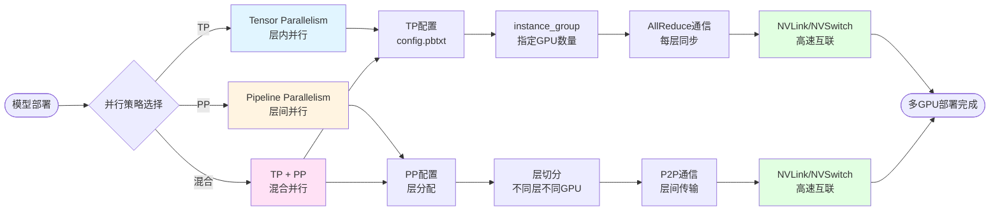

**技术栈**：
- **<span style="color: red; font-weight: bold">Tensor Parallelism (TP)</span>**：模型层内并行，将每一层拆分到多张 GPU，每层计算时需要 AllReduce 通信
- **<span style="color: red; font-weight: bold">Pipeline Parallelism (PP)</span>**：模型层间并行，将不同层分配到不同 GPU，像流水线一样处理
- **<span style="color: red; font-weight: bold">NVLink/NVSwitch</span>**：GPU 间的高速通信通道，比 PCIe 快得多

**核心知识点**：

1. **Tensor Parallelism (TP)**：
   - **原理**：将矩阵乘法按列或行拆分，每张 GPU 计算一部分，每层计算完成后通过 AllReduce 通信合并结果
   - **适用场景**：单层参数很大，单卡显存不够（如 70B+ 模型的单层）
   - **通信开销**：每层都需要 AllReduce 通信，通信频率高，需要 NVLink 高速互联
   - **配置方式**：在 `config.pbtxt` 中设置 `instance_group`，指定 GPU 数量和 `tensor_parallelism` 参数
   - **性能特点**：延迟低（所有 GPU 同时计算），但通信开销大，适合延迟敏感场景

2. **Pipeline Parallelism (PP)**：
   - **原理**：将模型按层拆分，不同层分配到不同 GPU，数据像流水线一样在 GPU 间传递
   - **适用场景**：模型层数很深，但单层不大（如 32 层以上的模型）
   - **通信开销**：层间 P2P 通信，通信频率低，但需要等待前一层完成
   - **配置方式**：将不同层分配到不同 GPU，配置 pipeline stages
   - **性能特点**：通信开销小，但存在流水线气泡（Pipeline Bubble），吞吐量高但延迟略高

3. **混合并行（TP + PP）**：
   - **原理**：同时使用 TP 和 PP，既拆分层内（TP），又拆分层间（PP）
   - **适用场景**：超大模型（如 175B+），单种并行方式无法满足
   - **配置方式**：先按 PP 拆分层，每层内部再按 TP 拆分
   - **性能特点**：结合两种并行的优势，适合超大模型部署

4. **通信优化**：
   - **NVLink/NVSwitch**：GPU 间高速互联，带宽 600GB/s（NVLink 4.0），比 PCIe 快 10 倍
   - **通信模式**：TP 使用 AllReduce（集合通信），PP 使用 P2P（点对点通信）
   - **通信优化**：使用 NCCL 库优化通信，支持异步通信重叠计算

5. **负载均衡**：
   - **TP 负载均衡**：确保每张 GPU 的计算量相等
   - **PP 负载均衡**：确保每个 stage 的计算时间相近，减少流水线气泡
   - **动态调整**：根据实际负载动态调整层分配

**最佳实践**：

1. **并行策略选择**：
   - **小模型（< 7B）**：单卡部署，无需并行
   - **中等模型（7B-70B）**：使用 TP，TP=2/4/8 根据显存需求
   - **大模型（70B-175B）**：使用 TP+PP 混合并行
   - **超大模型（> 175B）**：必须使用混合并行

2. **TP 配置优化**：
   - **TP 数量**：通常 2、4、8，根据模型大小和显存选择
   - **通信优化**：确保 GPU 通过 NVLink 连接，避免跨节点通信
   - **AllReduce 优化**：使用 Ring AllReduce 或 Tree AllReduce

3. **PP 配置优化**：
   - **Stage 数量**：根据模型层数和 GPU 数量确定
   - **层分配**：确保每个 stage 的计算时间相近
   - **流水线优化**：使用 Pipeline Parallelism 的优化技术（如 1F1B）

4. **性能验证**：
   - 测试不同并行配置的吞吐量和延迟
   - 监控 GPU 利用率和通信开销
   - 验证多 GPU 并行后的精度（应该与单卡一致）

5. **成本优化**：
   - **吞吐量优先**：使用更大的 TP/PP，提升吞吐量
   - **延迟优先**：使用较小的 TP，降低延迟
   - **成本平衡**：在满足 SLA 的前提下，最小化 GPU 数量

## 2.2 服务化与API接口

**作用**：提供标准化的 API 接口供客户端调用推理服务。支持同步接口（批量返回）、流式接口（实时返回），流式输出可以降低首字延迟（TTFT），提升用户体验。

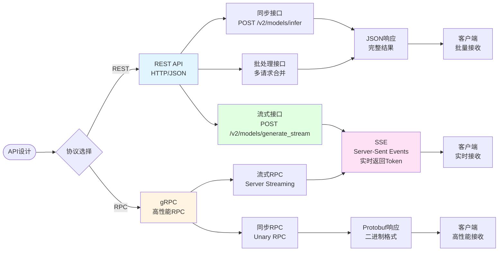

**技术栈**：
- **<span style="color: red; font-weight: bold">REST API</span>**：基于 HTTP 的接口，使用 JSON 格式，简单易用
- **<span style="color: red; font-weight: bold">gRPC</span>**：Google 开发的 RPC 框架，使用 Protobuf 序列化，性能更高
- **<span style="color: red; font-weight: bold">SSE (Server-Sent Events)</span>**：服务器主动推送数据给客户端，用于流式输出

**核心知识点**：
1. **REST API**：
   - 同步接口：`POST /v2/models/{model_name}/infer`，等待完整结果返回
   - 流式接口：`POST /v2/models/{model_name}/generate_stream`，实时返回每个 token
   - 批处理接口：多个请求合并处理，提高 GPU 利用率

2. **gRPC**：
   - 使用 Protobuf 序列化，比 JSON 更高效
   - 支持流式 RPC，可以双向流式通信
   - 适合高性能场景

3. **SSE 流式输出**：
   - 服务器通过 HTTP 连接持续推送数据
   - 客户端实时接收生成的 token，无需轮询
   - 降低首字延迟，提升用户体验

## 2.3 Continuous Batching 详解

**作用**：动态批处理技术，允许不同请求在不同时间加入和退出批次，相比静态批处理大幅提升 GPU 利用率，降低延迟，是实现高吞吐量推理的关键技术。

**Continuous Batching 原理**：传统静态批处理需要等待所有请求到达后才能开始处理，且必须等待所有请求完成才能释放资源。Continuous Batching（连续批处理）允许请求动态加入和退出批次，新请求可以立即加入正在处理的批次，完成的请求可以立即退出，最大化 GPU 利用率。

**Continuous Batching 流程**：

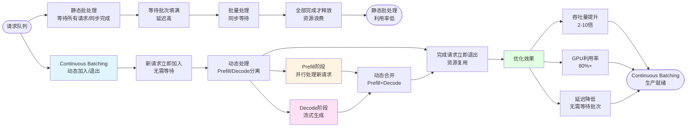

**技术栈**：
- **批处理框架**：**<span style="color: red; font-weight: bold">Triton Inference Server</span>** Dynamic Batching、**<span style="color: red; font-weight: bold">Continuous Batching</span>**
- **核心机制**：**<span style="color: red; font-weight: bold">动态批处理</span>**、**<span style="color: red; font-weight: bold">Prefill/Decode 分离</span>**、**<span style="color: red; font-weight: bold">请求调度</span>**
- **优化技术**：**<span style="color: red; font-weight: bold">In-flight Batching</span>**、**<span style="color: red; font-weight: bold">Iteration-level Batching</span>**

**核心优化技术**：

1. **Prefill/Decode 分离**：
   - **原理**：将生成过程分为 Prefill（处理输入 prompt）和 Decode（生成新 token）两个阶段，分别批处理
   - **Prefill 阶段**：新请求的 prompt 处理，计算密集，可以批量并行
   - **Decode 阶段**：已开始生成的请求继续生成，可以动态合并处理
   - **优势**：不同阶段的请求可以混合处理，提升 GPU 利用率

2. **动态请求调度**：
   - **加入机制**：新请求到达时，如果当前批次未满，立即加入；如果已满，等待下一个调度周期
   - **退出机制**：请求生成完成后（遇到 EOS token 或达到最大长度），立即退出批次，释放资源
   - **调度策略**：根据 GPU 利用率、队列长度、延迟要求动态调整批次大小

3. **In-flight Batching**：
   - **原理**：在生成过程中动态添加新请求，无需等待当前批次完成
   - **实现**：每个 Decode 步骤都可以接受新请求加入
   - **优势**：最大化 GPU 利用率，降低延迟

4. **Iteration-level Batching**：
   - **原理**：在每个生成迭代（iteration）级别进行批处理，而不是整个序列级别
   - **优势**：更细粒度的批处理，更好的资源利用

**核心知识点**：

1. **与静态批处理的对比**：
   - **静态批处理**：等待批次填满 → 批量处理 → 全部完成才释放，GPU 利用率 30-50%
   - **Continuous Batching**：动态加入/退出 → 持续处理 → 立即释放，GPU 利用率 80%+

2. **吞吐量与延迟平衡**：
   - **小批次**：延迟低，但吞吐量低
   - **大批次**：吞吐量高，但延迟高
   - **动态调整**：根据负载自动调整批次大小，平衡吞吐量和延迟

3. **Triton 配置**：
   - 在 `config.pbtxt` 中配置 `dynamic_batching`
   - 设置 `max_queue_delay_microseconds` 控制等待时间
   - 设置 `preferred_batch_size` 和 `max_batch_size`

4. **与 PagedAttention 协同**：
   - Continuous Batching 需要动态管理 KV Cache
   - PagedAttention 提供高效的内存管理
   - 两者结合实现高吞吐量推理

**最佳实践**：

1. **配置优化**：
   - 启用 Dynamic Batching：`dynamic_batching { }`
   - 设置合理的 `max_queue_delay_microseconds`（通常 100-500ms）
   - 根据 GPU 显存设置 `max_batch_size`

2. **性能调优**：
   - 监控 GPU 利用率，目标 >80%
   - 监控队列长度，避免请求堆积
   - 平衡吞吐量和延迟，根据 SLA 调整

3. **延迟控制**：
   - 设置最大等待时间，避免延迟过高
   - 使用优先级队列，重要请求优先处理
   - 监控 P50/P95/P99 延迟指标

4. **资源管理**：
   - 与 PagedAttention 协同，高效管理 KV Cache
   - 监控显存使用，避免 OOM
   - 根据负载动态扩缩容

## 2.4 多模型编排策略

**作用**：通过 NIM/Triton 实现多个模型在同一服务器上的统一管理和调度，根据请求特征智能路由到不同模型，优化资源利用率，支持模型热切换和版本管理。

**多模型编排原理**：在生产环境中，通常需要同时部署多个模型（不同版本、不同规模、不同用途），多模型编排通过统一的模型仓库（Model Repository）和智能调度策略，实现多个模型的统一管理、动态加载、资源分配和请求路由。

**多模型编排流程**：

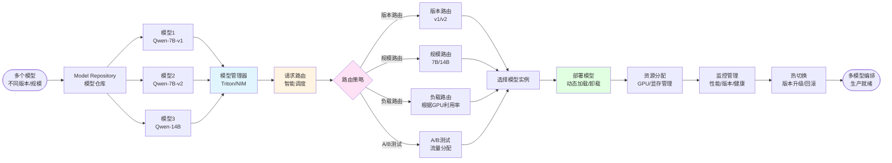

**技术栈**：
- **编排框架**：**<span style="color: red; font-weight: bold">Triton Inference Server</span>** Model Repository、**<span style="color: red; font-weight: bold">NVIDIA NIM</span>**（标准化微服务）
- **核心功能**：**<span style="color: red; font-weight: bold">模型管理</span>**、**<span style="color: red; font-weight: bold">请求路由</span>**、**<span style="color: red; font-weight: bold">版本控制</span>**、**<span style="color: red; font-weight: bold">资源调度</span>**

**核心编排策略**：

1. **模型版本管理**：
   - **版本控制**：支持同一模型的多个版本（v1, v2, v3），通过版本号区分
   - **版本路由**：根据请求参数或配置路由到指定版本
   - **热切换**：支持在不中断服务的情况下切换模型版本
   - **回滚机制**：支持快速回滚到之前的版本

2. **智能请求路由**：
   - **基于版本路由**：`/v2/models/qwen-7b/versions/1/infer` 指定版本
   - **基于负载路由**：根据 GPU 利用率路由到负载较低的模型实例
   - **基于特征路由**：根据请求特征（如 prompt 长度）路由到合适的模型
   - **A/B 测试**：支持流量分配，进行模型对比测试

3. **资源动态分配**：
   - **按需加载**：模型按需加载到 GPU，未使用的模型可以卸载释放显存
   - **显存管理**：智能管理 GPU 显存，支持多个模型共享 GPU
   - **优先级调度**：根据模型优先级分配资源，重要模型优先

4. **模型生命周期管理**：
   - **加载/卸载**：支持动态加载和卸载模型
   - **预热机制**：支持模型预热，减少首次请求延迟
   - **健康检查**：定期检查模型健康状态，自动恢复故障模型

**核心知识点**：

1. **Triton Model Repository**：
   - **目录结构**：`model_name/version/model.engine`，每个版本独立目录
   - **版本管理**：版本号可以是数字（1, 2, 3）或字符串（latest, stable）
   - **自动发现**：Triton 自动扫描 Model Repository，发现新模型和版本

2. **NVIDIA NIM（NVIDIA Inference Microservice）**：
   - **标准化服务**：提供标准化的推理微服务，简化模型部署
   - **模型市场**：提供预优化的模型，开箱即用
   - **API 统一**：统一的 API 接口，简化客户端调用

3. **请求路由策略**：
   - **显式路由**：客户端指定模型版本和实例
   - **隐式路由**：服务端根据策略自动路由
   - **负载均衡**：多个模型实例间的负载均衡

4. **资源优化**：
   - **模型共享**：多个模型共享 GPU，提高资源利用率
   - **动态调度**：根据请求负载动态调整模型实例数量
   - **成本优化**：在满足 SLA 的前提下，最小化 GPU 使用

**最佳实践**：

1. **模型组织**：
   - 使用清晰的命名规范（如 `qwen-7b-v1`, `qwen-7b-v2`）
   - 每个版本独立目录，便于管理
   - 使用版本标签（latest, stable, experimental）

2. **路由配置**：
   - 根据业务需求选择合适的路由策略
   - 实现智能路由，根据请求特征选择最优模型
   - 支持 A/B 测试，对比不同模型版本

3. **资源管理**：
   - 监控 GPU 显存使用，避免 OOM
   - 实现模型按需加载，释放未使用模型的显存
   - 设置模型优先级，重要模型优先保证资源

4. **版本管理**：
   - 支持平滑升级，新版本验证后再切换
   - 保留旧版本，支持快速回滚
   - 记录版本变更日志，便于问题追踪

5. **性能优化**：
   - 使用模型预热，减少首次请求延迟
   - 实现智能缓存，缓存常用模型
   - 监控模型性能，及时发现问题

## 2.5 监控与运维

**作用**：实时监控推理服务的性能、资源使用和服务质量，及时发现问题（延迟升高、错误率增加、GPU 利用率低），为优化提供数据支撑。

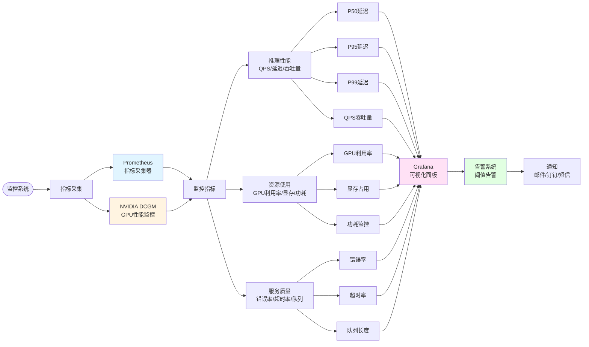

**技术栈**：
- **<span style="color: red; font-weight: bold">Prometheus</span>**：开源监控系统，采集和存储指标数据（Pull 模式）
- **<span style="color: red; font-weight: bold">Grafana</span>**：可视化工具，将 Prometheus 的数据绘制成图表
- **<span style="color: red; font-weight: bold">DCGM (NVIDIA Data Center GPU Manager)</span>**：NVIDIA 的 GPU 性能监控工具

**核心知识点**：
1. **监控指标分类**：
   - **推理性能**：<span style="color: red; font-weight: bold">QPS</span>（每秒请求数）、<span style="color: red; font-weight: bold">延迟（P50/P95/P99）</span>、吞吐量
   - **资源使用**：<span style="color: red; font-weight: bold">GPU 利用率</span>、显存占用、功耗
   - **服务质量**：错误率、超时率、队列长度

2. **监控架构**：
   - Prometheus 采集指标（Pull 模式）
   - Grafana 查询 Prometheus 数据并可视化
   - 告警系统基于阈值触发通知

3. **关键指标理解**：
   - **P50/P95/P99 延迟**：50%/95%/99% 的请求延迟低于该值
   - **QPS**：每秒处理的请求数，反映吞吐能力
   - **GPU 利用率**：GPU 计算资源的使用率，理想情况 >80%

## 2.6 高可用与扩展

**作用**：通过多实例部署、负载均衡、健康检查和自动扩缩容，确保系统在部分组件故障时仍能提供服务，应对高并发场景，并根据负载动态调整实例数量以节省成本。

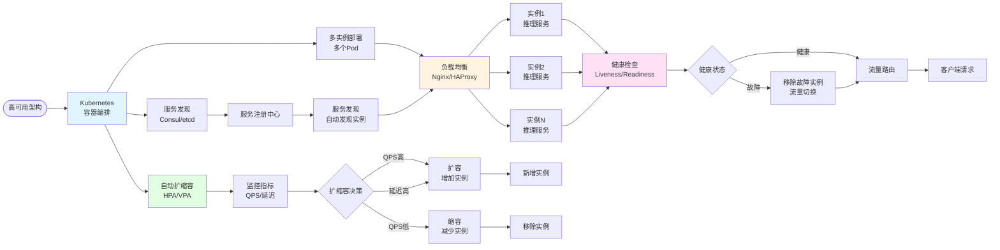

**技术栈**：
- **<span style="color: red; font-weight: bold">Kubernetes</span>**：容器编排平台，支持自动扩缩容、故障恢复
- **<span style="color: red; font-weight: bold">负载均衡</span>**：Nginx、HAProxy，将请求分发到多个服务实例
- **服务发现**：Consul、etcd，自动发现可用的服务实例

**核心知识点**：
1. **多实例部署**：
   - 部署多个相同的服务实例（Pod）
   - 负载均衡器（Nginx/HAProxy）分发请求
   - 某个实例故障时，流量自动切换到其他实例

2. **健康检查**：
   - **Liveness Probe**：检测服务是否存活，死亡则重启
   - **Readiness Probe**：检测服务是否就绪，未就绪则不接收流量
   - 自动故障恢复，无需人工干预

3. **自动扩缩容**：
   - **<span style="color: red; font-weight: bold">HPA (Horizontal Pod Autoscaler)</span>**：根据 CPU/内存/QPS 自动扩缩容
   - **VPA (Vertical Pod Autoscaler)**：自动调整 Pod 的资源限制
   - 根据监控指标（QPS、延迟）动态调整实例数

4. **实际故障场景示例：多台 8 卡机器中有一块 GPU 坏掉怎么办？**  
   - **场景假设**：集群中有多台 `8 × A100` 服务器，每台机器上部署 1 个 Triton 推理服务 Pod（`nvidia.com/gpu: 8`），对外通过 Nginx/K8s Service 做负载均衡。现在其中一台机器的某一块 GPU 出现硬件故障。  
   - **监控与告警**：  
     - DCGM / nvidia-smi / 节点级监控会发现该 GPU 异常（频繁报错、ECC 错误、掉卡等），Prometheus + Alertmanager 触发告警。  
   - **短期处理思路（保证在线服务）**：  
     1. **K8s 层面隔离故障节点或故障 GPU**：  
        - 将该节点 `cordon` + `drain`（暂不再调度新 Pod，上面的 Pod 迁移到其他健康节点）；  
        - 或者调整该节点上 Triton Pod 的资源申请，从 `nvidia.com/gpu: 8` 改为 `7`，让 K8s Device Plugin 不再把坏 GPU 暴露给容器。  
     2. **服务层面自动摘除实例**：  
        - Readiness Probe 失败 → 负载均衡自动把流量切走，不再把新请求打到这台机器；  
        - 其他健康机器继续提供服务，整体 QPS 下降一点，但服务不中断。  
     3. **多卡并行策略调整**：  
        - 如果这台机上跑的是 8 卡 TP（`tensor_parallel = 8`）的大模型，可以为集群预留一套 7 卡/单卡的降级配置，故障时在其他机器上切换到「小一号」并行/模型方案，保证核心业务先活着。  
   - **长期处理思路（恢复容量）**：  
     - 硬件同事更换故障 GPU 或整机；  
     - 恢复后取消 `cordon`，重新调度 Pod，并在 HPA 中把目标实例数调回原来水平，恢复总体吞吐能力。  
   - **面试可以归纳一句话**：  
     > 不把「一台 8 卡机器」当成单点，而是通过 **多实例部署 + 负载均衡 + 健康检查 + HPA** 把整体做成一个弹性集群；单机某块 GPU 坏掉时，通过 **节点隔离 / 资源调整 / 自动摘除实例** 来快速恢复服务，把影响控制在吞吐量下降，而不是整体服务中断。

---

# 3. 实际部署案例：8 台 8 卡 A100 服务器部署方案（面试回答思路）

> 📝 **说明**：本章节提供面试时的回答思路和关键要点。详细的部署命令、Dockerfile、YAML 配置文件等实操内容，请参考：[云端大模型-8卡A100部署实战.md](./云端大模型-8卡A100部署实战.md)

## 3.1 场景与目标

**场景**：公司有一套 **8 台 8 卡 A100（共 64 张 GPU）** 的服务器集群，需要将一个已经用 TensorRT-LLM 优化好的大模型（`.engine` 文件）部署成在线推理服务。

**目标**：
- **高并发**：支持高 QPS（例如 500+ QPS）
- **低延迟**：P95/P99 延迟可控（例如 P99 < 500ms）
- **高可用**：7×24 小时稳定运行，单机故障不影响整体服务
- **可扩展**：支持按需扩容和版本迭代

## 3.2 前置准备：硬件环境与模型准备

1. **硬件环境到位**：
   - 每台服务器：8×A100（80GB）、64 核 CPU、512GB+ 内存、NVMe SSD、万兆以上网络
   - 所有机器安装好 **NVIDIA 驱动 + CUDA + Docker + NVIDIA Container Toolkit**，确保 `nvidia-smi` 和 `docker --gpus all` 正常工作

2. **模型准备（对应第 1 章模型优化技术）**：
   - 使用 **TensorRT-LLM** 将 PyTorch/Transformers 大模型转换为适配 A100 的 `.engine` 文件
   - 同时进行 **INT8/INT4/FP8 量化、图优化、混合精度、KV Cache / FlashAttention / Kernel 优化**
   - 输出：`models/模型名/1/model.engine + config.pbtxt`，这是标准的 **Triton Model Repository** 结构

> **面试话术**：我会先在离线环境用 TensorRT-LLM 把模型转成适配 A100 的高效 `.engine`，并按 Triton 的目录规范整理好。

## 3.3 推理服务封装：统一的 Docker 镜像

1. **选择基础镜像**：
   - 使用 NVIDIA 官方的 `nvcr.io/nvidia/tritonserver:24.01-trtllm-python-py3` 镜像
   - 该镜像已包含 CUDA、TensorRT-LLM Runtime 和 **Triton Inference Server**

2. **打包模型和配置**：
   - 在 Dockerfile 中将本地 `models/` 目录拷贝到镜像的 `/models`
   - 配置默认启动命令：`tritonserver --model-repository=/models --allow-gpu-metrics=true`

3. **推送到私有仓库**：
   - 构建镜像 `my-triton-llm:tag`，推送到公司私有镜像仓库
   - 8 台服务器统一从该仓库拉取，保证版本一致

> **面试话术**：我会把大模型和推理引擎封装在一个统一的 Triton 镜像里，实现"镜像即服务"，这样在 8 台服务器上只需要 docker run / K8s 部署这一份镜像。

## 3.4 部署方式 1：单机 Docker 验证（快速上线）

1. **单机启动验证**：
   - 在一台 8 卡服务器上用 `docker run --gpus all` 启动该镜像
   - 挂载所有 GPU，映射 HTTP/gRPC/metrics 端口（8000/8001/8002）

2. **功能与性能验证**：
   - 通过 Triton 的健康检查接口（`/v2/health/ready`）和实际推理请求验证
   - 确认模型加载成功、接口可访问、延迟和显存占用符合预期

3. **适用场景**：
   - 适合 PoC 验证或单机小规模业务，部署简单，问题排查容易

> **面试话术**：我会先在一台 8 卡机器上用 Docker 把服务跑通，验证模型和引擎没问题，再上 K8s 做多机扩展。

## 3.5 部署方式 2：Kubernetes 集群化部署（生产环境）

1. **K8s 部署策略**：
   - 使用 `Deployment` 或 `StatefulSet` 部署 Triton 镜像
   - 设置 `replicas=8`（每台 8 卡机器跑 1 个 Pod）
   - 每个 Pod 配置 `resources.limits.nvidia.com/gpu: 8`，结合 **Tensor Parallelism** 实现多卡并行

2. **服务暴露与负载均衡**：
   - 使用 `Service` 暴露 `8000`（REST）、`8001`（gRPC）、`8002`（metrics）端口
   - 可配合 Ingress/Nginx/LoadBalancer，业务只需访问统一域名，K8s 自动分发流量到 8 个 Triton Pod

3. **健康检查与自愈**：
   - 配置 `readinessProbe` 调用 `/v2/health/ready`，确保只有模型加载成功的 Pod 才加入负载均衡
   - 配置 `livenessProbe`/`startupProbe`，异常时自动重启，冷启动时避免误杀

4. **自动扩缩容（HPA）**：
   - 基于 CPU/GPU 利用率或 QPS、延迟指标配置 **HPA**
   - 高峰自动增加副本数，充分利用 64 张 A100；低峰自动缩容，节省 GPU 成本

5. **多机故障处理示例**：
   - 如果某一台 8 卡机器中有一两张 GPU 出现硬件故障，通过 K8s + Device Plugin 可以自动标记该节点为 `NotReady` 或减少可用 GPU 数量
   - HPA 会在其他健康节点上补齐副本，整个集群对上层仍然是一个稳定的服务入口

> **面试话术**：生产环境我会用 K8s，把 Triton + TensorRT-LLM 镜像做成 Deployment + Service，再配置 HPA 和健康检查，让 8 台 8 卡 A100 组成一个可以自动扩缩容、自动自愈的推理集群。

## 3.6 监控与运维亮点（加分项）

1. **监控体系**：
   - 部署 **Prometheus + Grafana + NVIDIA DCGM**
   - 采集并可视化：QPS、P50/P95/P99 延迟、GPU 利用率、显存占用、功耗、错误率

2. **告警与 SLO**：
   - 配置告警规则（例如 P99 > 500ms、错误率 > 1%、GPU 利用率异常）
   - 快速发现性能问题

3. **灰度与回滚**：
   - 利用 K8s 的滚动升级和多 Deployment + Ingress 权重，实现 **灰度发布** 和一键回滚

> **面试话术**：不仅仅把模型跑起来，我还会把监控、告警和灰度升级流程一起设计好，保证服务长期可用和可演进。

## 3.7 总结：一句话归纳

> **面试总结话术**：
> 
> "整体上，我会先用 TensorRT-LLM 把大模型优化成适配 A100 的 `.engine`，再基于 Triton + Docker 做成统一的推理镜像，在单机上验证通过后，通过 Kubernetes 在 8 台 8 卡 A100 上做多副本部署和自动扩缩容，配合 Prometheus/Grafana/DCGM 做监控告警，这样就可以在这套服务器上跑起一个高可用、高吞吐的大模型推理服务。"
