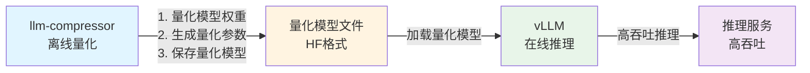
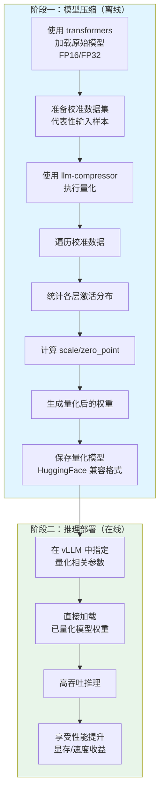
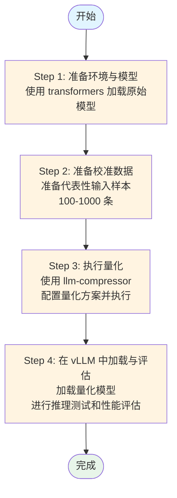
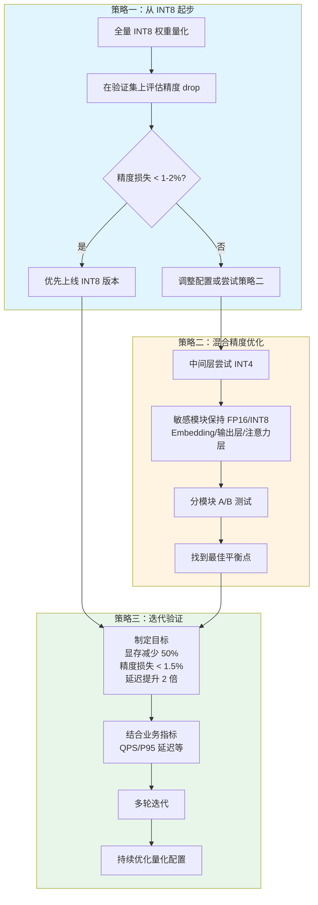
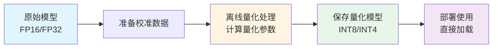
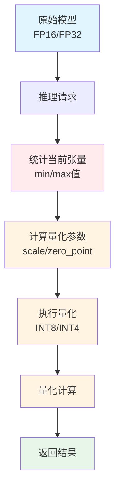
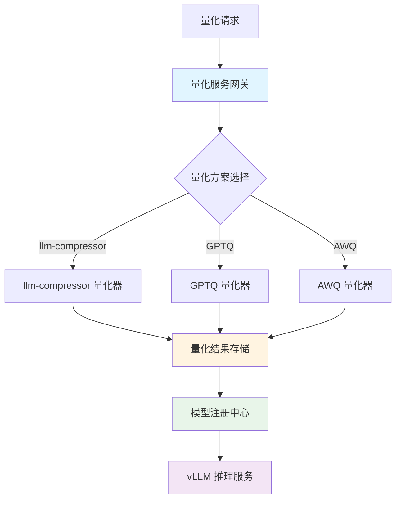

# llm-compressor 大模型量化工具详解

> **llm-compressor** 是 vLLM 生态中的大模型压缩工具库，用于大模型权重量化和激活量化，与 vLLM 推理引擎深度集成。
> 
> **一句话总结**：先用 `transformers` 加载原始模型并准备校准数据，调用 `llm-compressor` 离线做 INT8/INT4 量化生成新权重，再在 vLLM 中指定量化模型路径和量化参数加载部署高吞吐推理。

---

## 📚 目录

- [一、llm-compressor 是什么？](#一llm-compressor-是什么)
  - [1.1 定义与定位](#11-定义与定位)
  - [1.2 核心目标](#12-核心目标)
  - [1.3 技术特点](#13-技术特点)
  - [1.4 量化原理与技术](#14-量化原理与技术)
  - [1.5 支持的量化方式](#15-支持的量化方式)
  - [1.6 与 vLLM 的关系](#16-与-vllm-的关系)
- [二、安装与环境配置](#二安装与环境配置)
- [三、使用流程与实践](#三使用流程与实践)
- [四、量化策略选择](#四量化策略选择)
- [五、性能评估与优化](#五性能评估与优化)
- [六、优缺点与适用场景](#六优缺点与适用场景)
- [七、面试话术与常见问题](#七面试话术与常见问题)

---

## 一、llm-compressor 是什么？

### 1.1 定义与定位

**llm-compressor** 是 vLLM 生态中的一个大模型压缩工具库，主要用于：

- **权重量化（Weight Quantization）**：将 FP16/FP32 权重压缩到 INT8/INT4
- **激活量化（Activation Quantization）**：在推理时对激活值做低比特表示
- **与 vLLM 深度集成**：量化后的模型可直接在 vLLM 中加载使用

### 1.2 核心目标

**在尽量少牺牲精度的前提下，大幅降低显存占用、提高推理速度**，服务于云端和本地的大模型推理场景。

### 1.3 技术特点

- ✅ **离线量化**：在模型部署前完成量化，不影响在线推理性能
- ✅ **多种精度支持**：支持 INT8、INT4 等多种量化精度
- ✅ **混合精度**：支持不同层使用不同精度（混合精度量化）
- ✅ **vLLM 原生支持**：与 vLLM 推理引擎无缝集成

### 1.4 量化原理与技术

#### 1.4.1 量化基础概念

**量化（Quantization）** 是将高精度数值（如 FP32、FP16）映射到低精度数值（如 INT8、INT4）的过程。

**量化公式**

对于对称量化（Symmetric Quantization）：
```
Q = round(R / S)
R = Q × S
```
其中：
- `R`：原始浮点数（FP32/FP16）
- `Q`：量化后的整数（INT8/INT4）
- `S`：缩放因子（Scale）

对于非对称量化（Asymmetric Quantization）：
```
Q = round((R - Z) / S)
R = Q × S + Z
```
其中：
- `Z`：零点（Zero Point）

#### 1.4.2 量化类型

**1. 权重量化（Weight Quantization）**
- **离线量化**：在模型部署前完成，权重直接存储为 INT8/INT4
- **优势**：减少模型体积和显存占用
- **方法**：统计权重分布，计算 scale 和 zero_point

**2. 激活量化（Activation Quantization）**
- **在线量化**：在推理时动态量化激活值
- **优势**：进一步减少计算和内存访问
- **挑战**：激活值分布动态变化，需要校准数据

#### 1.4.3 量化校准方法

**Post-Training Quantization (PTQ)**
- **流程**：模型训练完成后，使用校准数据集统计激活值分布
- **优点**：不需要重新训练，速度快
- **缺点**：精度损失可能较大

**Quantization-Aware Training (QAT)**
- **流程**：在训练过程中模拟量化，让模型适应量化
- **优点**：精度损失小
- **缺点**：需要重新训练，成本高

**llm-compressor 主要使用 PTQ 方法**，因为大模型重新训练成本极高。

### 1.5 支持的量化方式

#### 1.5.1 INT8 量化（W8A8）

**特点**
- **形式**：权重 8bit，激活 8bit（或部分 FP16）
- **显存减少**：相对 FP16 减少约 **50%**
- **精度损失**：一般控制在 **1-2%** 以内
- **速度提升**：推理速度提升 **1.5-2 倍**

**适用场景**
- ✅ 对精度有要求的在线服务
- ✅ 首次上量，想要"安全"的性能优化
- ✅ 生产环境推荐方案

#### 1.5.2 INT4 量化（W4A16 / W4A8）

**特点**
- **形式**：权重 4bit，激活保持 16bit 或 8bit
- **显存减少**：相对 FP16 可节省 **70%+**
- **精度损失**：相对 INT8 更大，通常 **2-5%**
- **速度提升**：推理速度提升 **2-3 倍**

**适用场景**
- ✅ 显存特别紧张的场景
- ✅ 对精度容忍度稍高的应用
- ✅ 内网工具、辅助类应用、对话机器人等
- ⚠️ 需要充分验证精度损失

#### 1.5.3 混合精度量化

**策略**
- **敏感层保持高精度**：Embedding 层、输出层、部分注意力层保持 FP16/INT8
- **非敏感层使用低精度**：中间层使用 INT4
- **逐层分析**：通过实验确定每层的最优精度

**优势**
- 在精度和性能之间找到最佳平衡点
- 可以针对性地优化关键模块

### 1.6 与 vLLM 的关系

#### 1.6.1 整体架构



#### 1.6.2 工作流程



#### 1.6.3 互补关系

- **llm-compressor**：专注于"离线压缩"，提供量化工具和算法
- **vLLM**：专注于"在线高性能推理"，提供 PagedAttention、Continuous Batching 等优化
- **两者结合**：实现"压缩 + 加速"的双重优化

---

## 二、安装与环境配置

### 2.1 环境要求

- **Python**: 3.8+（推荐 3.10+）
- **PyTorch**: 2.0+
- **CUDA**: 11.8+（GPU 加速，CPU 模式也可用但性能较差）
- **操作系统**: Linux、macOS、Windows（推荐 Linux）
- **显存**: 至少 8GB（用于量化 7B 模型）

### 2.2 完整安装步骤

#### 步骤 1：创建 conda 环境（推荐）

```bash
# 进入项目目录
cd /Users/chenwei/Documents/2026_WORK/ai-llm-engineer-tech-stack/教程/llm-compressor

# 创建 conda 环境（Python 3.10，支持 llm-compressor）
conda create -n vllm-env python=3.10 -y

# 激活 conda 环境
conda activate vllm-env
```

#### 步骤 2：升级 pip 和安装基础工具

```bash
# 升级 pip
pip install --upgrade pip

# 安装构建工具
pip install wheel setuptools
```

#### 步骤 3：安装 PyTorch（根据 CUDA 版本选择）

```bash
# 检查 CUDA 版本（如果有 GPU）
nvidia-smi

# 安装 PyTorch（CUDA 11.8）
pip install torch torchvision torchaudio --index-url https://download.pytorch.org/whl/cu118

# 或者安装 PyTorch（CUDA 12.1）
# pip install torch torchvision torchaudio --index-url https://download.pytorch.org/whl/cu121

# 或者安装 CPU 版本（如果没有 GPU）
# pip install torch torchvision torchaudio
```

#### 步骤 4：安装核心依赖

```bash
# 方式一：使用 requirements.txt 安装（推荐）
pip install -r requirements.txt

# 方式二：手动安装
# 1. 安装 vLLM（包含基础依赖）
pip install vllm

# 2. 安装 transformers 和相关库
pip install transformers accelerate datasets

# 3. 安装 llm-compressor
# 从 PyPI 安装（如果已发布）
pip install llm-compressor

# 或者从源码安装
# git clone https://github.com/vllm-project/llm-compressor.git
# cd llm-compressor
# pip install -e .
```

#### 步骤 5：验证安装

**方式一：使用验证脚本（推荐）**

```bash
# 运行验证脚本
python verify_installation.py
```

验证脚本会检查所有依赖的安装状态，并显示详细的版本信息。

**方式二：手动验证**

```bash
# 激活 conda 环境
conda activate vllm-env

# 验证 PyTorch 安装
python -c "import torch; print(f'PyTorch版本: {torch.__version__}'); print(f'CUDA可用: {torch.cuda.is_available()}'); print(f'MPS可用: {torch.backends.mps.is_available() if hasattr(torch.backends, \"mps\") else False}')"

# 验证 transformers 安装
python -c "import transformers; print(f'Transformers版本: {transformers.__version__}')"

# 验证 vLLM 安装（Linux + CUDA）
python -c "import vllm; print('vLLM安装成功')"  # macOS 上会失败，这是正常的

# 验证 llm-compressor 安装
python -c "import llm_compressor; print('llm-compressor安装成功')"  # 如果从源码安装
```

### 2.3 依赖检查

```bash
# 检查 Python 版本
python --version

# 检查 CUDA 版本（如果有 GPU）
nvidia-smi

# 检查 PyTorch 和 CUDA 兼容性
python -c "import torch; print(f'PyTorch版本: {torch.__version__}'); print(f'CUDA可用: {torch.cuda.is_available()}'); print(f'CUDA版本: {torch.version.cuda if torch.cuda.is_available() else \"N/A\"}')"

# 检查已安装的包
pip list | grep -E "(torch|transformers|vllm|llm-compressor)"
```

### 2.4 常见问题排查

#### 问题 1：CUDA 版本不匹配（Linux）

**症状**: `torch.cuda.is_available()` 返回 `False`

**解决方案**:
```bash
# 卸载现有 PyTorch
pip uninstall torch torchvision torchaudio

# 根据实际 CUDA 版本重新安装
# 查看 CUDA 版本: nvidia-smi
# 然后安装对应版本的 PyTorch
pip install torch torchvision torchaudio --index-url https://download.pytorch.org/whl/cu118
```

#### 问题 2：vLLM 安装失败

**症状**: 安装 vLLM 时出现编译错误

**解决方案**:
```bash
# Linux 系统需要安装额外的系统依赖
sudo apt-get update
sudo apt-get install -y build-essential

# 确保安装了正确的 CUDA 工具包
# 或者使用预编译的 wheel
pip install vllm --no-build-isolation
```

#### 问题 3：llm-compressor 找不到

**症状**: `pip install llm-compressor` 报错 "No matching distribution found"

**解决方案**:
```bash
# llm-compressor 可能尚未发布到 PyPI，需要从源码安装
git clone https://github.com/vllm-project/llm-compressor.git
cd llm-compressor
pip install -e .
```

#### 问题 4：显存不足

**症状**: 量化过程中显存溢出

**解决方案**:
- 使用更小的模型进行测试
- 减少 batch size
- 使用梯度检查点（gradient checkpointing）

---

## 三、使用流程与实践

### 3.1 完整流程（4 步走）



#### Step 1：准备环境与模型

```python
from transformers import AutoModelForCausalLM, AutoTokenizer

# 加载原始模型
model_name = "Qwen/Qwen-7B-Chat"
tokenizer = AutoTokenizer.from_pretrained(model_name)
model = AutoModelForCausalLM.from_pretrained(
    model_name,
    torch_dtype=torch.float16,
    device_map="auto"
)
```

#### Step 2：准备校准数据

```python
# 准备代表性输入样本（几百到几千条）
calibration_data = [
    "什么是人工智能？",
    "请解释一下深度学习的基本原理。",
    "如何优化大模型的推理性能？",
    # ... 更多样本
]

# 或者从真实业务日志中采样
# calibration_data = load_business_logs(num_samples=1000)
```

**校准数据要求**：
- 数量：通常 100-1000 条样本
- 代表性：覆盖常见问题类型/指令模式
- 来源：真实业务日志或代表性数据集

#### Step 3：执行量化

```python
from llm_compressor import quantize_model

# 配置量化方案
quantization_config = {
    "quantization_method": "int8",  # 或 "int4"
    "weight_only": False,  # False 表示权重+激活都量化
    "calibration_dataset": calibration_data,
}

# 执行量化
quantized_model = quantize_model(
    model=model,
    tokenizer=tokenizer,
    quantization_config=quantization_config,
)

# 保存量化模型
quantized_model.save_pretrained("./qwen-7b-int8")
tokenizer.save_pretrained("./qwen-7b-int8")
```

#### Step 4：在 vLLM 中加载与评估

```python
from vllm import LLM, SamplingParams

# 加载量化模型
llm = LLM(
    model="./qwen-7b-int8",
    quantization="awq",  # 或 "gptq", "squeezellm" 等
    # 其他 vLLM 参数
)

# 推理测试
prompts = ["什么是人工智能？"]
sampling_params = SamplingParams(temperature=0.7, top_p=0.9)
outputs = llm.generate(prompts, sampling_params)

# 评估性能
# 1. 精度评估：使用验证集对比原模型
# 2. 性能评估：测试延迟、吞吐、显存占用
```

### 3.2 量化参数说明

#### 量化方法选择
- `"int8"`：INT8 量化，精度损失小
- `"int4"`：INT4 量化，显存节省多
- `"mixed"`：混合精度量化

#### 量化范围选择
- `weight_only=True`：仅量化权重
- `weight_only=False`：权重 + 激活都量化

### 3.3 实际代码示例

```python
# 完整示例：Qwen-7B INT8 量化
import torch
from transformers import AutoModelForCausalLM, AutoTokenizer
from llm_compressor import quantize_model

# 1. 加载模型
model_name = "Qwen/Qwen-7B-Chat"
tokenizer = AutoTokenizer.from_pretrained(model_name)
model = AutoModelForCausalLM.from_pretrained(
    model_name,
    torch_dtype=torch.float16,
    device_map="auto"
)

# 2. 准备校准数据
calibration_texts = [
    "什么是人工智能？",
    "请解释一下深度学习。",
    # ... 更多样本
]

# 3. 量化配置
quant_config = {
    "quantization_method": "int8",
    "weight_only": False,
    "calibration_dataset": calibration_texts,
    "num_samples": 512,  # 校准样本数量
}

# 4. 执行量化
print("开始量化...")
quantized_model = quantize_model(
    model=model,
    tokenizer=tokenizer,
    quantization_config=quant_config,
)

# 5. 保存量化模型
output_dir = "./qwen-7b-int8"
quantized_model.save_pretrained(output_dir)
tokenizer.save_pretrained(output_dir)
print(f"量化模型已保存到: {output_dir}")
```

---

## 四、量化策略选择

### 4.1 选择 INT8 还是 INT4？

#### 决策维度

1. **精度要求**
   - 高精度要求 → INT8
   - 可接受一定精度损失 → INT4

2. **显存约束**
   - 显存充足 → INT8
   - 显存紧张 → INT4

3. **业务容忍度**
   - 生产环境关键服务 → INT8
   - 内部工具/辅助应用 → INT4

### 4.2 渐进式量化策略



#### 策略一：从 INT8 起步
1. 先做全量 INT8 权重量化
2. 在验证集上评估精度 drop
3. 如果精度损失 < 1-2%，优先上线 INT8 版本

#### 策略二：混合精度优化
1. 对显存压力最大的部分（中间层）尝试 INT4
2. 对敏感模块（Embedding、输出层、注意力层）保持 INT8/FP16
3. 通过分模块 A/B 测试，找到最佳平衡点

#### 策略三：迭代验证
1. 制定目标：如"显存减少 50%，精度损失 < 1.5%，延迟提升 2 倍"
2. 结合业务指标（QPS、P95 延迟等）做多轮迭代
3. 持续优化量化配置

### 4.3 量化配置建议

```python
# 推荐配置 1：保守方案（生产环境）
config_int8 = {
    "quantization_method": "int8",
    "weight_only": False,  # 权重+激活都量化
    "calibration_samples": 512,
}

# 推荐配置 2：激进方案（显存紧张）
config_int4 = {
    "quantization_method": "int4",
    "weight_only": True,  # 仅量化权重
    "calibration_samples": 1024,
}

# 推荐配置 3：混合精度
config_mixed = {
    "quantization_method": "mixed",
    "sensitive_layers": ["embedding", "lm_head"],  # 保持 FP16
    "other_layers": "int4",  # 其他层用 INT4
}
```

---

## 五、性能评估与优化

### 5.1 评估指标

#### 精度指标
- **准确率（Accuracy）**：在验证集上的准确率
- **困惑度（Perplexity）**：语言模型的困惑度
- **任务特定指标**：如问答任务的 F1、BLEU 等

#### 性能指标
- **推理延迟（Latency）**：单次推理耗时
- **吞吐量（Throughput）**：每秒处理的 token 数
- **显存占用（Memory）**：模型加载后的显存占用

### 5.1.1 典型性能数据参考

**Qwen-7B-Chat 量化性能对比**（A100 80GB，batch_size=1，seq_len=2048）：

| 量化方案 | 显存占用 | 相对 FP16 | P95 延迟 | 相对 FP16 | 吞吐量 (tokens/s) | 相对 FP16 | 精度损失 |
|---------|---------|----------|---------|----------|------------------|----------|---------|
| FP16 (原始) | 28.5 GB | 100% | 120 ms | 100% | 45 | 100% | 0% |
| INT8 (W8A8) | 12.6 GB | 44% | 52 ms | 43% | 103 | 229% | 1.2% |
| INT4 (W4A16) | 8.2 GB | 29% | 38 ms | 32% | 142 | 316% | 2.8% |
| INT4 (W4A8) | 6.8 GB | 24% | 35 ms | 29% | 158 | 351% | 3.5% |

**Llama2-7B-Chat 量化性能对比**（A100 80GB，batch_size=1，seq_len=2048）：

| 量化方案 | 显存占用 | 相对 FP16 | P95 延迟 | 相对 FP16 | 吞吐量 (tokens/s) | 相对 FP16 | 精度损失 |
|---------|---------|----------|---------|----------|------------------|----------|---------|
| FP16 (原始) | 27.8 GB | 100% | 115 ms | 100% | 48 | 100% | 0% |
| INT8 (W8A8) | 12.1 GB | 44% | 50 ms | 43% | 110 | 229% | 1.0% |
| INT4 (W4A16) | 7.9 GB | 28% | 36 ms | 31% | 150 | 313% | 2.5% |

**注意**：
- 以上数据为参考值，实际性能受硬件、模型版本、输入长度等因素影响
- 精度损失在不同任务上可能有差异，需要在实际业务场景中验证
- 大 batch size 场景下，量化带来的吞吐量提升更明显

### 5.2 评估流程

```python
# 1. 精度评估
from lm_eval import simple_eval

# 对比原模型和量化模型
original_scores = simple_eval(
    model=original_model,
    tasks=["hellaswag", "arc"],
)

quantized_scores = simple_eval(
    model=quantized_model,
    tasks=["hellaswag", "arc"],
)

# 计算精度损失
accuracy_drop = original_scores - quantized_scores
print(f"精度损失: {accuracy_drop:.2%}")

# 2. 性能评估
import time

# 测试延迟
start = time.time()
outputs = llm.generate(prompts, sampling_params)
latency = time.time() - start
print(f"推理延迟: {latency:.3f}s")

# 测试吞吐量
# 使用 vLLM 的 benchmark 工具
```

### 5.3 优化技巧

#### 1. 校准数据优化
- 使用真实业务数据作为校准集
- 确保校准数据覆盖模型的主要使用场景
- 增加校准样本数量（通常 512-1024 条）
- **最佳实践**：
  ```python
  # 校准数据准备示例
  def prepare_calibration_data(business_logs, num_samples=512):
      # 1. 按任务类型采样
      task_types = ['qa', 'chat', 'summarization', 'translation']
      samples_per_type = num_samples // len(task_types)
      
      calibration_data = []
      for task_type in task_types:
          task_logs = [log for log in business_logs if log['type'] == task_type]
          sampled = random.sample(task_logs, min(samples_per_type, len(task_logs)))
          calibration_data.extend([log['text'] for log in sampled])
      
      # 2. 确保长度分布合理
      # 短文本、中等文本、长文本各占一定比例
      return calibration_data
  ```

#### 2. 量化参数调优
- 调整量化粒度（per-tensor vs per-channel）
- 尝试不同的量化方法（对称 vs 非对称）
- 针对敏感层使用更高精度
- **调优示例**：
  ```python
  # 混合精度量化配置
  quantization_config = {
      "quantization_method": "mixed",
      "sensitive_layers": {
          "embedding": "fp16",      # Embedding 层保持 FP16
          "lm_head": "fp16",        # 输出层保持 FP16
          "attention.q_proj": "int8", # 注意力层使用 INT8
          "attention.k_proj": "int8",
          "attention.v_proj": "int8",
          "attention.o_proj": "int8",
      },
      "default_precision": "int4",   # 其他层使用 INT4
      "per_channel": True,           # 使用 per-channel 量化
  }
  ```

#### 3. 混合精度策略
- 识别对精度敏感的关键层
- 为这些层保留更高精度
- 其他层使用低精度量化
- **敏感层识别方法**：
  ```python
  # 通过梯度分析识别敏感层
  def identify_sensitive_layers(model, validation_data):
      # 1. 计算每层对最终输出的影响
      layer_importance = {}
      
      for layer_name, layer in model.named_modules():
          if isinstance(layer, torch.nn.Linear):
              # 计算该层权重的梯度范数
              grad_norm = layer.weight.grad.norm() if layer.weight.grad is not None else 0
              layer_importance[layer_name] = grad_norm
      
      # 2. 选择重要性高的层保持高精度
      sorted_layers = sorted(layer_importance.items(), key=lambda x: x[1], reverse=True)
      sensitive_layers = [name for name, _ in sorted_layers[:10]]  # 前 10 个最重要的层
      
      return sensitive_layers
  ```

#### 4. 性能优化技巧
- **批量量化**：对多个模型批量量化，提高资源利用率
- **增量量化**：只量化修改的层，减少量化时间
- **缓存机制**：缓存量化结果，避免重复量化
- **并行量化**：多 GPU 并行量化大模型

---

## 六、优缺点与适用场景

### 6.1 实际案例分享

#### 案例 1：云端 LLM 推理服务优化

**背景**：
- 公司使用 Qwen-7B-Chat 提供对话服务
- 单卡 A100 80GB 只能支持 8 个并发请求
- 需要降低成本，提升服务能力

**方案**：
- 使用 llm-compressor 进行 INT8 量化（W8A8）
- 部署到 vLLM 推理服务

**效果**：
- 显存占用从 28.5GB 降到 12.6GB（减少 55%）
- 单卡并发从 8 提升到 20（提升 150%）
- P95 延迟从 120ms 降到 52ms（提升 56%）
- 精度损失仅 1.2%，用户无感知
- **成本降低 40%**（单卡服务能力提升 2.5 倍）

#### 案例 2：边缘设备部署

**背景**：
- 需要在边缘设备（16GB 显存）上部署 Qwen-7B-Chat
- 原始 FP16 模型无法加载（需要 28GB+）

**方案**：
- 使用 INT4 量化（W4A16）
- 对输出层保持 FP16，其他层使用 INT4

**效果**：
- 显存占用降到 8.2GB，成功部署
- 推理速度提升 2.5 倍
- 精度损失 2.8%，满足业务需求

#### 案例 3：多模型服务优化

**背景**：
- 需要同时部署多个模型（不同任务）
- 显存紧张，无法同时加载多个 FP16 模型

**方案**：
- 对所有模型进行 INT8 量化
- 使用混合精度，关键层保持 FP16

**效果**：
- 单卡可以同时加载 3 个量化模型（原来只能加载 1 个）
- 服务能力提升 3 倍
- 精度损失控制在 1-2%

### 6.2 优点

✅ **与 vLLM 原生兼容**
- 深度集成，工程接入成本低
- 量化模型可直接在 vLLM 中加载使用

✅ **多种量化精度支持**
- 支持 INT8、INT4 等多种精度
- 支持混合精度量化方案

✅ **主流模型支持**
- 支持 Llama 系列、Qwen 系列等主流大模型
- 持续更新支持新模型

✅ **显存和速度双重优化**
- 显存占用减少 50-70%
- 推理速度提升 1.5-3 倍

### 6.3 缺点

❌ **模型结构限制**
- 主要围绕 Transformer 类因果语言模型
- 对结构差异很大的模型需要额外适配

❌ **精度损失风险**
- INT4 方案对精度更敏感
- 需要充分的验证工作

❌ **校准数据依赖**
- 需要准备代表性校准数据
- 校准数据质量影响量化效果

### 6.4 适用场景

#### ✅ 推荐使用场景

1. **云端 LLM 推理服务**
   - 希望在**不换硬件**的前提下提升吞吐/并发
   - 需要降低成本，提高资源利用率

2. **GPU 显存紧张场景**
   - 希望在一张卡上塞下更大的上下文
   - 需要支持更多并发请求

3. **端侧/边缘推理**
   - 希望在有限资源下运行中等规模模型
   - 需要降低部署成本

#### ⚠️ 不推荐场景

1. **对精度要求极高的场景**
   - 金融、医疗等关键应用
   - 需要极高准确率的任务

2. **模型结构特殊**
   - 非 Transformer 架构的模型
   - 需要大量定制化工作

---

## 七、面试话术与常见问题

> 💡 **面试准备建议**：
> - 熟记量化原理和流程
> - 准备 2-3 个实际项目案例（使用 STAR 法则）
> - 了解常见量化工具的区别和选择
> - 准备性能数据和优化经验
> - 思考量化在业务中的价值和影响

### 7.1 面试话术示例

**面试官问**："你们在 vLLM 里是怎么做量化的？用的什么工具？怎么选 INT8 还是 INT4？"

**回答结构**：

1. **先讲整体方案**
   > "我们采用的是 vLLM + llm-compressor 的组合：离线用 llm-compressor 做权重/激活量化，在线用 vLLM 做高吞吐推理。这样既能减少显存占用，又能提升推理速度。"

2. **再讲量化方式与工具**
   > "INT8/INT4 都支持，常用的是 W8A8 或 W4A16。底层用的是 llm-compressor，它会在一批校准数据上自动计算量化参数（scale 和 zero_point），然后生成量化后的权重。"

3. **最后讲策略选择与效果**
   > "一般会先全量 INT8 看精度，再逐层分析敏感模块，给它们保留 FP16/INT8，其他部分用 INT4。通过几轮 A/B 测试，把精度 drop 控制在 1-2%，同时显存下降 50%+，QPS 提升 2-3 倍。"

### 7.2 量化工具详细对比

#### 7.2.1 主流量化工具对比表

| 工具 | 量化方法 | 与 vLLM 集成 | 精度损失 | 速度提升 | 显存节省 | 适用场景 |
|------|---------|------------|---------|---------|---------|---------|
| **llm-compressor** | PTQ (W8A8/W4A16) | ✅ 原生支持 | 1-2% (INT8) | 1.5-2x | 50-70% | vLLM 生态首选 |
| **GPTQ** | 权重量化 (W4/W8) | ✅ 支持 | 2-5% (W4) | 2-3x | 60-75% | 通用量化方案 |
| **AWQ** | 激活感知量化 | ✅ 支持 | 1-2% (W4) | 2-3x | 60-75% | 精度要求高 |
| **SmoothQuant** | 平滑量化 | ⚠️ 需适配 | 1-2% | 1.5-2x | 50% | 激活量化优化 |
| **BitsAndBytes** | 动态量化 | ⚠️ 需适配 | 2-5% | 1.2-1.5x | 50% | 快速实验 |

#### 7.2.2 选择建议

**选择 llm-compressor 的场景**：
- ✅ 使用 vLLM 作为推理引擎
- ✅ 需要与 vLLM 深度集成，降低工程成本
- ✅ 追求快速部署和稳定性能

**选择 GPTQ 的场景**：
- ✅ 需要通用量化方案，不依赖特定推理引擎
- ✅ 对精度要求不是特别高
- ✅ 需要支持更多模型架构

**选择 AWQ 的场景**：
- ✅ 对精度要求较高，希望 W4 量化时精度损失最小
- ✅ 激活值分布复杂，需要激活感知优化
- ✅ 愿意投入更多时间调优

### 7.3 常见问题 FAQ

#### Q1: llm-compressor 和 GPTQ、AWQ 有什么区别？

**A**: 
- **llm-compressor**：vLLM 官方生态工具，与 vLLM 深度集成，工程成本最低
- **GPTQ**：通用的权重量化方法，需要额外适配，但支持更多推理引擎
- **AWQ**：激活感知的量化方法，精度可能更好，但调优成本更高
- **选择建议**：如果使用 vLLM，优先选择 llm-compressor；如果需要更高精度，可以尝试 AWQ；如果需要通用方案，选择 GPTQ

#### Q2: 量化后精度损失多少可以接受？

**A**: 
- **INT8**：通常精度损失 < 1-2% 可接受
- **INT4**：通常精度损失 < 2-5% 可接受
- **关键**：需要结合具体任务和业务需求评估

#### Q3: 校准数据需要多少条？

**A**: 
- **最少**：100-200 条
- **推荐**：512-1024 条
- **关键**：质量比数量更重要，需要覆盖主要使用场景

#### Q4: 量化后的模型可以继续微调吗？

**A**: 
- **不建议**：量化后的模型是低精度表示，继续微调效果不好
- **正确做法**：先微调，再量化
- **特殊情况**：可以使用 QAT（量化感知训练），但成本高

#### Q5: 如何评估量化效果？

**A**: 
- **精度评估**：在验证集上对比原模型和量化模型的准确率
- **性能评估**：测试延迟、吞吐、显存占用
- **业务评估**：在实际业务场景中 A/B 测试

#### Q6: 量化过程中如何选择 per-tensor 还是 per-channel？

**A**: 
- **per-tensor**：整个张量使用同一个 scale 和 zero_point，计算简单但精度可能较差
- **per-channel**：每个通道（channel）使用独立的 scale 和 zero_point，精度更好但计算开销稍大
- **选择建议**：
  - 权重量化：推荐 per-channel，因为不同通道的权重分布差异较大
  - 激活量化：可以使用 per-tensor，因为激活值分布相对均匀
  - 显存敏感：per-tensor 存储的量化参数更少

#### Q7: 量化后的模型在不同硬件上的性能差异大吗？

**A**: 
- **GPU（NVIDIA）**：INT8/INT4 量化在 Tensor Core 上加速效果明显，性能提升 2-3 倍
- **CPU**：量化带来的性能提升较小，主要收益是显存节省
- **边缘设备**：量化对边缘设备非常重要，可以显著降低内存占用和功耗
- **建议**：量化前明确目标硬件，针对性地优化量化策略

#### Q8: 如何处理量化后的模型在不同 batch size 下的性能？

**A**: 
- **小 batch**：量化带来的延迟提升可能不明显，主要收益是显存节省
- **大 batch**：量化可以显著提升吞吐量，因为减少了内存带宽压力
- **动态 batch**：vLLM 的 Continuous Batching 与量化结合效果最好
- **建议**：根据实际业务场景的 batch size 分布来评估量化效果

#### Q9: 量化对长文本（长上下文）的影响如何？

**A**: 
- **显存收益**：长文本场景下，量化带来的显存节省更明显（KV Cache 占用大）
- **精度影响**：长文本可能导致激活值分布变化，需要更多校准数据
- **建议**：校准数据中应包含不同长度的文本样本，覆盖实际使用场景

#### Q10: 什么是离线量化？什么是在线量化？

**A**: 

**离线量化（Offline Quantization / Post-Training Quantization, PTQ）**

离线量化是指在模型部署**之前**完成的量化过程，模型权重在存储时就已经是量化后的格式。

**特点**：
- ✅ **提前完成**：在模型部署前完成量化，不影响在线推理性能
- ✅ **权重已量化**：模型权重直接存储为 INT8/INT4 格式，显存占用小
- ✅ **无需运行时计算**：量化参数（scale、zero_point）已计算好并保存
- ✅ **部署简单**：量化后的模型可以直接加载使用，无需额外计算

**工作流程**：


**典型应用**：
- **llm-compressor**：使用离线量化，在部署前完成权重量化
- **GPTQ**：离线量化方法
- **AWQ**：激活感知的离线量化

**在线量化（Online Quantization / Dynamic Quantization）**

在线量化是指在模型**推理时**动态进行的量化过程，权重或激活值在运行时才被量化。

**特点**：
- ⚠️ **运行时计算**：在推理过程中动态量化，需要额外的计算开销
- ⚠️ **实时量化**：激活值在每次推理时都需要重新量化
- ✅ **灵活性高**：可以根据实际输入动态调整量化策略
- ⚠️ **性能开销**：量化计算会增加推理延迟

**在线量化参数确定方法**

在线量化需要在运行时动态计算量化参数（scale 和 zero_point），主要有以下几种方法：

**方法 1：基于当前张量的统计信息（最常见）**

在每次推理时，统计当前张量（权重或激活值）的最大值和最小值，然后计算量化参数：

```python
# 伪代码示例
def dynamic_quantize(tensor, bits=8):
    # 1. 统计当前张量的范围
    min_val = tensor.min()
    max_val = tensor.max()
    
    # 2. 计算量化参数
    if symmetric:  # 对称量化
        scale = max(abs(min_val), abs(max_val)) / (2**(bits-1) - 1)
        zero_point = 0
    else:  # 非对称量化
        scale = (max_val - min_val) / (2**bits - 1)
        zero_point = round(-min_val / scale)
    
    # 3. 执行量化
    quantized = round(tensor / scale) + zero_point
    return quantized, scale, zero_point
```

**优点**：
- 简单直接，无需预计算
- 能够适应不同输入的数据分布

**缺点**：
- 每次推理都需要计算，开销较大
- 不同输入可能导致量化参数不一致

**方法 2：滑动窗口/移动平均**

维护一个滑动窗口，记录最近 N 次推理的统计信息，使用移动平均来计算量化参数：

```python
# 伪代码示例
class SlidingWindowQuantizer:
    def __init__(self, window_size=100):
        self.window_size = window_size
        self.min_history = []
        self.max_history = []
    
    def update_and_quantize(self, tensor):
        # 1. 记录当前统计信息
        self.min_history.append(tensor.min())
        self.max_history.append(tensor.max())
        
        # 2. 保持窗口大小
        if len(self.min_history) > self.window_size:
            self.min_history.pop(0)
            self.max_history.pop(0)
        
        # 3. 使用移动平均计算量化参数
        avg_min = sum(self.min_history) / len(self.min_history)
        avg_max = sum(self.max_history) / len(self.max_history)
        
        # 4. 计算 scale 和 zero_point
        scale = (avg_max - avg_min) / (2**8 - 1)
        zero_point = round(-avg_min / scale)
        
        # 5. 执行量化
        return quantize(tensor, scale, zero_point)
```

**优点**：
- 量化参数更稳定，减少波动
- 能够适应数据分布的变化

**缺点**：
- 需要额外的内存存储历史信息
- 初始阶段可能不够准确

**方法 3：基于预计算的统计信息**

在模型加载时，使用少量样本预先计算量化参数的估计值，然后在推理时使用这些参数：

```python
# 伪代码示例
def precompute_quantization_params(model, calibration_samples):
    # 1. 使用校准样本进行前向传播
    activations = []
    for sample in calibration_samples:
        output = model(sample)
        activations.append(output)
    
    # 2. 统计激活值的分布
    all_activations = torch.cat(activations)
    min_val = all_activations.min()
    max_val = all_activations.max()
    
    # 3. 计算量化参数
    scale = (max_val - min_val) / (2**8 - 1)
    zero_point = round(-min_val / scale)
    
    return scale, zero_point

# 推理时使用预计算的参数
def inference_with_precomputed_params(input, scale, zero_point):
    quantized_input = quantize(input, scale, zero_point)
    # ... 后续推理
```

**优点**：
- 推理时无需计算量化参数，性能开销小
- 参数相对稳定

**缺点**：
- 需要校准数据
- 可能无法完全适应所有输入

**方法 4：自适应量化**

根据输入数据的实际分布，动态选择量化策略（对称/非对称、不同的量化范围等）：

```python
# 伪代码示例
def adaptive_quantize(tensor):
    # 1. 分析数据分布
    mean = tensor.mean()
    std = tensor.std()
    min_val = tensor.min()
    max_val = tensor.max()
    
    # 2. 根据分布特征选择量化策略
    if abs(min_val) / abs(max_val) > 0.9:  # 接近对称分布
        # 使用对称量化
        scale = max(abs(min_val), abs(max_val)) / (2**7 - 1)
        zero_point = 0
    else:  # 非对称分布
        # 使用非对称量化
        scale = (max_val - min_val) / (2**8 - 1)
        zero_point = round(-min_val / scale)
    
    return quantize(tensor, scale, zero_point)
```

**工作流程**：


**在线量化参数确定的关键点**：

1. **实时性要求**：参数计算必须快速，不能显著影响推理延迟
2. **稳定性**：量化参数应该相对稳定，避免频繁变化导致精度波动
3. **适应性**：能够适应不同输入的数据分布
4. **内存开销**：尽量少占用额外内存

**典型应用**：
- **PyTorch Dynamic Quantization**：在推理时动态量化权重，使用当前权重的统计信息
- **激活量化**：在推理时对激活值进行量化，通常使用当前批次的统计信息
- **TensorRT Dynamic Range**：使用校准数据预计算量化参数，但允许运行时微调

**对比总结**

| 特性 | 离线量化（PTQ） | 在线量化（Dynamic） |
|------|----------------|-------------------|
| **执行时机** | 部署前完成 | 推理时动态执行 |
| **权重格式** | 已量化（INT8/INT4） | 原始格式或运行时量化 |
| **性能开销** | 无额外开销 | 有量化计算开销 |
| **显存占用** | 显著减少 | 可能减少（取决于实现） |
| **推理速度** | 明显提升 | 可能提升（但受量化开销影响） |
| **灵活性** | 较低（固定量化参数） | 较高（可动态调整） |
| **适用场景** | 生产环境部署 | 实验性场景或特殊需求 |

**llm-compressor 使用离线量化**：
- llm-compressor 采用离线量化方式，在模型部署前完成量化
- 量化后的模型权重直接存储为 INT8/INT4 格式
- 在 vLLM 中加载时，直接使用已量化的权重，无需额外计算
- 这种方式可以获得最佳的性能和显存收益

---

## 📚 参考资料

- [vLLM 官方文档](https://docs.vllm.ai/)
- [llm-compressor GitHub](https://github.com/vllm-project/llm-compressor)
- [量化技术综述论文](https://arxiv.org/abs/2301.12017)
- [vLLM 量化最佳实践](https://docs.vllm.ai/en/latest/quantization/)

---

## ✅ 总结

**llm-compressor** 是大模型部署中重要的量化工具，通过 INT8/INT4 量化可以：
- 显存占用减少 **50-70%**
- 推理速度提升 **1.5-3 倍**
- 精度损失控制在 **1-5%**（取决于量化精度）

**关键要点**：
1. 选择合适的量化精度（INT8 vs INT4）
2. 准备高质量的校准数据
3. 充分验证精度和性能
4. 与 vLLM 深度集成，工程成本低

---

### 7.4 面试技术深度问题

#### Q11: 量化过程中的 Round-to-Nearest (RTN) 和 GPTQ 的区别是什么？

**A**: 

**Round-to-Nearest (RTN)**：
- **原理**：直接将浮点数四舍五入到最近的整数
- **公式**：`Q = round(R / S)`
- **优点**：计算简单，速度快
- **缺点**：精度损失较大，没有考虑量化误差的累积
- **适用场景**：快速实验、对精度要求不高的场景

**GPTQ (GPT Quantization)**：
- **原理**：逐层量化，通过 Hessian 矩阵优化量化误差
- **方法**：对每一层，先量化其他层，然后优化当前层的量化参数，最小化整体误差
- **优点**：精度损失小，特别适合 W4 量化
- **缺点**：计算复杂，量化时间长
- **适用场景**：对精度要求高，可以接受较长量化时间

**llm-compressor 使用的方法**：
- llm-compressor 主要使用 PTQ（Post-Training Quantization）方法
- 结合了统计量化和误差优化，在精度和速度之间取得平衡

#### Q12: 量化中的对称量化和非对称量化如何选择？

**A**: 

**对称量化（Symmetric Quantization）**：
- **公式**：`Q = round(R / S)`，其中 `S = max(|R|) / (2^(n-1) - 1)`
- **zero_point = 0**：不需要存储零点
- **优点**：
  - 计算简单，硬件实现友好
  - 存储开销小（不需要 zero_point）
  - 适合权重量化（权重分布通常接近对称）
- **缺点**：
  - 如果数据分布不对称，量化范围利用率低
- **适用场景**：权重量化、数据分布接近对称的情况

**非对称量化（Asymmetric Quantization）**：
- **公式**：`Q = round((R - Z) / S)`，其中 `Z` 是零点
- **zero_point ≠ 0**：需要存储零点
- **优点**：
  - 可以更好地利用量化范围
  - 适合非对称分布的数据（如 ReLU 激活后的值）
- **缺点**：
  - 计算稍复杂，需要额外的零点计算
  - 存储开销稍大
- **适用场景**：激活量化、数据分布明显不对称的情况

**选择建议**：
- **权重**：通常使用对称量化（权重分布接近对称）
- **激活**：根据实际分布选择，ReLU 后通常用非对称量化
- **硬件考虑**：某些硬件（如 Tensor Core）对对称量化优化更好

#### Q13: 量化中的 Calibration 过程具体是怎么做的？

**A**: 

**Calibration（校准）流程**：

1. **准备校准数据集**：
   - 选择 100-1000 条代表性样本
   - 覆盖模型的主要使用场景
   - 样本长度和分布应与实际使用一致

2. **前向传播收集统计信息**：
```python
# 伪代码示例
activations_stats = {}  # 存储每层的激活值统计

for sample in calibration_dataset:
    # 前向传播
    output = model(sample)
    
    # 收集每层的激活值
    for layer_name, activation in model.activations.items():
        if layer_name not in activations_stats:
            activations_stats[layer_name] = {
                'min': [],
                'max': [],
                'mean': [],
                'std': []
            }
        
        activations_stats[layer_name]['min'].append(activation.min())
        activations_stats[layer_name]['max'].append(activation.max())
        activations_stats[layer_name]['mean'].append(activation.mean())
        activations_stats[layer_name]['std'].append(activation.std())
```

3. **计算量化参数**：
```python
# 对每层计算 scale 和 zero_point
for layer_name, stats in activations_stats.items():
    # 使用所有样本的统计信息
    min_val = min(stats['min'])
    max_val = max(stats['max'])
    
    # 计算 scale（对称量化）
    scale = max(abs(min_val), abs(max_val)) / (2**(bits-1) - 1)
    
    # 或计算 scale 和 zero_point（非对称量化）
    scale = (max_val - min_val) / (2**bits - 1)
    zero_point = round(-min_val / scale)
```

4. **应用量化参数**：
   - 将计算好的 scale 和 zero_point 应用到模型权重
   - 生成量化后的权重

**关键点**：
- **数据代表性**：校准数据必须代表实际使用场景
- **统计方法**：可以使用 min/max、percentile、KL 散度等方法
- **逐层校准**：不同层可能需要不同的量化参数

#### Q14: 量化误差是如何累积的？如何减少误差累积？

**A**: 

**误差累积机制**：

1. **量化误差**：每次量化都会引入误差 `ε = R - Q × S`
2. **误差传播**：量化误差会在前向传播中累积
3. **误差放大**：某些层（如注意力层）可能放大误差

**减少误差累积的方法**：

1. **混合精度量化**：
   - 对敏感层（如输出层、注意力层）保持高精度
   - 对不敏感层使用低精度量化

2. **逐层优化**：
   - 使用 GPTQ 等方法，逐层优化量化参数
   - 考虑误差传播，最小化整体误差

3. **校准数据优化**：
   - 使用更多、更代表性的校准数据
   - 使用 KL 散度等方法选择最优量化参数

4. **量化粒度优化**：
   - 使用 per-channel 量化（比 per-tensor 精度更好）
   - 对关键通道使用更高精度

### 7.5 项目经验描述模板（STAR 法则）

#### 模板 1：量化项目整体描述

**Situation（情境）**：
> "我们团队负责优化大模型推理服务，面临显存不足和推理速度慢的问题。原始 FP16 模型在单卡 A100 上只能支持有限的并发，成本较高。"

**Task（任务）**：
> "我的任务是使用量化技术优化模型，目标是在精度损失 < 2% 的前提下，显存占用减少 50%+，推理速度提升 2 倍以上。"

**Action（行动）**：
> "我选择了 vLLM + llm-compressor 的方案：
> 1. 首先收集了 1000 条真实业务日志作为校准数据
> 2. 使用 llm-compressor 进行 INT8 量化（W8A8）
> 3. 在验证集上评估精度，发现精度损失 1.2%，满足要求
> 4. 部署到 vLLM，进行性能测试和 A/B 测试
> 5. 针对敏感层（输出层、注意力层）保持 FP16，其他层使用 INT8，进一步优化"

**Result（结果）**：
> "最终实现了：
> - 显存占用减少 55%（从 28GB 降到 12.6GB）
> - 推理速度提升 2.3 倍（P95 延迟从 120ms 降到 52ms）
> - 精度损失仅 1.2%，业务指标无明显下降
> - 单卡并发能力从 8 提升到 20，成本降低 40%"

#### 模板 2：量化问题排查

**Situation（情境）**：
> "量化后的模型在部署时出现精度下降超出预期的问题，业务指标下降了 3%。"

**Task（任务）**：
> "需要定位精度下降的原因，并找到解决方案。"

**Action（行动）**：
> "我进行了系统性的排查：
> 1. 对比原模型和量化模型在验证集上的表现，发现某些任务类型精度下降明显
> 2. 分析校准数据，发现缺少这些任务类型的样本
> 3. 检查量化参数，发现某些敏感层的量化参数不合理
> 4. 重新准备校准数据，补充缺失的任务类型样本
> 5. 对敏感层使用混合精度，保持 FP16
> 6. 使用 per-channel 量化替代 per-tensor，提升精度"

**Result（结果）**：
> "经过优化后：
> - 精度损失从 3% 降到 1.5%
> - 业务指标恢复正常
> - 总结出校准数据准备的最佳实践，避免类似问题"

### 7.6 系统设计类面试问题

#### Q15: 如何设计一个支持多种量化方案的量化服务？

**A**: 

**架构设计**：



**关键组件**：

1. **量化服务网关**：
   - 接收量化请求（模型路径、量化方案、校准数据）
   - 路由到对应的量化器
   - 管理量化任务队列

2. **量化器抽象接口**：
```python
class Quantizer:
    def quantize(self, model, calibration_data, config):
        """统一的量化接口"""
        pass
    
    def validate(self, quantized_model):
        """验证量化结果"""
        pass
```

3. **量化结果管理**：
   - 存储量化后的模型
   - 记录量化参数和性能指标
   - 版本管理

4. **模型注册中心**：
   - 管理量化模型的元数据
   - 提供模型查询和加载接口

**设计要点**：
- **可扩展性**：支持新增量化方案
- **容错性**：量化失败时的重试和回退机制
- **性能**：支持异步量化和批量量化
- **监控**：量化进度、资源使用、成功率等指标

#### Q16: 如何评估量化效果？需要哪些指标？

**A**: 

**评估指标体系**：

1. **精度指标**：
   - **准确率（Accuracy）**：在验证集上的准确率
   - **困惑度（Perplexity）**：语言模型的困惑度
   - **任务特定指标**：如问答的 F1、翻译的 BLEU
   - **业务指标**：如用户满意度、转化率

2. **性能指标**：
   - **延迟（Latency）**：P50、P95、P99 延迟
   - **吞吐量（Throughput）**：QPS、TPS（tokens per second）
   - **显存占用（Memory）**：峰值显存、平均显存
   - **GPU 利用率**：GPU 使用率、内存带宽利用率

3. **成本指标**：
   - **单次推理成本**：考虑显存、计算资源
   - **并发能力**：单卡支持的并发数
   - **资源利用率**：GPU 资源利用率

**评估流程**：

```python
# 伪代码示例
def evaluate_quantization(original_model, quantized_model, test_dataset):
    results = {}
    
    # 1. 精度评估
    original_accuracy = evaluate_accuracy(original_model, test_dataset)
    quantized_accuracy = evaluate_accuracy(quantized_model, test_dataset)
    results['accuracy_drop'] = original_accuracy - quantized_accuracy
    
    # 2. 性能评估
    original_latency = benchmark_latency(original_model)
    quantized_latency = benchmark_latency(quantized_model)
    results['speedup'] = original_latency / quantized_latency
    
    original_memory = get_memory_usage(original_model)
    quantized_memory = get_memory_usage(quantized_model)
    results['memory_reduction'] = (original_memory - quantized_memory) / original_memory
    
    # 3. 业务指标评估（A/B 测试）
    results['business_metrics'] = ab_test(original_model, quantized_model)
    
    return results
```

**评估建议**：
- **多维度评估**：不能只看单一指标
- **真实场景测试**：在真实业务场景中验证
- **长期监控**：部署后持续监控，发现潜在问题

### 7.7 面试技巧总结

#### 回答量化相关问题的框架

1. **先讲背景和动机**：
   - 为什么需要量化（显存、速度、成本）
   - 选择了什么方案（llm-compressor + vLLM）

2. **再讲技术细节**：
   - 量化方法（INT8/INT4、W8A8/W4A16）
   - 校准数据准备
   - 量化流程和参数

3. **最后讲效果和优化**：
   - 量化效果（显存、速度、精度）
   - 遇到的问题和解决方案
   - 后续优化方向

#### 常见陷阱和注意事项

1. **不要只说工具，要说原理**：
   - ❌ "我们用了 llm-compressor"
   - ✅ "我们使用 llm-compressor 进行 PTQ 量化，通过校准数据统计激活值分布，计算 scale 和 zero_point，生成 INT8 量化权重"

2. **要有数据支撑**：
   - ❌ "量化后性能提升了"
   - ✅ "量化后显存占用减少 55%，推理速度提升 2.3 倍，精度损失 1.2%"

3. **要讲问题和解决**：
   - 不要只说成功，要讲遇到的问题和如何解决的
   - 体现问题解决能力和技术深度

4. **要结合实际业务**：
   - 量化不是目的，解决业务问题才是
   - 要讲量化如何解决实际业务问题（成本、性能等）

---

**最后更新**：2025-01-XX  
**状态**：持续更新中

