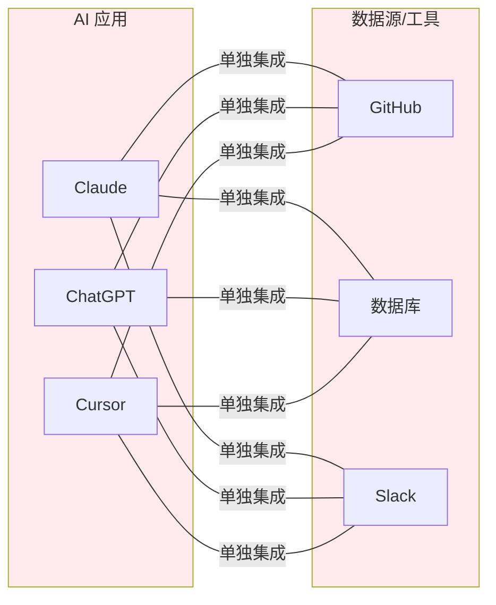
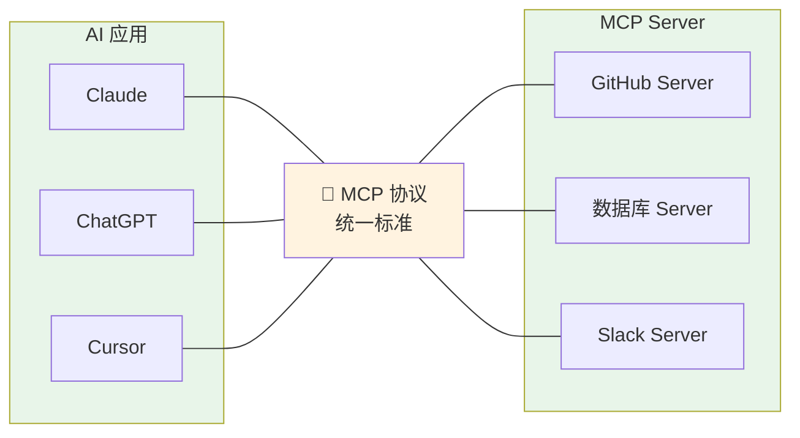
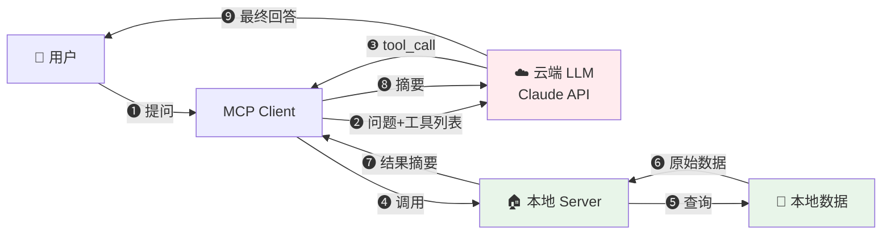
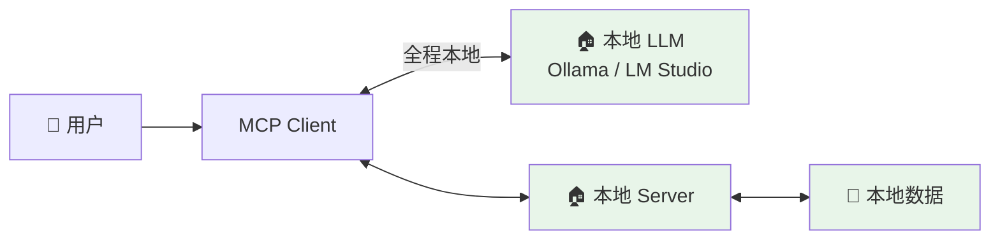
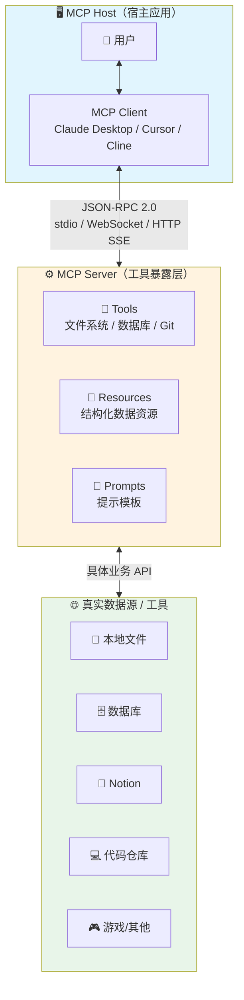
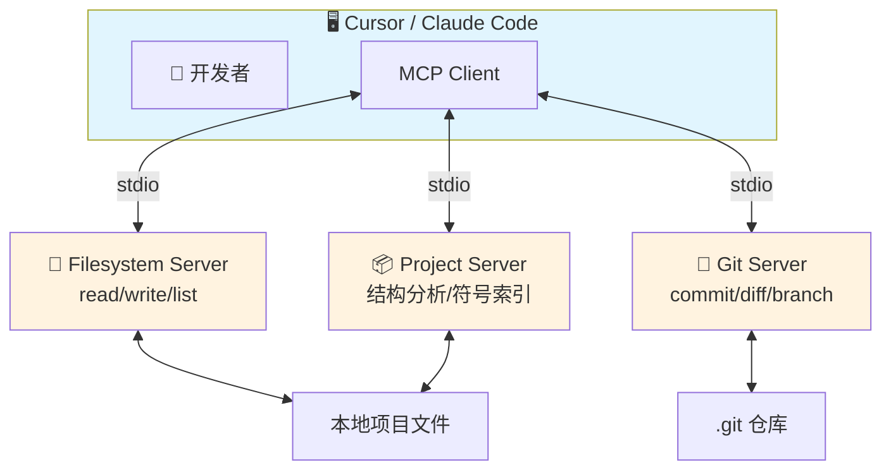
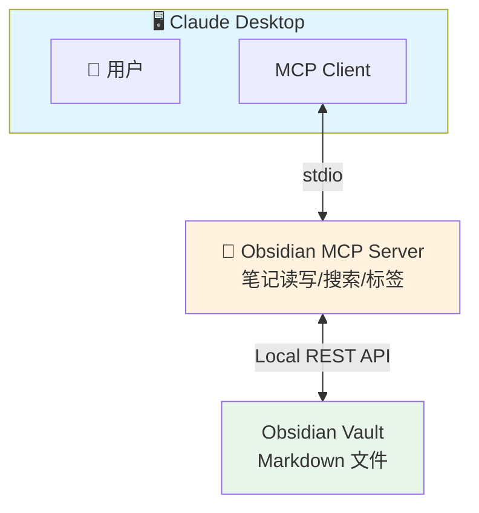
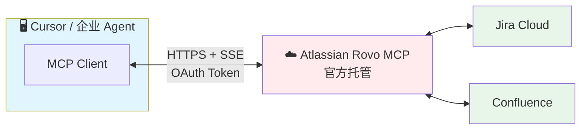
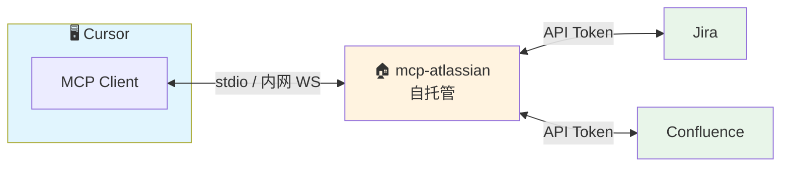

# MCP（Model Context Protocol）技术介绍

> 2025–2026 年 AI Agent 工具连接事实标准  
> 2024 年 11 月 Anthropic 开源，2025 年快速成为 de-facto 标准

---

## 1. 什么是 MCP？

| 属性 | 内容 |
|------|------|
| **全称** | Model Context Protocol（模型上下文协议） |
| **提出者** | Anthropic（Claude 的母公司） |
| **开源时间** | 2024 年 11 月 25 日 |
| **当前规范** | 2025-11-25（最新稳定版） |
| **官网** | https://modelcontextprotocol.io |
| **定位** | AI 领域的"USB-C 接口" —— 标准化外部上下文、工具、数据接入协议 |

**一句话总结**：  
MCP 是一种**开放、标准化、双向的通信协议**，让大语言模型（LLM）及 AI 应用（Claude、Cursor、自定义 Agent 等）能够安全、统一地访问外部数据源、工具、本地文件、业务系统，不再被困在静态知识和沙箱内。

---

## 2. 为什么需要 MCP？（核心痛点解决）

| 痛点 | 传统方案（2024 年前） | MCP 解决方式 |
|------|---------------------|-------------|
| 工具调用碎片化 | 各模型 Function Calling 格式不统一 | 统一协议，模型无关 |
| 数据源孤岛 | RAG / 自定义插件 / LangChain tools | 标准化 Server-Client 架构 |
| 本地文件/桌面权限难搞 | 几乎无法安全开放 | 本地 MCP Server + 可控授权 |
| 跨应用工具重复开发 | 每个应用都要重新写工具 | 写一次 Server，全局复用 |
| 安全性与隐私 | 敏感数据明文传云端 | 本地执行，原始数据基本不出本地 |

**一句话**：MCP 把 AI 从"只能聊天"推向"能真正干活的 Agent"。

### 2.1 集成成本对比：N×M vs N+M

**没有 MCP**：



**问题**：3 个应用 × 3 个工具 = **9 次集成**，成本指数增长。

**有 MCP**：



**优势**：3 个应用 + 3 个 Server = **6 次开发**，成本线性增长。

> **类比**：没有 MCP 像每个设备用不同充电线；有了 MCP 就像统一 USB-C，插上即用。

### 2.2 "数据不出本地"的准确理解

> ⚠️ **常见误解**：用了 MCP 就完全不需要调云端 API —— 这是不准确的。

**场景1：云端 LLM + 本地 MCP Server（最常见）**



- ✅ 原始敏感数据在本地处理
- ✅ 只把结果摘要发给云端
- ⚠️ 仍需调用云端 LLM API

**场景2：本地 LLM + 本地 MCP Server（完全私有化）**



- ✅ 数据完全不出本地
- ✅ 无需任何云端 API
- ⚠️ 本地模型能力有限

**两种场景对比**：

| 场景 | LLM 位置 | 数据流向 | 隐私程度 | 适用场景 |
|------|---------|---------|---------|---------|
| 传统方案 | 云端 | 所有数据发云端 | ❌ 低 | - |
| 场景1 | 云端 | 原始数据本地处理，只传摘要 | ⚠️ 中 | 大多数企业场景 |
| 场景2 | 本地 | 完全不出本地 | ✅ 高 | 高度敏感场景 |

---

## 3. MCP 核心架构

### 3.1 架构图（面试必画）



**架构组件说明**：

| 组件 | 角色 | 职责 | 示例 |
|------|------|------|------|
| **Host（宿主）** | 最外层应用 | 运行 LLM 应用，管理多个 MCP Client | Claude Desktop、Cursor、VS Code + Cline |
| **MCP Client** | 协议客户端 | 与 MCP Server 建立 **1:1 连接**，负责协议通信 | 内置于 Host 中，用户不直接感知 |
| **MCP Server** | 能力提供方 | 暴露 Tools/Resources/Prompts 三大能力 | GitHub Server、Postgres Server |
| **DataSources** | 真实数据源 | 被 MCP Server 访问的底层资源 | 本地文件、数据库、第三方 API |

### 3.2 三大核心能力

| 能力 | 说明 | 示例 |
|------|------|------|
| **Tools（工具）** | 可被 LLM 自动发现和调用的**函数/操作** | `read_file`、`query_db`、`send_slack` |
| **Resources（资源）** | 用 URI 标识的**结构化数据资源** | `file:///docs/report.pdf`、`postgres://db/users` |
| **Prompts（提示）** | 可参数化的**提示模板** | SQL 生成模板、代码审查模板 |

### 3.3 通信协议

| 协议 | 传输方式 | 适用场景 |
|------|---------|---------|
| **stdio** | 标准输入输出 | 本地进程通信（最常用） |
| **WebSocket** | 双向长连接 | 实时推送场景 |
| **HTTP SSE** | 服务端推送 | 远程 Server、流式响应 |

> **关键点**：一个 Host 可同时连接多个 MCP Server，实现工具组合。

### 3.4 核心流程（6 步，面试必背）

1. **发现连接**：Client 启动时发现并连接 MCP Server
2. **获取能力**：Server 返回工具/资源/提示列表（含 schema）
3. **用户提问**：Client 连同工具列表发给 LLM
4. **LLM 判断**：LLM 返回 `tool_call` 请求
5. **执行工具**：Client 调用 Server → Server 执行 → 返回结果
6. **生成回答**：LLM 拿到结果生成最终回答

---

## 4. MCP vs Function Calling（面试高频对比）

| 维度 | 原生 Function Calling | MCP |
|------|----------------------|-----|
| 协议 | 各家不同 | 统一 JSON-RPC 2.0 + JSON Schema |
| 执行位置 | 云端直接调用 | 本地/自托管 Server 执行 |
| 工具复用 | 每个应用重新定义 | 一次编写，全局可用 |
| 本地模型支持 | 基本不支持 | 原生友好（Ollama、LM Studio） |
| 工具发现 | 无 | 自动发现 + 热加载 |
| 数据隐私 | 较低 | 高（原始数据不出本地） |
| 生态规模 | 各家自有生态 | 社区已超 1.3 万个 MCP Server |

**结论**：MCP 用一点延迟换来安全性、可组合性、生态级复用。

---

## 5. MCP 常见使用场景（2026 年初热度排序）

| 排名 | 场景 | 核心目标 | 典型 Host | MCP Server 类型 | 数据位置 |
|------|------|---------|----------|----------------|---------|
| ⭐1 | **代码智能体** | 让 AI 真正"懂"并操作本地代码 | Cursor、Claude Code、Cline | Filesystem + Git + 项目专用 | 本地文件系统 |
| 2 | **本地知识管理** | AI 读取/搜索/编辑个人知识库 | Claude Desktop、Cursor | Obsidian / Logseq MCP | 本地 Markdown |
| 3 | **企业系统集成** | 把企业工具带入 AI 工作流 | Cursor、企业自定义 Agent | Atlassian Rovo / 飞书 MCP | 云端企业 API |
| 4 | **设计/创意工具** | 用自然语言改设计稿 | Claude Desktop、Cursor | Figma / Canva MCP | 云端设计平台 |
| 5 | **Agent 代码执行** | 写代码调用工具（更省 token） | Cursor、Claude Code | Python 执行环境 + MCP | 本地 + 远程 |
| 6 | **游戏/虚拟世界** | AI 控制游戏角色 | Claude Desktop | Minecraft Bot MCP | 游戏服务器 |

> 下面重点介绍前三个最热门场景的方案设计。

### 5.1 场景一：代码智能体（Cursor / Claude Code / Cline）

**核心思想**：让 AI 像"本地资深开发者"一样，直接读写项目文件、理解 monorepo 结构、运行 git、执行终端命令。

**典型架构**：



**暴露的核心能力**：

| 类型 | 能力 | 说明 |
|------|------|------|
| **Tools** | `read_file`, `write_file`, `list_directory` | 文件读写 |
| **Tools** | `run_command` | 有限终端命令 |
| **Tools** | `git_commit`, `git_diff`, `git_branch` | Git 操作 |
| **Tools** | `get_project_structure`, `find_component` | 项目结构分析 |
| **Resources** | `file:///src/components/Button.tsx` | 直接用 URI 读取文件 |
| **Prompts** | 代码审查模板、重构建议模板 | 预置提示 |

**典型工作流**：

```
用户："帮我把 Button 组件改成支持 dark mode"
  ↓
LLM → tool_call: read_file("/src/components/Button.tsx")
  ↓
Server 返回文件内容
  ↓
LLM 生成修改后代码 → tool_call: write_file(...)
  ↓
Server 写入文件
  ↓
LLM → tool_call: git_commit("feat: add dark mode to Button")
```

**2025–2026 趋势**：
- IDE 自动为当前项目启动 MCP Server（一键式）
- 高级 Server 缓存项目结构、符号索引，减少重复扫描
- 部分场景转向"LLM 写 Python 代码操作文件"（更省 token）

### 5.2 场景二：本地知识管理（Obsidian / Logseq / PDF）

**核心思想**：把个人第二大脑变成 AI 可搜索、可编辑、可总结的"活知识库"，全程本地，零云端泄露。

**典型架构**：



**暴露的核心能力**：

| 类型 | 能力 | 说明 |
|------|------|------|
| **Tools** | `search_notes` | 全文/标签/属性搜索 |
| **Tools** | `read_note`, `create_note`, `append_block` | 笔记 CRUD |
| **Tools** | `update_frontmatter` | 修改元数据 |
| **Resources** | `obsidian:///daily/2026-02-04.md` | 直接读取笔记 |
| **Prompts** | 周报总结模板、文献综述模板 | 预置提示 |

**典型工作流**：

```
用户："总结我最近一个月关于 LLM Agent 的笔记，生成周报"
  ↓
LLM → tool_call: search_notes(query="LLM Agent", since="2026-01-01")
  ↓
Server 查询 Obsidian vault → 返回匹配笔记列表
  ↓
LLM → tool_call: read_note(...) 读取关键笔记
  ↓
LLM 综合生成周报草稿
  ↓
用户确认 → tool_call: create_note("Weekly/2026-W05.md", content)
```

**Obsidian vs Logseq**：

| 特性 | Obsidian | Logseq |
|------|----------|--------|
| **数据结构** | 文件级 Markdown | 块级大纲 |
| **MCP 生态** | 成熟（20+ Server） | 发展中 |
| **适合场景** | 长文档、知识库 | 大纲笔记、块级操作 |

### 5.3 场景三：企业系统集成（Jira / Confluence / 飞书）

**核心思想**：让 AI 成为"企业员工助手"，能查/改/创 Jira ticket、Confluence 页面，强调企业级安全。

**两种主流路线**：

**路线 A：官方托管远程 MCP Server（企业首选）**



**路线 B：开源自托管 MCP Server（更灵活）**



**暴露的核心能力**（Jira + Confluence）：

| 类型 | 能力 | 说明 |
|------|------|------|
| **Tools** | `list_issues`, `create_issue`, `transition_issue` | Jira 操作 |
| **Tools** | `search_pages`, `create_page`, `update_page` | Confluence 操作 |
| **Resources** | `jira://issue/MOB-123` | 直接读取 Issue |
| **Resources** | `confluence://page/123456` | 直接读取页面 |

**典型工作流**：

```
用户："把上周代码审查的 bug 都转成高优先级 Jira ticket"
  ↓
LLM → tool_call: search_issues("code review bugs since:2026-01-27")
  ↓
Server 调用 Jira API → 返回 issues 列表（8 条摘要）
  ↓
LLM 循环 → tool_call: transition_issue(id, "High Priority")
  ↓
完成 → "已更新 8 个 ticket"
```

> ⚠️ **注意：此场景与"本地知识管理"的隐私模型不同**
> 
> - **Jira/Confluence 本身就是云服务**，数据原本就在云端，不存在"数据不出本地"
> - **MCP 的价值**在于：减少发送给 LLM 的数据量（只发 issues 摘要，而不是全量数据）
> - **对比传统方案**：以前可能需要把整个项目的 issues 列表粘贴给 ChatGPT；现在 LLM 只收到"8 条匹配结果"的摘要
> - **真正的安全关注点**是：Token 权限控制、审计日志、Rate Limit（见下表）

**企业级安全关注点（2026 年热点）**：

| 关注点 | 说明 |
|--------|------|
| **审计日志** | 谁让 AI 修改了哪个 ticket？ |
| **权限控制** | AI 只能操作分配给当前用户的项目 |
| **Rate Limit** | 避免 AI 洪水式调用 |
| **Token 管理** | 短期 scoped token 或 OAuth refresh |

### 5.4 三大场景总结

**三种场景的隐私模型对比**：

| 场景 | 数据源位置 | MCP Server 位置 | 发给 LLM 的数据 | 隐私程度 |
|------|-----------|----------------|----------------|---------|
| **代码智能体** | 本地文件系统 | 本地 | 文件内容（可控） | ✅ 高 |
| **本地知识管理** | 本地 Markdown | 本地 | 笔记摘要（可控） | ✅ 高 |
| **企业系统集成** | 云端（Jira 等） | 本地/远程 | issues 摘要（减少但仍有） | ⚠️ 中 |

> **关键区别**：
> - 前两个场景：数据源在本地，MCP 真正实现"原始数据不出本地"
> - 第三个场景：数据源本身在云端，MCP 的价值是**减少发给 LLM 的数据量**（只传摘要），而非"数据不出本地"

> **一句话**：这三个场景代表了 MCP 从"个人生产力"（代码 + 笔记）向"企业生产力"（业务系统）的完整梯度，架构上都是 **Client → MCP Server → 真实数据源** 的经典模式，只是 Server 复杂度、认证方式和部署位置逐步升级。

---

## 6. MCP 优缺点总结

### 优点 ✅

- **生态爆发** → 上万 Server + 初步 Registry（类似 VS Code Marketplace）
- **隐私可控** → 本地执行 + 本地模型组合
- **工具可组合** → 多 Server 同时工作
- **IDE 深度融合** → Cursor、VS Code 等原生支持

### 挑战 ⚠️

- **延迟** → 高于纯云端调用
- **安全模型** → 权限、审计、沙箱仍在完善
- **跨厂商兼容** → OpenAI/Google 未深度原生支持

---

## 7. 快速上手命令（2026 年主流）

```bash
# 方式1：官方 filesystem server
npx @modelcontextprotocol/filesystem-server

# 方式2：项目专用 server（Cursor / Claude Code 最常用）
npx @cursor-sh/mcp-project --path ~/code/my-repo

# 方式3：Claude Desktop 一键安装扩展
# Claude → Extensions → 搜索 Filesystem / Git / Notion → Install

# 方式4：手动连接本地 server
# Claude Desktop → Settings → MCP → Add Local → ws://localhost:8765
```

---

## 8. 面试加分点（可主动抛出）

- MCP 正在把 **RAG、Function Calling、Plugin** 三条路线统一
- 2025 年底 Anthropic 推 **"Agent 写代码调用 MCP"** 优化路径（更省 token）
- **安全**已成为 2025 下半年最热话题（细粒度权限、审计日志）
- 未来方向：**MCP Registry GA** + 多模型兼容层
- 如果公司要做私有化 Agent 平台，MCP 是目前最有潜力的基础设施

---

## 9. 一句话总结（面试结尾可用）

> **MCP 是 AI Agent 的"HTTP + USB-C"，让工具和数据接入从碎片化 N×M 变成可组合的 N+M 生态。**

面试开场可以说：
> "MCP 就是 AI 的 USB-C 接口，让大模型可以标准化地接入各种外部工具和数据源。"

---

## 参考资料

- [MCP 官方规范](https://modelcontextprotocol.io/specification/2025-11-25)
- [MCP GitHub 仓库](https://github.com/modelcontextprotocol)
- [Anthropic MCP 发布博客](https://www.anthropic.com/news/model-context-protocol)

---

**更新日期**：2026 年 2 月
