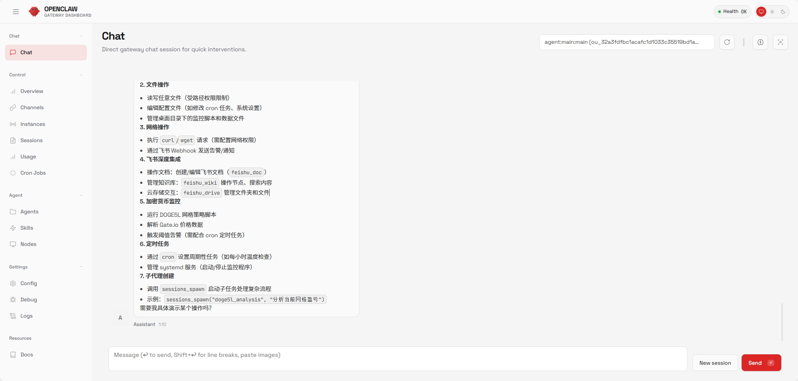

# Nginx HTTPS：局域网 Web UI 访问

> 本文档从 [环境构建与 API 配置](./1_OpenClaw_Deploy_Guide.md) 中独立出来，详细介绍如何通过 Nginx 反向代理让局域网设备访问 OpenClaw Web UI。
>
> 返回 [项目总览](../README.md)

---

## 目录

- [1. 概述](#1-概述)
- [2. 生成自签名 SSL 证书](#2-生成自签名-ssl-证书)
- [3. 配置 Nginx](#3-配置-nginx)
- [4. 配置 OpenClaw 允许外部来源](#4-配置-openclaw-允许外部来源)
- [5. 效果展示](#5-效果展示)

---

## 1. 概述

OpenClaw 自带一个功能丰富的 **Control UI**（Web 聊天界面），默认监听 `127.0.0.1:18789`。通过 Nginx 反向代理，可以让局域网内的手机、平板、其他电脑都能访问。

**架构**：

```
局域网设备 (手机/平板/电脑)
    ↓ HTTPS (端口 7860)
Nginx 反向代理 (自签名 SSL)
    ↓ HTTP (127.0.0.1:18789)
OpenClaw Gateway
```

## 2. 生成自签名 SSL 证书

```bash
sudo mkdir -p /etc/nginx/ssl
sudo openssl req -x509 -nodes -days 365 -newkey rsa:2048 \
  -keyout /etc/nginx/ssl/openclaw.key \
  -out /etc/nginx/ssl/openclaw.crt \
  -subj "/CN=192.168.1.100"
```

> 将 `192.168.1.100` 替换为你的服务器局域网 IP。

## 3. 配置 Nginx

创建 `/etc/nginx/sites-available/openclaw`：

```nginx
server {
    listen 7860 ssl;
    server_name 192.168.1.100;

    ssl_certificate /etc/nginx/ssl/openclaw.crt;
    ssl_certificate_key /etc/nginx/ssl/openclaw.key;

    # HTTP 请求代理
    location / {
        proxy_pass http://127.0.0.1:18789;
        proxy_http_version 1.1;
        proxy_set_header Upgrade $http_upgrade;
        proxy_set_header Connection "upgrade";
        proxy_set_header Host $host;
        proxy_set_header X-Real-IP $remote_addr;
        proxy_set_header X-Forwarded-For $proxy_add_x_forwarded_for;
        proxy_set_header X-Forwarded-Proto $scheme;
        proxy_read_timeout 86400;
    }

    # ⚠️ WebSocket 连接自动注入 token（关键！）
    location /ws {
        proxy_pass http://127.0.0.1:18789/ws?token=你的token;
        proxy_http_version 1.1;
        proxy_set_header Upgrade $http_upgrade;
        proxy_set_header Connection "upgrade";
        proxy_set_header Host $host;
        proxy_set_header X-Real-IP $remote_addr;
        proxy_set_header X-Forwarded-For $proxy_add_x_forwarded_for;
        proxy_set_header X-Forwarded-Proto $scheme;
        proxy_read_timeout 86400;
    }
}
```

> **关键点**：`/ws` location 必须将 token 拼接到 `proxy_pass` URL 中，否则 WebSocket 连接会因缺少认证而失败。详见 [踩坑记录](../README.md#坑-3nginx-websocket-要注入-token)。

启用并重启：

```bash
sudo ln -s /etc/nginx/sites-available/openclaw /etc/nginx/sites-enabled/
sudo nginx -t && sudo systemctl reload nginx
```

## 4. 配置 OpenClaw 允许外部来源

在 `~/.openclaw/openclaw.json` 中添加：

```json
{
  "gateway": {
    "mode": "local",
    "controlUi": {
      "allowedOrigins": ["https://192.168.1.100:7860"]
    },
    "auth": {
      "token": "你的token"
    },
    "trustedProxies": ["127.0.0.1"]
  }
}
```

现在打开 `https://192.168.1.100:7860`，就能在局域网内任何设备上使用 OpenClaw Web UI 了。

> 首次访问时浏览器会提示证书不受信任（因为是自签名），点击「继续访问」即可。

## 5. 效果展示

<p align="center">
  
</p>

<p align="center"><em>OpenClaw Gateway Dashboard — 局域网 Web UI 聊天界面</em></p>
